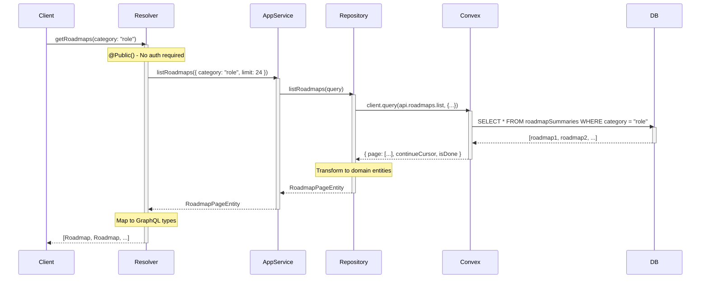
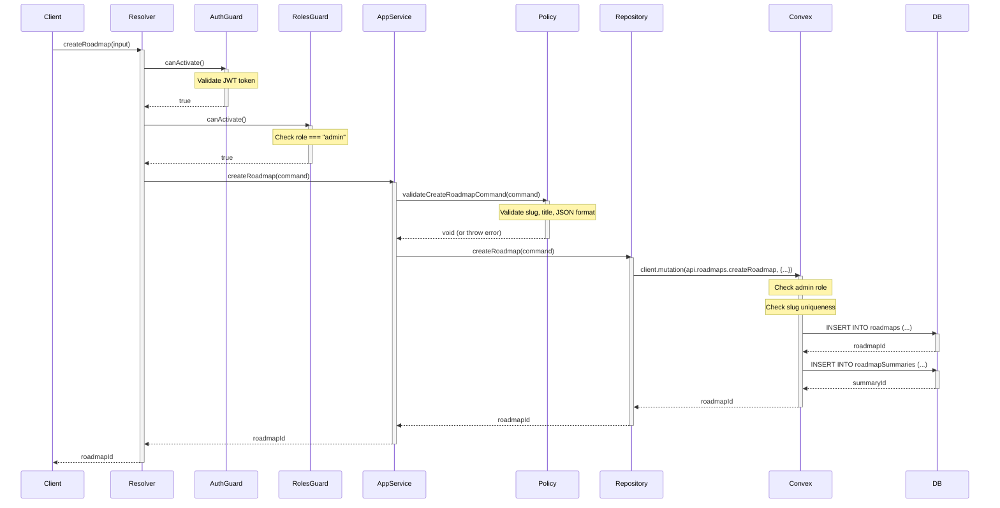

# Luồng Business Logic - VizTechStack

## 1. Tổng Quan Domain-Driven Design

VizTechStack áp dụng **Domain-Driven Design (DDD)** với **Hexagonal Architecture** (Ports & Adapters) để tổ chức business logic.

### 1.1 Cấu Trúc Layers

```
┌─────────────────────────────────────────────────────────┐
│                    TRANSPORT LAYER                       │
│  (GraphQL Resolvers, REST Controllers)                  │
│  - Nhận requests từ clients                             │
│  - Validate input                                       │
│  - Transform DTO ↔ Domain                               │
└─────────────────────────────────────────────────────────┘
                            ↓
┌─────────────────────────────────────────────────────────┐
│                  APPLICATION LAYER                       │
│  (Use Cases, Application Services)                      │
│  - Orchestrate business operations                      │
│  - Transaction management                               │
│  - Call domain services                                 │
└─────────────────────────────────────────────────────────┘
                            ↓
┌─────────────────────────────────────────────────────────┐
│                    DOMAIN LAYER                          │
│  (Entities, Value Objects, Domain Services)             │
│  - Core business logic                                  │
│  - Business rules validation                            │
│  - Domain events                                        │
└─────────────────────────────────────────────────────────┘
                            ↓
┌─────────────────────────────────────────────────────────┐
│                INFRASTRUCTURE LAYER                      │
│  (Repositories, External Services)                      │
│  - Database access                                      │
│  - External API calls                                   │
│  - File system operations                               │
└─────────────────────────────────────────────────────────┘
```


## 2. Roadmap Module - Chi Tiết Implementation

### 2.1 Cấu Trúc Module

```
apps/api/src/modules/roadmap/
├── application/                    # Application Layer
│   ├── commands/                  # Write operations
│   │   └── create-roadmap.command.ts
│   ├── queries/                   # Read operations
│   │   ├── list-roadmaps.query.ts
│   │   └── get-roadmap-by-slug.query.ts
│   ├── services/                  # Use case orchestration
│   │   └── roadmap-application.service.ts
│   └── ports/                     # Interfaces (contracts)
│       └── roadmap.repository.ts
├── domain/                        # Domain Layer
│   ├── entities/                  # Domain models
│   │   └── roadmap.entity.ts
│   ├── errors/                    # Domain exceptions
│   │   └── roadmap-domain-error.ts
│   └── policies/                  # Business rules
│       └── roadmap-input.policy.ts
├── infrastructure/                # Infrastructure Layer
│   └── adapters/                  # Concrete implementations
│       └── convex-roadmap.repository.ts
└── transport/                     # Transport Layer
    └── graphql/                   # GraphQL API
        ├── resolvers/
        │   └── roadmap.resolver.ts
        ├── schemas/
        │   └── roadmap.schema.ts
        ├── mappers/
        │   └── roadmap-graphql.mapper.ts
        └── filters/
            └── roadmap-domain-exception.filter.ts
```


### 2.2 Luồng Đọc Dữ Liệu: List Roadmaps

#### Step-by-Step Flow

```
1. Client Request
   ↓
2. GraphQL Resolver (Transport Layer)
   ↓
3. Application Service (Application Layer)
   ↓
4. Repository Interface (Port)
   ↓
5. Convex Repository (Adapter)
   ↓
6. Convex Database
   ↓
7. Transform & Return
```

#### Code Flow Chi Tiết

**Step 1: Client Request**
```typescript
// Client (Next.js)
const { data } = await apolloClient.query({
  query: gql`
    query GetRoadmaps($category: RoadmapCategory) {
      getRoadmaps(category: $category) {
        _id
        slug
        title
        description
        category
        difficulty
        topicCount
        status
      }
    }
  `,
  variables: { category: 'role' }
});
```

**Step 2: GraphQL Resolver**
```typescript
// apps/api/src/modules/roadmap/transport/graphql/resolvers/roadmap.resolver.ts
@Resolver(() => Roadmap)
@UseGuards(ClerkAuthGuard, RolesGuard)
@UseFilters(RoadmapDomainExceptionFilter)
export class RoadmapResolver {
  constructor(
    private readonly roadmapApplicationService: RoadmapApplicationService,
  ) {}

  @Query(() => [Roadmap])
  @Public()  // No authentication required
  async getRoadmaps(
    @Args('category', { type: () => RoadmapCategory, nullable: true })
    category?: RoadmapCategory,
  ): Promise<Roadmap[]> {
    // 1. Map GraphQL input to Domain query
    const roadmapPage = await this.roadmapApplicationService.listRoadmaps({
      category: mapCategoryInputToDomain(category),
      limit: 24,
    });

    // 2. Map Domain entities to GraphQL types
    return roadmapPage.items.map(mapRoadmapEntityToGraphql);
  }
}
```


**Step 3: Application Service**
```typescript
// apps/api/src/modules/roadmap/application/services/roadmap-application.service.ts
@Injectable()
export class RoadmapApplicationService {
  constructor(
    @Inject(ROADMAP_REPOSITORY)
    private readonly roadmapRepository: RoadmapRepository,
  ) {}

  async listRoadmaps(query: ListRoadmapsQuery): Promise<RoadmapPageEntity> {
    // 1. Validate input (optional)
    // 2. Call repository
    const roadmapPage = await this.roadmapRepository.listRoadmaps(query);
    
    // 3. Apply business logic (if needed)
    // 4. Return domain entities
    return roadmapPage;
  }
}
```

**Step 4: Repository Interface (Port)**
```typescript
// apps/api/src/modules/roadmap/application/ports/roadmap.repository.ts
export const ROADMAP_REPOSITORY = Symbol('ROADMAP_REPOSITORY');

export interface RoadmapRepository {
  listRoadmaps(query: ListRoadmapsQuery): Promise<RoadmapPageEntity>;
  getRoadmapBySlug(query: GetRoadmapBySlugQuery): Promise<RoadmapEntity>;
  createRoadmap(command: CreateRoadmapCommand): Promise<string>;
}

// Query/Command DTOs
export interface ListRoadmapsQuery {
  category?: 'role' | 'skill' | 'best-practice';
  limit?: number;
  cursor?: string;
}
```


**Step 5: Convex Repository (Adapter)**
```typescript
// apps/api/src/modules/roadmap/infrastructure/adapters/convex-roadmap.repository.ts
@Injectable()
export class ConvexRoadmapRepository implements RoadmapRepository {
  constructor(private readonly convexService: ConvexService) {}

  async listRoadmaps(query: ListRoadmapsQuery): Promise<RoadmapPageEntity> {
    try {
      // 1. Call Convex API
      const result = await this.convexService.client.query(
        api.roadmaps.list,
        {
          category: query.category,
          paginationOpts: {
            numItems: query.limit ?? 24,
            cursor: query.cursor ?? null,
          },
        },
      );

      // 2. Validate response structure
      if (!this.isRoadmapPaginatedPayload(result)) {
        throw new RoadmapInfrastructureDomainError(
          'Invalid paginated payload',
          'listRoadmaps',
        );
      }

      // 3. Transform to domain entities
      return {
        items: result.page.map((item) => this.mapRoadmapSummary(item)),
        nextCursor: result.isDone ? null : result.continueCursor,
        isDone: result.isDone,
      };
    } catch (error) {
      // 4. Handle errors
      throw this.mapInfrastructureError(error, 'listRoadmaps');
    }
  }

  private mapRoadmapSummary(payload: RoadmapSummaryPayload): RoadmapEntity {
    return {
      _id: payload._id,
      slug: payload.slug,
      title: payload.title,
      description: payload.description,
      category: payload.category,
      difficulty: payload.difficulty,
      topicCount: payload.topicCount,
      status: payload.status ?? 'public',
    };
  }
}
```


**Step 6: Convex Database Query**
```typescript
// convex/roadmaps.ts
export const list = query({
  args: {
    category: v.optional(v.union(
      v.literal("role"),
      v.literal("skill"),
      v.literal("best-practice"),
    )),
    paginationOpts: paginationOptsValidator,
  },
  handler: async (ctx, args) => {
    // 1. Build query
    let query = ctx.db.query("roadmapSummaries");

    // 2. Apply filters
    if (args.category) {
      query = query.withIndex("by_category_created_at", (q) =>
        q.eq("category", args.category)
      );
    }

    // 3. Filter by status (only public)
    query = query.filter((q) => q.eq(q.field("status"), "public"));

    // 4. Order by createdAt desc
    query = query.order("desc");

    // 5. Paginate
    const result = await query.paginate(args.paginationOpts);

    // 6. Transform response
    return {
      page: result.page.map(mapToSummaryListItem),
      continueCursor: result.continueCursor,
      isDone: result.isDone,
    };
  },
});
```


### 2.3 Luồng Ghi Dữ Liệu: Create Roadmap

#### Step-by-Step Flow

```
1. Client Request (Admin only)
   ↓
2. GraphQL Resolver
   ↓
3. ClerkAuthGuard (JWT validation)
   ↓
4. RolesGuard (Admin check)
   ↓
5. Application Service
   ↓
6. Domain Validation
   ↓
7. Repository
   ↓
8. Convex Mutation
   ↓
9. Database Write
   ↓
10. Return ID
```

#### Code Flow Chi Tiết

**Step 1-2: Client Request & Resolver**
```typescript
// Client
const { data } = await apolloClient.mutate({
  mutation: gql`
    mutation CreateRoadmap($input: CreateRoadmapInput!) {
      createRoadmap(input: $input)
    }
  `,
  variables: {
    input: {
      slug: 'frontend-developer',
      title: 'Frontend Developer',
      description: 'Complete frontend roadmap',
      category: 'ROLE',
      difficulty: 'INTERMEDIATE',
      topicCount: 50,
      nodesJson: JSON.stringify(nodes),
      edgesJson: JSON.stringify(edges),
      status: 'DRAFT',
    }
  }
});

// Resolver
@Mutation(() => String)
@Roles('admin')  // Only admin can create
async createRoadmap(
  @Args('input') input: CreateRoadmapInput,
): Promise<string> {
  const command = mapCreateRoadmapInputToCommand(input);
  return this.roadmapApplicationService.createRoadmap(command);
}
```


**Step 3-4: Authentication & Authorization**
```typescript
// ClerkAuthGuard
@Injectable()
export class ClerkAuthGuard implements CanActivate {
  async canActivate(context: ExecutionContext): Promise<boolean> {
    const ctx = GqlExecutionContext.create(context);
    const { req } = ctx.getContext();

    // Check if route is public
    const isPublic = this.reflector.get<boolean>('isPublic', context.getHandler());
    if (isPublic) return true;

    // Validate JWT token
    const token = this.extractToken(req);
    if (!token) throw new UnauthorizedException('No token provided');

    try {
      const payload = await this.clerkClient.verifyToken(token);
      req.user = payload;
      return true;
    } catch (error) {
      throw new UnauthorizedException('Invalid token');
    }
  }
}

// RolesGuard
@Injectable()
export class RolesGuard implements CanActivate {
  canActivate(context: ExecutionContext): boolean {
    const requiredRoles = this.reflector.get<string[]>('roles', context.getHandler());
    if (!requiredRoles) return true;

    const ctx = GqlExecutionContext.create(context);
    const { req } = ctx.getContext();
    const user = req.user;

    const userRole = user?.publicMetadata?.role;
    return requiredRoles.includes(userRole);
  }
}
```


**Step 5-6: Application Service & Domain Validation**
```typescript
// Application Service
async createRoadmap(command: CreateRoadmapCommand): Promise<string> {
  // 1. Validate input using domain policy
  RoadmapInputPolicy.validateCreateRoadmapCommand(command);

  // 2. Check business rules
  if (command.topicCount < 1) {
    throw new RoadmapValidationDomainError(
      'Topic count must be at least 1',
      'topicCount'
    );
  }

  // 3. Call repository
  const roadmapId = await this.roadmapRepository.createRoadmap(command);

  // 4. (Optional) Publish domain event
  // this.eventBus.publish(new RoadmapCreatedEvent(roadmapId));

  return roadmapId;
}

// Domain Policy
export class RoadmapInputPolicy {
  static validateCreateRoadmapCommand(command: CreateRoadmapCommand): void {
    // Slug validation
    if (!command.slug || command.slug.length < 3) {
      throw new RoadmapValidationDomainError(
        'Slug must be at least 3 characters',
        'slug'
      );
    }

    // Title validation
    if (!command.title || command.title.length < 5) {
      throw new RoadmapValidationDomainError(
        'Title must be at least 5 characters',
        'title'
      );
    }

    // JSON validation
    try {
      JSON.parse(command.nodesJson);
      JSON.parse(command.edgesJson);
    } catch (error) {
      throw new RoadmapValidationDomainError(
        'Invalid JSON format',
        'nodesJson/edgesJson'
      );
    }
  }
}
```


**Step 7-9: Repository & Database Write**
```typescript
// Repository
async createRoadmap(command: CreateRoadmapCommand): Promise<string> {
  try {
    const roadmapId = await this.convexService.client.mutation(
      api.roadmaps.createRoadmap,
      {
        slug: command.slug,
        title: command.title,
        description: command.description,
        category: command.category,
        difficulty: command.difficulty,
        topicCount: command.topicCount,
        nodesJson: command.nodesJson,
        edgesJson: command.edgesJson,
        status: command.status,
      },
    );

    return roadmapId;
  } catch (error) {
    if (error.message.includes('already exists')) {
      throw new RoadmapValidationDomainError(
        `Roadmap with slug '${command.slug}' already exists`,
        'slug'
      );
    }
    throw this.mapInfrastructureError(error, 'createRoadmap');
  }
}

// Convex Mutation
export const createRoadmap = mutation({
  args: { /* ... */ },
  handler: async (ctx, args) => {
    // 1. Check authentication
    const identity = await ctx.auth.getUserIdentity();
    if (!identity) {
      throw new Error("Unauthenticated");
    }

    // 2. Check authorization
    assertAdmin(identity, "createRoadmap");

    // 3. Check uniqueness
    const existing = await ctx.db
      .query("roadmaps")
      .withIndex("by_slug", (q) => q.eq("slug", args.slug))
      .first();

    if (existing) {
      throw new Error(`Roadmap with slug '${args.slug}' already exists`);
    }

    // 4. Insert roadmap
    const roadmapId = await ctx.db.insert("roadmaps", {
      ...args,
      userId: identity.subject,
      createdAt: Date.now(),
    });

    // 5. Insert summary (denormalization)
    await ctx.db.insert("roadmapSummaries", {
      roadmapId,
      slug: args.slug,
      title: args.title,
      description: args.description,
      category: args.category,
      difficulty: args.difficulty,
      topicCount: args.topicCount,
      status: args.status,
      createdAt: Date.now(),
    });

    return roadmapId;
  },
});
```


## 3. Error Handling Strategy

### 3.1 Domain Errors

```typescript
// Base domain error
export abstract class RoadmapDomainError extends Error {
  constructor(
    message: string,
    public readonly code: string,
    public readonly context?: Record<string, unknown>,
  ) {
    super(message);
    this.name = this.constructor.name;
  }
}

// Specific error types
export class RoadmapValidationDomainError extends RoadmapDomainError {
  constructor(message: string, field: string) {
    super(message, 'ROADMAP_VALIDATION_ERROR', { field });
  }
}

export class RoadmapNotFoundDomainError extends RoadmapDomainError {
  constructor(slug: string) {
    super(
      `Roadmap with slug '${slug}' not found`,
      'ROADMAP_NOT_FOUND',
      { slug }
    );
  }
}

export class RoadmapAuthorizationDomainError extends RoadmapDomainError {
  constructor(operation: string) {
    super(
      `Unauthorized to perform ${operation}`,
      'ROADMAP_AUTHORIZATION_ERROR',
      { operation }
    );
  }
}
```

### 3.2 GraphQL Exception Filter

```typescript
// Transform domain errors to GraphQL errors
@Catch(RoadmapDomainError)
export class RoadmapDomainExceptionFilter implements GqlExceptionFilter {
  catch(exception: RoadmapDomainError, host: ArgumentsHost) {
    const gqlHost = GqlArgumentsHost.create(host);

    // Map to appropriate HTTP status
    const statusCode = this.getStatusCode(exception);

    return new GraphQLError(exception.message, {
      extensions: {
        code: exception.code,
        statusCode,
        context: exception.context,
      },
    });
  }

  private getStatusCode(error: RoadmapDomainError): number {
    if (error instanceof RoadmapValidationDomainError) return 400;
    if (error instanceof RoadmapNotFoundDomainError) return 404;
    if (error instanceof RoadmapAuthorizationDomainError) return 403;
    return 500;
  }
}
```


## 4. Data Transformation Layers

### 4.1 Mapper Pattern

```typescript
// GraphQL Input → Domain Command
export function mapCreateRoadmapInputToCommand(
  input: CreateRoadmapInput,
): CreateRoadmapCommand {
  return {
    slug: input.slug,
    title: input.title,
    description: input.description,
    category: mapCategoryInputToDomain(input.category),
    difficulty: mapDifficultyInputToDomain(input.difficulty),
    topicCount: input.topicCount,
    nodesJson: input.nodesJson,
    edgesJson: input.edgesJson,
    status: mapStatusInputToDomain(input.status),
  };
}

// Domain Entity → GraphQL Type
export function mapRoadmapEntityToGraphql(entity: RoadmapEntity): Roadmap {
  return {
    _id: entity._id,
    slug: entity.slug,
    title: entity.title,
    description: entity.description,
    category: mapCategoryDomainToGraphql(entity.category),
    difficulty: mapDifficultyDomainToGraphql(entity.difficulty),
    topicCount: entity.topicCount,
    status: mapStatusDomainToGraphql(entity.status),
    nodesJson: entity.nodesJson,
    edgesJson: entity.edgesJson,
  };
}

// Enum mappings
export function mapCategoryInputToDomain(
  category?: RoadmapCategory,
): 'role' | 'skill' | 'best-practice' | undefined {
  if (!category) return undefined;
  
  const mapping = {
    [RoadmapCategory.ROLE]: 'role' as const,
    [RoadmapCategory.SKILL]: 'skill' as const,
    [RoadmapCategory.BEST_PRACTICE]: 'best-practice' as const,
  };
  
  return mapping[category];
}
```

### 4.2 Why Mappers?

**Benefits:**
- ✅ Decouple layers (GraphQL ↔ Domain ↔ Database)
- ✅ Type safety at boundaries
- ✅ Easy to change one layer without affecting others
- ✅ Clear transformation logic

**Example:**
```
GraphQL Enum: RoadmapCategory.ROLE
      ↓ (mapper)
Domain Type: 'role'
      ↓ (mapper)
Database Value: 'role'
```


## 5. Dependency Injection Pattern

### 5.1 NestJS DI Container

```typescript
// Module configuration
@Module({
  providers: [
    // Resolver (Transport Layer)
    RoadmapResolver,
    
    // Application Service
    RoadmapApplicationService,
    
    // Repository (Interface → Implementation)
    {
      provide: ROADMAP_REPOSITORY,  // Token (Symbol)
      useClass: ConvexRoadmapRepository,  // Concrete implementation
    },
  ],
})
export class RoadmapModule {}
```

### 5.2 Benefits of DI

**1. Testability**
```typescript
// Easy to mock dependencies in tests
describe('RoadmapApplicationService', () => {
  let service: RoadmapApplicationService;
  let mockRepository: jest.Mocked<RoadmapRepository>;

  beforeEach(() => {
    mockRepository = {
      listRoadmaps: jest.fn(),
      getRoadmapBySlug: jest.fn(),
      createRoadmap: jest.fn(),
    } as any;

    service = new RoadmapApplicationService(mockRepository);
  });

  it('should list roadmaps', async () => {
    mockRepository.listRoadmaps.mockResolvedValue({ items: [], ... });
    const result = await service.listRoadmaps({ limit: 24 });
    expect(result.items).toEqual([]);
  });
});
```

**2. Flexibility**
```typescript
// Easy to swap implementations
{
  provide: ROADMAP_REPOSITORY,
  useClass: process.env.USE_POSTGRES 
    ? PostgresRoadmapRepository 
    : ConvexRoadmapRepository,
}
```

**3. Single Responsibility**
```typescript
// Each class has one responsibility
class RoadmapResolver {
  // Responsibility: Handle HTTP/GraphQL requests
}

class RoadmapApplicationService {
  // Responsibility: Orchestrate use cases
}

class ConvexRoadmapRepository {
  // Responsibility: Data access
}
```


## 6. CQRS Pattern (Command Query Responsibility Segregation)

### 6.1 Separation of Concerns

```
Commands (Write Operations)
├── CreateRoadmapCommand
├── UpdateRoadmapCommand
└── DeleteRoadmapCommand

Queries (Read Operations)
├── ListRoadmapsQuery
├── GetRoadmapBySlugQuery
└── GetRoadmapByIdQuery
```

### 6.2 Benefits

**1. Clear Intent**
```typescript
// Command: Expresses intent to change state
interface CreateRoadmapCommand {
  slug: string;
  title: string;
  description: string;
  // ... other fields
}

// Query: Expresses intent to read data
interface ListRoadmapsQuery {
  category?: string;
  limit?: number;
  cursor?: string;
}
```

**2. Different Optimization Strategies**
```typescript
// Commands: Focus on validation and consistency
async createRoadmap(command: CreateRoadmapCommand) {
  // Heavy validation
  RoadmapInputPolicy.validateCreateRoadmapCommand(command);
  
  // Business rules
  await this.checkDuplicateSlug(command.slug);
  
  // Write to database
  return this.repository.createRoadmap(command);
}

// Queries: Focus on performance
async listRoadmaps(query: ListRoadmapsQuery) {
  // Minimal validation
  // Use denormalized table (roadmapSummaries)
  // Implement caching
  return this.repository.listRoadmaps(query);
}
```

**3. Scalability**
```
Write Model (Commands)
├── Strong consistency
├── Complex validation
└── Transactional

Read Model (Queries)
├── Eventual consistency OK
├── Denormalized data
├── Caching
└── Read replicas
```


## 7. Design Patterns Summary

### 7.1 Patterns Used

| Pattern | Purpose | Location |
|---------|---------|----------|
| **Repository** | Abstract data access | `application/ports/` |
| **Adapter** | Implement interfaces | `infrastructure/adapters/` |
| **Mapper** | Transform data between layers | `transport/graphql/mappers/` |
| **Guard** | Authentication & Authorization | `common/guards/` |
| **Filter** | Exception handling | `transport/graphql/filters/` |
| **Decorator** | Metadata for guards | `common/decorators/` |
| **CQRS** | Separate read/write | `application/commands/`, `application/queries/` |
| **DI** | Dependency injection | NestJS modules |
| **Policy** | Business rules | `domain/policies/` |

### 7.2 Architecture Benefits

**1. Testability**
- Easy to mock dependencies
- Unit test each layer independently
- Integration tests with real implementations

**2. Maintainability**
- Clear separation of concerns
- Easy to locate code
- Consistent structure across modules

**3. Flexibility**
- Easy to swap implementations (Convex → PostgreSQL)
- Add new features without breaking existing code
- Support multiple transport layers (GraphQL, REST)

**4. Scalability**
- CQRS allows separate scaling of reads/writes
- Repository pattern enables read replicas
- Denormalization for query performance


## 8. Sequence Diagrams

### 8.1 List Roadmaps (Read Flow)




### 8.2 Create Roadmap (Write Flow)




## 9. Best Practices & Conventions

### 9.1 Naming Conventions

**Commands (Write Operations)**
```typescript
// Pattern: {Verb}{Entity}Command
CreateRoadmapCommand
UpdateRoadmapCommand
DeleteRoadmapCommand
PublishRoadmapCommand
```

**Queries (Read Operations)**
```typescript
// Pattern: {Verb}{Entity}Query or Get{Entity}By{Criteria}Query
ListRoadmapsQuery
GetRoadmapBySlugQuery
GetRoadmapByIdQuery
SearchRoadmapsQuery
```

**Entities**
```typescript
// Pattern: {Entity}Entity
RoadmapEntity
RoadmapPageEntity
TopicEntity
```

**Errors**
```typescript
// Pattern: {Entity}{Type}DomainError
RoadmapValidationDomainError
RoadmapNotFoundDomainError
RoadmapAuthorizationDomainError
RoadmapInfrastructureDomainError
```

### 9.2 File Organization

```
module/
├── application/           # Use cases
│   ├── commands/         # Write operations
│   ├── queries/          # Read operations
│   ├── services/         # Orchestration
│   └── ports/            # Interfaces
├── domain/               # Business logic
│   ├── entities/         # Domain models
│   ├── errors/           # Domain exceptions
│   ├── events/           # Domain events
│   └── policies/         # Business rules
├── infrastructure/       # Technical details
│   └── adapters/         # Implementations
└── transport/            # API layer
    ├── graphql/          # GraphQL API
    ├── rest/             # REST API (if needed)
    └── grpc/             # gRPC API (if needed)
```


### 9.3 Code Style Guidelines

**1. Single Responsibility Principle**
```typescript
// ❌ Bad: Resolver doing too much
@Query(() => [Roadmap])
async getRoadmaps() {
  const data = await this.convexClient.query(...);
  const validated = this.validate(data);
  const transformed = this.transform(validated);
  return transformed;
}

// ✅ Good: Each layer has one responsibility
@Query(() => [Roadmap])
async getRoadmaps() {
  const roadmapPage = await this.roadmapApplicationService.listRoadmaps({});
  return roadmapPage.items.map(mapRoadmapEntityToGraphql);
}
```

**2. Dependency Inversion Principle**
```typescript
// ❌ Bad: Depend on concrete implementation
class RoadmapApplicationService {
  constructor(private convexRepository: ConvexRoadmapRepository) {}
}

// ✅ Good: Depend on abstraction
class RoadmapApplicationService {
  constructor(
    @Inject(ROADMAP_REPOSITORY)
    private repository: RoadmapRepository  // Interface
  ) {}
}
```

**3. Error Handling**
```typescript
// ❌ Bad: Generic errors
throw new Error('Something went wrong');

// ✅ Good: Domain-specific errors
throw new RoadmapNotFoundDomainError(slug);
throw new RoadmapValidationDomainError('Invalid slug', 'slug');
```

**4. Type Safety**
```typescript
// ❌ Bad: Using 'any'
async listRoadmaps(query: any): Promise<any> { ... }

// ✅ Good: Explicit types
async listRoadmaps(query: ListRoadmapsQuery): Promise<RoadmapPageEntity> { ... }
```


## 10. Kết Luận

### 10.1 Điểm Mạnh của Architecture

✅ **Clean Architecture**
- Tách biệt rõ ràng giữa các layers
- Domain logic độc lập với infrastructure
- Dễ test và maintain

✅ **Type Safety**
- End-to-end TypeScript
- Compile-time error detection
- Better IDE support

✅ **Flexibility**
- Dễ swap implementations (Convex → PostgreSQL)
- Support multiple transport layers
- Extensible design

✅ **Testability**
- Easy to mock dependencies
- Unit test each layer independently
- Clear boundaries

### 10.2 Khuyến Nghị

**1. Tiếp Tục Áp Dụng**
- Domain-Driven Design
- Hexagonal Architecture
- CQRS pattern
- Repository pattern

**2. Cải Thiện**
- Add more unit tests
- Implement domain events
- Add caching layer
- Improve error messages

**3. Mở Rộng**
- Add more modules (User, Progress, Bookmark)
- Implement event sourcing (optional)
- Add saga pattern for complex workflows
- Implement CQRS with separate read/write databases

### 10.3 Learning Resources

**Books:**
- "Domain-Driven Design" by Eric Evans
- "Clean Architecture" by Robert C. Martin
- "Implementing Domain-Driven Design" by Vaughn Vernon

**Patterns:**
- Repository Pattern
- CQRS Pattern
- Hexagonal Architecture
- Dependency Injection

**NestJS:**
- Official Documentation: https://docs.nestjs.com
- GraphQL Best Practices
- Testing Strategies
