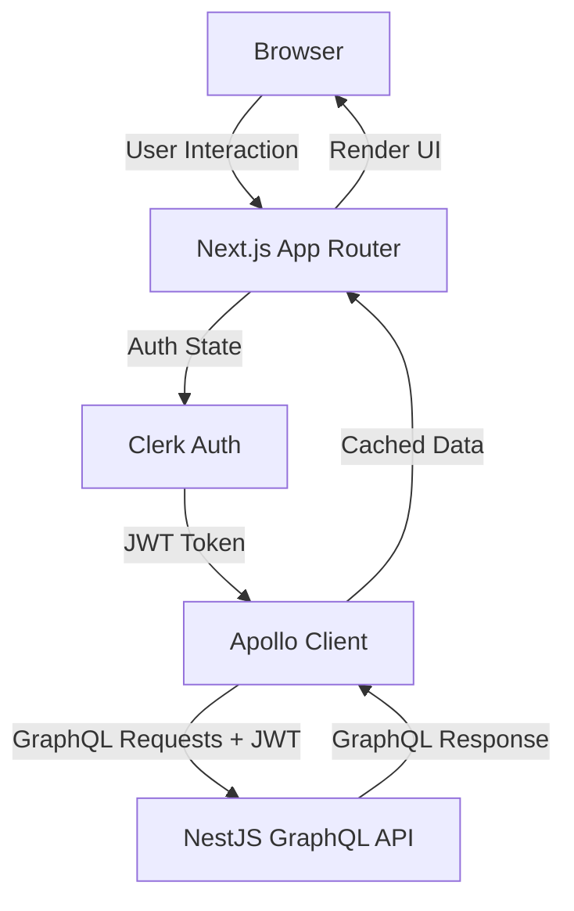
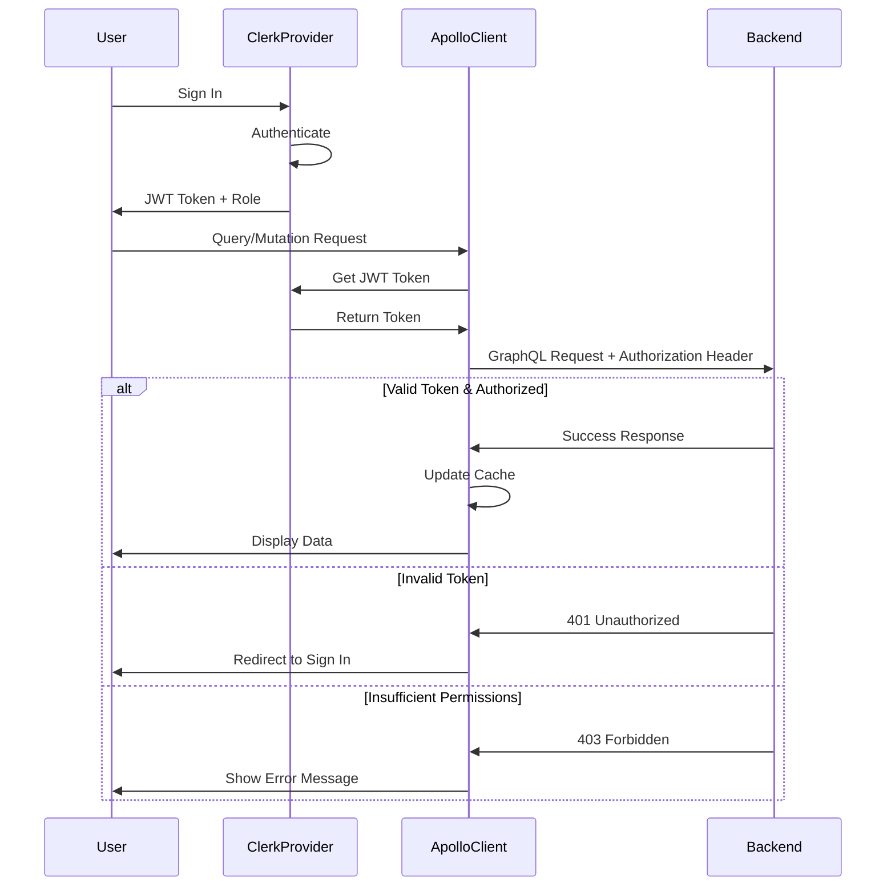
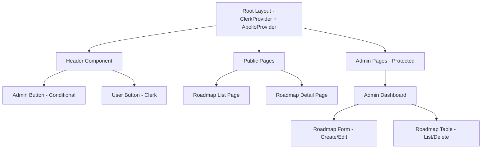

# Tài liệu Thiết kế - Frontend RBAC và Roadmap Integration

## Tổng quan

Tài liệu này mô tả việc tích hợp frontend cho hệ thống RBAC (Role-Based Access Control) và CRUD operations cho roadmap. Frontend sẽ kết nối với GraphQL API backend đã có sẵn, sử dụng Apollo Client để quản lý data fetching, Clerk để xác thực người dùng, và shadcn/ui components để xây dựng admin panel.

### Mục tiêu

- **Apollo Client Integration**: Setup Apollo Client với authentication headers từ Clerk JWT
- **Admin Panel UI**: Xây dựng giao diện quản trị roadmap với đầy đủ CRUD operations
- **Role-Based Rendering**: Hiển thị UI elements dựa trên user role (Admin/User/Guest)
- **Public Roadmap Display**: Trang hiển thị roadmap cho tất cả users
- **Type Safety**: Sử dụng GraphQL Codegen để generate types và hooks
- **Developer Documentation**: Tài liệu chi tiết cho intern/fresher developers

### Phạm vi

**Frontend Implementation bao gồm:**
- Apollo Client setup với Clerk authentication
- GraphQL queries và mutations với type-safe hooks
- Admin dashboard với CRUD interface
- Public roadmap listing và detail pages
- Role-based conditional rendering
- Error handling và loading states
- Form validation với Zod schemas
- Responsive design với Tailwind CSS

**Backend đã có sẵn:**
- GraphQL API với queries: `roadmaps`, `roadmap(slug)`
- GraphQL mutations: `createRoadmap`, `updateRoadmap`, `deleteRoadmap`
- Clerk JWT authentication với ClerkAuthGuard
- Role-based authorization với RolesGuard
- Convex database với roadmap schema


## Kiến trúc

### Tổng quan Kiến trúc Frontend



### Luồng Authentication và Data Fetching



### Component Architecture




### Cấu trúc Thư mục Frontend

```
apps/web/src/
├── app/
│   ├── layout.tsx                    # UPDATE: Add ApolloProvider
│   ├── page.tsx                      # Landing page
│   ├── roadmaps/
│   │   ├── page.tsx                  # NEW: Public roadmap list
│   │   └── [slug]/
│   │       └── page.tsx              # NEW: Public roadmap detail
│   └── admin/
│       ├── layout.tsx                # NEW: Admin layout with auth check
│       └── roadmaps/
│           ├── page.tsx              # NEW: Admin dashboard
│           ├── new/
│           │   └── page.tsx          # NEW: Create roadmap form
│           └── [id]/
│               └── edit/
│                   └── page.tsx      # NEW: Edit roadmap form
├── components/
│   ├── providers.tsx                 # UPDATE: Add ApolloProvider
│   ├── layout/
│   │   └── Header.tsx                # UPDATE: Add Admin Button
│   ├── auth/
│   │   ├── user-button-wrapper.tsx   # Existing
│   │   └── admin-button.tsx          # NEW: Admin navigation button
│   ├── roadmap/
│   │   ├── roadmap-list.tsx          # NEW: Public roadmap list
│   │   ├── roadmap-card.tsx          # NEW: Roadmap preview card
│   │   ├── roadmap-detail.tsx        # NEW: Roadmap detail view
│   │   └── roadmap-content.tsx       # NEW: Markdown renderer
│   └── admin/
│       ├── roadmap-form.tsx          # NEW: Create/Edit form
│       ├── roadmap-table.tsx         # NEW: Admin roadmap table
│       └── delete-roadmap-dialog.tsx # NEW: Delete confirmation
├── lib/
│   ├── apollo/
│   │   ├── client.ts                 # NEW: Apollo Client setup
│   │   └── links.ts                  # NEW: Apollo Links (auth, error)
│   ├── hooks/
│   │   ├── use-auth.ts               # NEW: Clerk auth hook
│   │   └── use-roadmap.ts            # NEW: Roadmap operations hook
│   └── utils.ts                      # Existing
└── features/
    └── roadmap/
        ├── queries.ts                # NEW: GraphQL queries
        ├── mutations.ts              # NEW: GraphQL mutations
        └── types.ts                  # NEW: TypeScript types

packages/shared/
├── graphql-schema/
│   └── src/
│       └── roadmap.graphql           # NEW: GraphQL schema definitions
└── graphql-generated/
    └── src/
        ├── types.ts                  # GENERATED: TypeScript types
        ├── schemas.ts                # GENERATED: Zod schemas
        └── hooks.ts                  # GENERATED: React hooks
```


## Các Thành phần và Giao diện

### 1. Apollo Client Setup

#### Apollo Client Configuration

```typescript
// apps/web/src/lib/apollo/client.ts
import { ApolloClient, InMemoryCache, HttpLink, from } from '@apollo/client';
import { setContext } from '@apollo/client/link/context';
import { onError } from '@apollo/client/link/error';

interface CreateApolloClientOptions {
  getToken: () => Promise<string | null>;
}

export function createApolloClient({ getToken }: CreateApolloClientOptions) {
  // HTTP connection to the API
  const httpLink = new HttpLink({
    uri: process.env.NEXT_PUBLIC_GRAPHQL_ENDPOINT || 'http://localhost:3001/graphql',
  });

  // Authentication link - adds JWT token to headers
  const authLink = setContext(async (_, { headers }) => {
    const token = await getToken();
    
    return {
      headers: {
        ...headers,
        authorization: token ? `Bearer ${token}` : '',
      },
    };
  });

  // Error handling link
  const errorLink = onError(({ graphQLErrors, networkError }) => {
    if (graphQLErrors) {
      graphQLErrors.forEach(({ message, extensions }) => {
        if (extensions?.code === 'UNAUTHENTICATED') {
          console.error('[Auth Error]:', message);
          // Redirect to sign in or refresh token
        } else if (extensions?.code === 'FORBIDDEN') {
          console.error('[Permission Error]:', message);
          // Show permission denied message
        }
      });
    }
    
    if (networkError) {
      console.error('[Network Error]:', networkError);
    }
  });

  // Combine links and create client
  return new ApolloClient({
    link: from([errorLink, authLink, httpLink]),
    cache: new InMemoryCache({
      typePolicies: {
        Query: {
          fields: {
            roadmaps: {
              merge(existing = [], incoming) {
                return incoming;
              },
            },
          },
        },
      },
    }),
    defaultOptions: {
      watchQuery: {
        fetchPolicy: 'cache-and-network',
      },
    },
  });
}
```


#### Apollo Provider Integration

```typescript
// apps/web/src/components/providers.tsx
"use client";

import { ApolloProvider } from '@apollo/client';
import { useAuth } from '@clerk/nextjs';
import { useMemo } from 'react';
import { TooltipProvider } from '@/components/ui/tooltip';
import { createApolloClient } from '@/lib/apollo/client';

interface ProvidersProps {
  children: React.ReactNode;
}

export function Providers({ children }: ProvidersProps) {
  const { getToken } = useAuth();
  
  const apolloClient = useMemo(() => {
    return createApolloClient({
      getToken: () => getToken(),
    });
  }, [getToken]);

  return (
    <ApolloProvider client={apolloClient}>
      <TooltipProvider>{children}</TooltipProvider>
    </ApolloProvider>
  );
}
```

### 2. GraphQL Schema Definitions

```graphql
# packages/shared/graphql-schema/src/roadmap.graphql

type Roadmap {
  id: ID!
  slug: String!
  title: String!
  description: String!
  content: String!
  author: String!
  tags: [String!]!
  publishedAt: Float!
  updatedAt: Float!
  isPublished: Boolean!
}

input CreateRoadmapInput {
  slug: String!
  title: String!
  description: String!
  content: String!
  tags: [String!]!
  isPublished: Boolean!
}

input UpdateRoadmapInput {
  id: String!
  slug: String
  title: String
  description: String
  content: String
  tags: [String]
  isPublished: Boolean
}

type Query {
  roadmaps: [Roadmap!]!
  roadmap(slug: String!): Roadmap
}

type Mutation {
  createRoadmap(input: CreateRoadmapInput!): Roadmap!
  updateRoadmap(input: UpdateRoadmapInput!): Roadmap!
  deleteRoadmap(id: String!): Roadmap!
}
```


### 3. Custom Hooks

#### useAuth Hook - Role-Based Access

```typescript
// apps/web/src/lib/hooks/use-auth.ts
import { useUser } from '@clerk/nextjs';

export interface UseAuthReturn {
  isSignedIn: boolean;
  isAdmin: boolean;
  isUser: boolean;
  userId: string | null;
  role: string | null;
  isLoading: boolean;
}

export function useAuth(): UseAuthReturn {
  const { isSignedIn, user, isLoaded } = useUser();
  
  const role = user?.publicMetadata?.role as string | undefined;
  const isAdmin = role === 'admin';
  const isUser = role === 'user' || !role; // Default to user if no role

  return {
    isSignedIn: isSignedIn ?? false,
    isAdmin,
    isUser,
    userId: user?.id ?? null,
    role: role ?? null,
    isLoading: !isLoaded,
  };
}
```

#### useRoadmap Hook - Roadmap Operations

```typescript
// apps/web/src/lib/hooks/use-roadmap.ts
import { useQuery, useMutation } from '@apollo/client';
import { useRouter } from 'next/navigation';
import { useCallback } from 'react';
import {
  GET_ROADMAPS,
  GET_ROADMAP_BY_SLUG,
  CREATE_ROADMAP,
  UPDATE_ROADMAP,
  DELETE_ROADMAP,
} from '@/features/roadmap/queries';
import type {
  Roadmap,
  CreateRoadmapInput,
  UpdateRoadmapInput,
} from '@/features/roadmap/types';

export function useRoadmaps() {
  const { data, loading, error, refetch } = useQuery(GET_ROADMAPS);
  
  return {
    roadmaps: (data?.roadmaps ?? []) as Roadmap[],
    loading,
    error,
    refetch,
  };
}

export function useRoadmapBySlug(slug: string) {
  const { data, loading, error } = useQuery(GET_ROADMAP_BY_SLUG, {
    variables: { slug },
    skip: !slug,
  });
  
  return {
    roadmap: data?.roadmap as Roadmap | null,
    loading,
    error,
  };
}

export function useCreateRoadmap() {
  const router = useRouter();
  const [createMutation, { loading, error }] = useMutation(CREATE_ROADMAP);
  
  const createRoadmap = useCallback(
    async (input: CreateRoadmapInput) => {
      const result = await createMutation({
        variables: { input },
        refetchQueries: [{ query: GET_ROADMAPS }],
      });
      
      if (result.data?.createRoadmap) {
        router.push('/admin/roadmaps');
      }
      
      return result.data?.createRoadmap;
    },
    [createMutation, router]
  );
  
  return { createRoadmap, loading, error };
}

export function useUpdateRoadmap() {
  const router = useRouter();
  const [updateMutation, { loading, error }] = useMutation(UPDATE_ROADMAP);
  
  const updateRoadmap = useCallback(
    async (input: UpdateRoadmapInput) => {
      const result = await updateMutation({
        variables: { input },
        refetchQueries: [{ query: GET_ROADMAPS }],
      });
      
      if (result.data?.updateRoadmap) {
        router.push('/admin/roadmaps');
      }
      
      return result.data?.updateRoadmap;
    },
    [updateMutation, router]
  );
  
  return { updateRoadmap, loading, error };
}

export function useDeleteRoadmap() {
  const [deleteMutation, { loading, error }] = useMutation(DELETE_ROADMAP);
  
  const deleteRoadmap = useCallback(
    async (id: string) => {
      const result = await deleteMutation({
        variables: { id },
        refetchQueries: [{ query: GET_ROADMAPS }],
      });
      
      return result.data?.deleteRoadmap;
    },
    [deleteMutation]
  );
  
  return { deleteRoadmap, loading, error };
}
```


### 4. GraphQL Queries và Mutations

```typescript
// apps/web/src/features/roadmap/queries.ts
import { gql } from '@apollo/client';

export const ROADMAP_FRAGMENT = gql`
  fragment RoadmapFields on Roadmap {
    id
    slug
    title
    description
    content
    author
    tags
    publishedAt
    updatedAt
    isPublished
  }
`;

export const GET_ROADMAPS = gql`
  ${ROADMAP_FRAGMENT}
  query GetRoadmaps {
    roadmaps {
      ...RoadmapFields
    }
  }
`;

export const GET_ROADMAP_BY_SLUG = gql`
  ${ROADMAP_FRAGMENT}
  query GetRoadmapBySlug($slug: String!) {
    roadmap(slug: $slug) {
      ...RoadmapFields
    }
  }
`;

export const CREATE_ROADMAP = gql`
  ${ROADMAP_FRAGMENT}
  mutation CreateRoadmap($input: CreateRoadmapInput!) {
    createRoadmap(input: $input) {
      ...RoadmapFields
    }
  }
`;

export const UPDATE_ROADMAP = gql`
  ${ROADMAP_FRAGMENT}
  mutation UpdateRoadmap($input: UpdateRoadmapInput!) {
    updateRoadmap(input: $input) {
      ...RoadmapFields
    }
  }
`;

export const DELETE_ROADMAP = gql`
  ${ROADMAP_FRAGMENT}
  mutation DeleteRoadmap($id: String!) {
    deleteRoadmap(id: $id) {
      ...RoadmapFields
    }
  }
`;
```

### 5. TypeScript Types

```typescript
// apps/web/src/features/roadmap/types.ts
export interface Roadmap {
  id: string;
  slug: string;
  title: string;
  description: string;
  content: string;
  author: string;
  tags: string[];
  publishedAt: number;
  updatedAt: number;
  isPublished: boolean;
}

export interface CreateRoadmapInput {
  slug: string;
  title: string;
  description: string;
  content: string;
  tags: string[];
  isPublished: boolean;
}

export interface UpdateRoadmapInput {
  id: string;
  slug?: string;
  title?: string;
  description?: string;
  content?: string;
  tags?: string[];
  isPublished?: boolean;
}

export interface RoadmapFormData {
  slug: string;
  title: string;
  description: string;
  content: string;
  tags: string;
  isPublished: boolean;
}
```


### 6. UI Components - Header với Admin Button

#### Admin Button Component

```typescript
// apps/web/src/components/auth/admin-button.tsx
"use client";

import Link from 'next/link';
import { Shield } from 'lucide-react';
import { Button } from '@/components/ui/button';
import { useAuth } from '@/lib/hooks/use-auth';

export function AdminButton() {
  const { isAdmin, isLoading } = useAuth();
  
  if (isLoading || !isAdmin) {
    return null;
  }
  
  return (
    <Button asChild variant="outline" size="sm">
      <Link href="/admin/roadmaps">
        <Shield className="mr-2 h-4 w-4" />
        Admin
      </Link>
    </Button>
  );
}
```

#### Updated Header Component

```typescript
// apps/web/src/components/layout/Header.tsx
"use client";

import { SignInButton, SignedIn, SignedOut } from "@clerk/nextjs";
import Link from "next/link";
import UserButtonWrapper from "../auth/user-button-wrapper";
import { AdminButton } from "../auth/admin-button";

export function Header() {
  return (
    <header className="border-b bg-white dark:border-zinc-800 dark:bg-zinc-950">
      <div className="container mx-auto flex h-16 max-w-5xl items-center justify-between px-4">
        <Link
          href="/"
          className="text-xl font-bold tracking-tight text-zinc-900 dark:text-zinc-50"
        >
          VizTechStack
        </Link>
        <nav className="flex items-center gap-4">
          <Link
            href="/roadmaps"
            className="text-sm font-medium text-zinc-700 hover:text-zinc-900 dark:text-zinc-300 dark:hover:text-zinc-50"
          >
            Roadmaps
          </Link>
          <SignedOut>
            <SignInButton mode="modal">
              <button className="cursor-pointer text-sm font-medium text-zinc-900 hover:underline dark:text-zinc-50">
                Sign in
              </button>
            </SignInButton>
          </SignedOut>
          <SignedIn>
            <AdminButton />
            <UserButtonWrapper />
          </SignedIn>
        </nav>
      </div>
    </header>
  );
}
```


### 7. Public Roadmap Components

#### Roadmap List Page

```typescript
// apps/web/src/app/roadmaps/page.tsx
import { Suspense } from 'react';
import { RoadmapList } from '@/components/roadmap/roadmap-list';

export default function RoadmapsPage() {
  return (
    <div className="container mx-auto max-w-5xl px-4 py-8">
      <div className="mb-8">
        <h1 className="text-4xl font-bold tracking-tight">Technology Roadmaps</h1>
        <p className="mt-2 text-lg text-zinc-600 dark:text-zinc-400">
          Explore curated learning paths for modern technologies
        </p>
      </div>
      
      <Suspense fallback={<div>Loading roadmaps...</div>}>
        <RoadmapList />
      </Suspense>
    </div>
  );
}
```

#### Roadmap List Component

```typescript
// apps/web/src/components/roadmap/roadmap-list.tsx
"use client";

import { useRoadmaps } from '@/lib/hooks/use-roadmap';
import { RoadmapCard } from './roadmap-card';
import { Alert, AlertDescription } from '@/components/ui/alert';

export function RoadmapList() {
  const { roadmaps, loading, error } = useRoadmaps();
  
  if (loading) {
    return (
      <div className="grid gap-6 md:grid-cols-2 lg:grid-cols-3">
        {[...Array(6)].map((_, i) => (
          <div key={i} className="h-48 animate-pulse rounded-lg bg-zinc-200 dark:bg-zinc-800" />
        ))}
      </div>
    );
  }
  
  if (error) {
    return (
      <Alert variant="destructive">
        <AlertDescription>
          Failed to load roadmaps. Please try again later.
        </AlertDescription>
      </Alert>
    );
  }
  
  if (roadmaps.length === 0) {
    return (
      <div className="text-center py-12">
        <p className="text-zinc-600 dark:text-zinc-400">
          No roadmaps available yet.
        </p>
      </div>
    );
  }
  
  return (
    <div className="grid gap-6 md:grid-cols-2 lg:grid-cols-3">
      {roadmaps.map((roadmap) => (
        <RoadmapCard key={roadmap.id} roadmap={roadmap} />
      ))}
    </div>
  );
}
```

#### Roadmap Card Component

```typescript
// apps/web/src/components/roadmap/roadmap-card.tsx
import Link from 'next/link';
import { Card, CardHeader, CardTitle, CardDescription, CardContent } from '@/components/ui/card';
import { Badge } from '@/components/ui/badge';
import type { Roadmap } from '@/features/roadmap/types';

interface RoadmapCardProps {
  roadmap: Roadmap;
}

export function RoadmapCard({ roadmap }: RoadmapCardProps) {
  const publishedDate = new Date(roadmap.publishedAt).toLocaleDateString('en-US', {
    year: 'numeric',
    month: 'short',
    day: 'numeric',
  });
  
  return (
    <Link href={`/roadmaps/${roadmap.slug}`}>
      <Card className="h-full transition-shadow hover:shadow-lg">
        <CardHeader>
          <CardTitle className="line-clamp-2">{roadmap.title}</CardTitle>
          <CardDescription className="line-clamp-3">
            {roadmap.description}
          </CardDescription>
        </CardHeader>
        <CardContent>
          <div className="flex flex-wrap gap-2 mb-3">
            {roadmap.tags.slice(0, 3).map((tag) => (
              <Badge key={tag} variant="secondary">
                {tag}
              </Badge>
            ))}
            {roadmap.tags.length > 3 && (
              <Badge variant="outline">+{roadmap.tags.length - 3}</Badge>
            )}
          </div>
          <p className="text-xs text-zinc-500 dark:text-zinc-400">
            Published {publishedDate}
          </p>
        </CardContent>
      </Card>
    </Link>
  );
}
```


#### Roadmap Detail Page

```typescript
// apps/web/src/app/roadmaps/[slug]/page.tsx
import { Suspense } from 'react';
import { RoadmapDetail } from '@/components/roadmap/roadmap-detail';

interface RoadmapPageProps {
  params: Promise<{ slug: string }>;
}

export default async function RoadmapPage({ params }: RoadmapPageProps) {
  const { slug } = await params;
  
  return (
    <div className="container mx-auto max-w-4xl px-4 py-8">
      <Suspense fallback={<div>Loading roadmap...</div>}>
        <RoadmapDetail slug={slug} />
      </Suspense>
    </div>
  );
}
```

#### Roadmap Detail Component

```typescript
// apps/web/src/components/roadmap/roadmap-detail.tsx
"use client";

import { useRoadmapBySlug } from '@/lib/hooks/use-roadmap';
import { RoadmapContent } from './roadmap-content';
import { Badge } from '@/components/ui/badge';
import { Alert, AlertDescription } from '@/components/ui/alert';
import { ArrowLeft } from 'lucide-react';
import Link from 'next/link';
import { Button } from '@/components/ui/button';

interface RoadmapDetailProps {
  slug: string;
}

export function RoadmapDetail({ slug }: RoadmapDetailProps) {
  const { roadmap, loading, error } = useRoadmapBySlug(slug);
  
  if (loading) {
    return (
      <div className="space-y-4">
        <div className="h-8 w-32 animate-pulse rounded bg-zinc-200 dark:bg-zinc-800" />
        <div className="h-12 w-3/4 animate-pulse rounded bg-zinc-200 dark:bg-zinc-800" />
        <div className="h-64 animate-pulse rounded bg-zinc-200 dark:bg-zinc-800" />
      </div>
    );
  }
  
  if (error || !roadmap) {
    return (
      <div>
        <Button asChild variant="ghost" className="mb-4">
          <Link href="/roadmaps">
            <ArrowLeft className="mr-2 h-4 w-4" />
            Back to Roadmaps
          </Link>
        </Button>
        <Alert variant="destructive">
          <AlertDescription>
            Roadmap not found or failed to load.
          </AlertDescription>
        </Alert>
      </div>
    );
  }
  
  const publishedDate = new Date(roadmap.publishedAt).toLocaleDateString('en-US', {
    year: 'numeric',
    month: 'long',
    day: 'numeric',
  });
  
  return (
    <article>
      <Button asChild variant="ghost" className="mb-4">
        <Link href="/roadmaps">
          <ArrowLeft className="mr-2 h-4 w-4" />
          Back to Roadmaps
        </Link>
      </Button>
      
      <header className="mb-8">
        <h1 className="text-4xl font-bold tracking-tight mb-4">
          {roadmap.title}
        </h1>
        <p className="text-xl text-zinc-600 dark:text-zinc-400 mb-4">
          {roadmap.description}
        </p>
        <div className="flex flex-wrap gap-2 mb-3">
          {roadmap.tags.map((tag) => (
            <Badge key={tag} variant="secondary">
              {tag}
            </Badge>
          ))}
        </div>
        <p className="text-sm text-zinc-500 dark:text-zinc-400">
          Published on {publishedDate}
        </p>
      </header>
      
      <RoadmapContent content={roadmap.content} />
    </article>
  );
}
```

#### Roadmap Content Component (Markdown Renderer)

```typescript
// apps/web/src/components/roadmap/roadmap-content.tsx
"use client";

interface RoadmapContentProps {
  content: string;
}

export function RoadmapContent({ content }: RoadmapContentProps) {
  // Simple markdown rendering - can be enhanced with react-markdown or similar
  return (
    <div className="prose prose-zinc dark:prose-invert max-w-none">
      <div dangerouslySetInnerHTML={{ __html: content }} />
    </div>
  );
}
```


### 8. Admin Panel Components

#### Admin Layout với Auth Check

```typescript
// apps/web/src/app/admin/layout.tsx
"use client";

import { useAuth } from '@/lib/hooks/use-auth';
import { useRouter } from 'next/navigation';
import { useEffect } from 'react';
import { Alert, AlertDescription } from '@/components/ui/alert';

export default function AdminLayout({
  children,
}: {
  children: React.ReactNode;
}) {
  const { isAdmin, isLoading, isSignedIn } = useAuth();
  const router = useRouter();
  
  useEffect(() => {
    if (!isLoading && !isSignedIn) {
      router.push('/');
    }
  }, [isLoading, isSignedIn, router]);
  
  if (isLoading) {
    return (
      <div className="container mx-auto max-w-6xl px-4 py-8">
        <div className="flex items-center justify-center h-64">
          <p>Loading...</p>
        </div>
      </div>
    );
  }
  
  if (!isAdmin) {
    return (
      <div className="container mx-auto max-w-6xl px-4 py-8">
        <Alert variant="destructive">
          <AlertDescription>
            Bạn không có quyền truy cập trang này. Chỉ Admin mới có thể quản lý roadmaps.
          </AlertDescription>
        </Alert>
      </div>
    );
  }
  
  return (
    <div className="container mx-auto max-w-6xl px-4 py-8">
      {children}
    </div>
  );
}
```

#### Admin Dashboard Page

```typescript
// apps/web/src/app/admin/roadmaps/page.tsx
"use client";

import Link from 'next/link';
import { Button } from '@/components/ui/button';
import { Plus } from 'lucide-react';
import { RoadmapTable } from '@/components/admin/roadmap-table';

export default function AdminRoadmapsPage() {
  return (
    <div>
      <div className="flex items-center justify-between mb-8">
        <div>
          <h1 className="text-3xl font-bold tracking-tight">Roadmap Management</h1>
          <p className="text-zinc-600 dark:text-zinc-400 mt-1">
            Create, edit, and manage technology roadmaps
          </p>
        </div>
        <Button asChild>
          <Link href="/admin/roadmaps/new">
            <Plus className="mr-2 h-4 w-4" />
            New Roadmap
          </Link>
        </Button>
      </div>
      
      <RoadmapTable />
    </div>
  );
}
```


#### Roadmap Table Component

```typescript
// apps/web/src/components/admin/roadmap-table.tsx
"use client";

import { useState } from 'react';
import { useRoadmaps } from '@/lib/hooks/use-roadmap';
import { Button } from '@/components/ui/button';
import { Badge } from '@/components/ui/badge';
import { Pencil, Trash2, Eye } from 'lucide-react';
import Link from 'next/link';
import { DeleteRoadmapDialog } from './delete-roadmap-dialog';
import type { Roadmap } from '@/features/roadmap/types';
import {
  Table,
  TableBody,
  TableCell,
  TableHead,
  TableHeader,
  TableRow,
} from '@/components/ui/table';

export function RoadmapTable() {
  const { roadmaps, loading, error } = useRoadmaps();
  const [deleteDialogOpen, setDeleteDialogOpen] = useState(false);
  const [selectedRoadmap, setSelectedRoadmap] = useState<Roadmap | null>(null);
  
  const handleDeleteClick = (roadmap: Roadmap) => {
    setSelectedRoadmap(roadmap);
    setDeleteDialogOpen(true);
  };
  
  if (loading) {
    return <div>Loading roadmaps...</div>;
  }
  
  if (error) {
    return <div>Error loading roadmaps: {error.message}</div>;
  }
  
  if (roadmaps.length === 0) {
    return (
      <div className="text-center py-12 border rounded-lg">
        <p className="text-zinc-600 dark:text-zinc-400 mb-4">
          No roadmaps created yet.
        </p>
        <Button asChild>
          <Link href="/admin/roadmaps/new">Create your first roadmap</Link>
        </Button>
      </div>
    );
  }
  
  return (
    <>
      <div className="border rounded-lg">
        <Table>
          <TableHeader>
            <TableRow>
              <TableHead>Title</TableHead>
              <TableHead>Slug</TableHead>
              <TableHead>Tags</TableHead>
              <TableHead>Status</TableHead>
              <TableHead>Updated</TableHead>
              <TableHead className="text-right">Actions</TableHead>
            </TableRow>
          </TableHeader>
          <TableBody>
            {roadmaps.map((roadmap) => (
              <TableRow key={roadmap.id}>
                <TableCell className="font-medium">{roadmap.title}</TableCell>
                <TableCell className="font-mono text-sm">{roadmap.slug}</TableCell>
                <TableCell>
                  <div className="flex gap-1">
                    {roadmap.tags.slice(0, 2).map((tag) => (
                      <Badge key={tag} variant="secondary" className="text-xs">
                        {tag}
                      </Badge>
                    ))}
                    {roadmap.tags.length > 2 && (
                      <Badge variant="outline" className="text-xs">
                        +{roadmap.tags.length - 2}
                      </Badge>
                    )}
                  </div>
                </TableCell>
                <TableCell>
                  <Badge variant={roadmap.isPublished ? 'default' : 'secondary'}>
                    {roadmap.isPublished ? 'Published' : 'Draft'}
                  </Badge>
                </TableCell>
                <TableCell className="text-sm text-zinc-600">
                  {new Date(roadmap.updatedAt).toLocaleDateString()}
                </TableCell>
                <TableCell className="text-right">
                  <div className="flex justify-end gap-2">
                    <Button asChild variant="ghost" size="sm">
                      <Link href={`/roadmaps/${roadmap.slug}`} target="_blank">
                        <Eye className="h-4 w-4" />
                      </Link>
                    </Button>
                    <Button asChild variant="ghost" size="sm">
                      <Link href={`/admin/roadmaps/${roadmap.id}/edit`}>
                        <Pencil className="h-4 w-4" />
                      </Link>
                    </Button>
                    <Button
                      variant="ghost"
                      size="sm"
                      onClick={() => handleDeleteClick(roadmap)}
                    >
                      <Trash2 className="h-4 w-4 text-red-600" />
                    </Button>
                  </div>
                </TableCell>
              </TableRow>
            ))}
          </TableBody>
        </Table>
      </div>
      
      {selectedRoadmap && (
        <DeleteRoadmapDialog
          roadmap={selectedRoadmap}
          open={deleteDialogOpen}
          onOpenChange={setDeleteDialogOpen}
        />
      )}
    </>
  );
}
```


#### Delete Roadmap Dialog

```typescript
// apps/web/src/components/admin/delete-roadmap-dialog.tsx
"use client";

import { useState } from 'react';
import { useDeleteRoadmap } from '@/lib/hooks/use-roadmap';
import {
  AlertDialog,
  AlertDialogAction,
  AlertDialogCancel,
  AlertDialogContent,
  AlertDialogDescription,
  AlertDialogFooter,
  AlertDialogHeader,
  AlertDialogTitle,
} from '@/components/ui/alert-dialog';
import type { Roadmap } from '@/features/roadmap/types';

interface DeleteRoadmapDialogProps {
  roadmap: Roadmap;
  open: boolean;
  onOpenChange: (open: boolean) => void;
}

export function DeleteRoadmapDialog({
  roadmap,
  open,
  onOpenChange,
}: DeleteRoadmapDialogProps) {
  const { deleteRoadmap, loading } = useDeleteRoadmap();
  const [error, setError] = useState<string | null>(null);
  
  const handleDelete = async () => {
    try {
      setError(null);
      await deleteRoadmap(roadmap.id);
      onOpenChange(false);
    } catch (err) {
      setError(err instanceof Error ? err.message : 'Failed to delete roadmap');
    }
  };
  
  return (
    <AlertDialog open={open} onOpenChange={onOpenChange}>
      <AlertDialogContent>
        <AlertDialogHeader>
          <AlertDialogTitle>Delete Roadmap</AlertDialogTitle>
          <AlertDialogDescription>
            Are you sure you want to delete "{roadmap.title}"? This action cannot be undone.
          </AlertDialogDescription>
        </AlertDialogHeader>
        {error && (
          <div className="text-sm text-red-600 dark:text-red-400">
            {error}
          </div>
        )}
        <AlertDialogFooter>
          <AlertDialogCancel disabled={loading}>Cancel</AlertDialogCancel>
          <AlertDialogAction
            onClick={handleDelete}
            disabled={loading}
            className="bg-red-600 hover:bg-red-700"
          >
            {loading ? 'Deleting...' : 'Delete'}
          </AlertDialogAction>
        </AlertDialogFooter>
      </AlertDialogContent>
    </AlertDialog>
  );
}
```

