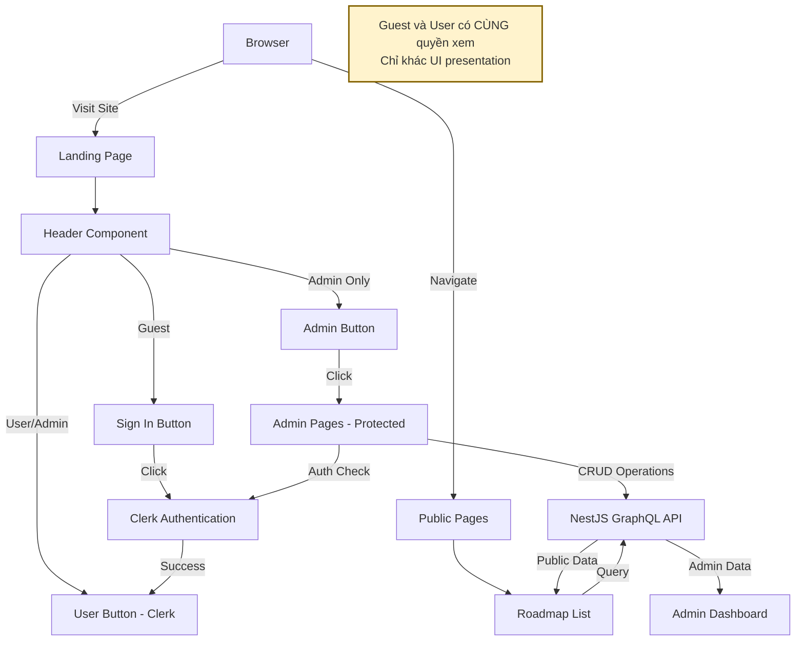
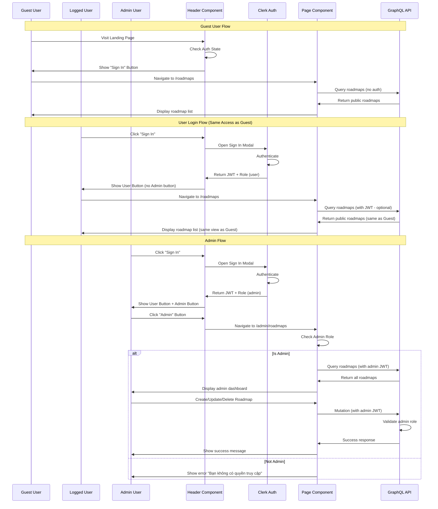
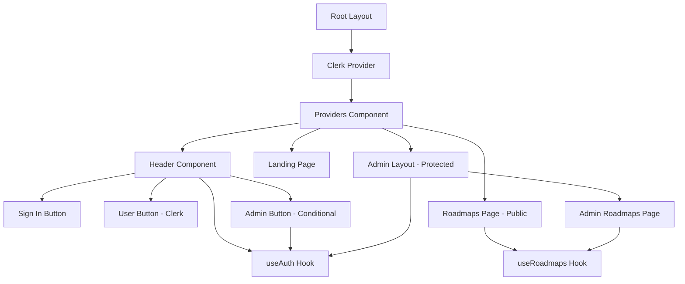
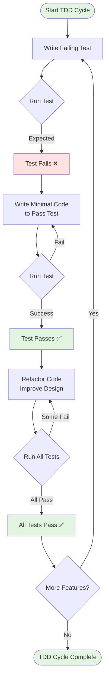
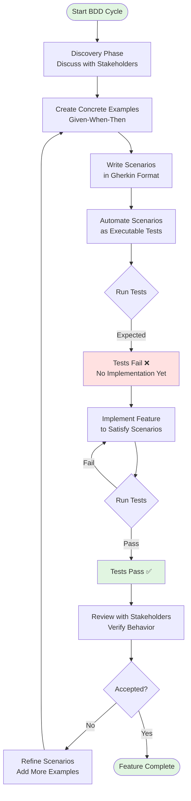

# Tài liệu Thiết kế - Frontend User Access Logic và RBAC Integration

## Tổng quan

Tài liệu này mô tả việc triển khai logic truy cập người dùng và tích hợp RBAC (Role-Based Access Control) cho frontend của VizTechStack. Hệ thống sẽ hỗ trợ 3 loại người dùng: Guest (khách), User (người dùng đã đăng nhập), và Admin (quản trị viên).

**QUAN TRỌNG - Làm rõ về User Types:**

Hệ thống thực tế chỉ có **2 cấp độ quyền truy cập**:

1. **Guest/User (cùng quyền - chỉ xem)**: 
   - Guest: Chưa đăng nhập
   - User: Đã đăng nhập nhưng không phải admin
   - **Cả hai đều CHỈ có quyền XEM roadmaps (read-only)**
   - Không có sự khác biệt về tính năng giữa Guest và User
   - Sự khác biệt duy nhất: Guest thấy nút "Sign in", User thấy User button

2. **Admin (full quyền CRUD)**:
   - Đã đăng nhập với role "admin"
   - Có nút "Admin" ở header
   - Có thể tạo/sửa/xóa roadmaps

### Mục tiêu

- **User Authentication Flow**: Tích hợp Clerk authentication với landing page và header navigation
- **Role-Based UI Rendering**: Hiển thị UI elements dựa trên authentication state (Admin/Signed-in/Guest)
- **Admin Access Control**: Nút "Admin" trong header chỉ hiển thị cho Admin users
- **Public Roadmap Access**: Tất cả users (Guest và User) có quyền XEM roadmap như nhau (read-only)
- **Admin CRUD Operations**: Chỉ Admin có quyền Create, Read, Update, Delete roadmap
- **Guest/User Equivalence**: Guest và User có cùng quyền truy cập (chỉ xem), chỉ khác nhau về UI presentation
- **Type Safety**: Sử dụng TypeScript với strict type checking
- **Error Messages**: Tất cả error messages bằng tiếng Việt

### Phạm vi

**Frontend Implementation bao gồm:**
- Landing page với authentication flow
- Header component với conditional rendering (Admin button, Sign in button, User button)
- Public roadmap listing page (accessible by all users)
- Admin dashboard với CRUD interface (admin-only)
- Role-based route protection
- Custom hooks cho authentication và authorization
- Error handling với Vietnamese messages
- Responsive design với Tailwind CSS và shadcn/ui

**Backend đã có sẵn:**
- GraphQL API với queries: `roadmaps`, `roadmap(slug)` - public access
- GraphQL mutations: `createRoadmap`, `updateRoadmap`, `deleteRoadmap` - admin only
- Clerk JWT authentication với ClerkAuthGuard
- Role-based authorization với RolesGuard
- Convex database với roadmap schema

## Kiến trúc

### QUAN TRỌNG - Developer Guide: Guest vs User Access Rights

**Điểm quan trọng cần nhớ:**

Hệ thống có **2 cấp độ quyền truy cập thực sự**, không phải 3:

1. **Read-Only Access (Guest + User)**:
   - Guest: `isSignedIn === false`
   - User: `isSignedIn === true && isAdmin === false`
   - **Cả hai có CÙNG quyền truy cập**: Chỉ xem roadmaps (read-only)
   - **Không có sự khác biệt về tính năng**
   - **Sự khác biệt duy nhất**: UI presentation (Sign in button vs User button)

2. **Full CRUD Access (Admin)**:
   - Admin: `isSignedIn === true && isAdmin === true`
   - Có thể tạo/sửa/xóa roadmaps
   - Có nút "Admin" trong header

**Khi implement features:**
- ❌ KHÔNG tạo logic khác nhau cho Guest vs User
- ❌ KHÔNG kiểm tra `isUser` để quyết định quyền truy cập
- ✅ CHỈ kiểm tra `isAdmin` để quyết định quyền CRUD
- ✅ Sử dụng `isUser` CHỈ để render UI khác nhau (User button vs Sign in button)

**Ví dụ đúng:**
```typescript
// ✅ ĐÚNG: Kiểm tra admin cho CRUD operations
if (isAdmin) {
  return <CreateRoadmapButton />;
}

// ✅ ĐÚNG: Sử dụng isUser cho UI rendering
{isUser ? <UserButton /> : <SignInButton />}

// ❌ SAI: Không cần kiểm tra isUser cho access control
if (isUser) {
  return <ViewRoadmapButton />; // SAI - Guest cũng có thể xem
}

// ✅ ĐÚNG: Guest và User đều có thể xem
return <ViewRoadmapButton />; // Không cần kiểm tra auth
```

### Tổng quan Kiến trúc Frontend



**Lưu ý quan trọng**: Guest và User có CÙNG quyền xem roadmaps (read-only), chỉ khác nhau về UI presentation.

### Luồng Authentication và Authorization




### Component Architecture



### Routing Structure

```
/                           # Landing page (public)
├── Header
│   ├── Sign In Button      # Guest only (UI difference)
│   ├── User Button         # User + Admin (UI difference)
│   └── Admin Button        # Admin only (functional difference)
│
/roadmaps                   # Public roadmap list
│                           # Guest và User: CÙNG quyền (read-only)
│                           # Admin: Read + có thể vào /admin để CRUD
│
/admin                      # Admin section (protected - CRUD access)
└── /roadmaps               # Admin dashboard
    ├── /new                # Create roadmap form
    └── /[id]/edit          # Edit roadmap form
```

**Lưu ý quan trọng:**
- `/roadmaps`: Accessible by ALL (Guest, User, Admin) - read-only
- `/admin/*`: Accessible by Admin ONLY - CRUD operations
- Guest và User có CÙNG quyền truy cập `/roadmaps` (không có sự khác biệt)

### Cấu trúc Thư mục

```
apps/web/src/
├── app/
│   ├── layout.tsx                    # Root layout với ClerkProvider
│   ├── page.tsx                      # Landing page
│   ├── roadmaps/
│   │   └── page.tsx                  # NEW: Public roadmap list
│   └── admin/
│       ├── layout.tsx                # NEW: Admin layout với auth check
│       └── roadmaps/
│           ├── page.tsx              # NEW: Admin dashboard
│           ├── new/
│           │   └── page.tsx          # NEW: Create roadmap form
│           └── [id]/
│               └── edit/
│                   └── page.tsx      # NEW: Edit roadmap form
├── components/
│   ├── layout/
│   │   └── Header.tsx                # UPDATE: Add Admin Button + Roadmaps link
│   ├── auth/
│   │   ├── user-button-wrapper.tsx   # Existing
│   │   └── admin-button.tsx          # NEW: Admin navigation button
│   ├── roadmap/
│   │   ├── roadmap-list.tsx          # NEW: Public roadmap list
│   │   └── roadmap-card.tsx          # NEW: Roadmap preview card
│   └── admin/
│       ├── roadmap-table.tsx         # NEW: Admin roadmap table
│       ├── roadmap-form.tsx          # NEW: Create/Edit form
│       └── delete-roadmap-dialog.tsx # NEW: Delete confirmation
├── lib/
│   └── hooks/
│       ├── use-auth.ts               # NEW: Clerk auth hook với role check
│       └── use-roadmaps.ts           # NEW: Roadmap operations hook
└── features/
    └── roadmap/
        └── types.ts                  # NEW: TypeScript types
```

## Các Thành phần và Giao diện

### 1. Authentication Hook - useAuth

#### Interface Definition

```typescript
interface UseAuthReturn {
  isSignedIn: boolean;      // User đã đăng nhập hay chưa
  isAdmin: boolean;         // User có role admin không
  isUser: boolean;          // User có role user không (hoặc không có role)
                            // NOTE: isUser chỉ dùng để phân biệt UI rendering
                            // Guest và User có CÙNG quyền truy cập (read-only)
  userId: string | null;    // Clerk user ID
  role: string | null;      // User role từ Clerk metadata
  isLoading: boolean;       // Auth state đang loading
}
```

#### Preconditions
- Clerk SDK đã được khởi tạo trong ClerkProvider
- User metadata chứa field `role` với giá trị "admin" hoặc "user"
- Component sử dụng hook phải nằm trong ClerkProvider context

#### Postconditions
- Returns valid authentication state object
- `isAdmin === true` if and only if `role === "admin"`
- `isUser === true` if `role === "user"` or `role === null`
- **IMPORTANT**: `isUser` is for UI rendering only; Guest and User have identical access rights (read-only)
- `isLoading === false` when authentication state is fully loaded
- No side effects on Clerk state


### 2. Roadmap Operations Hook - useRoadmaps

#### Interface Definition

```typescript
interface UseRoadmapsReturn {
  roadmaps: Roadmap[];      // Danh sách roadmaps
  loading: boolean;         // Đang fetch data
  error: Error | null;      // Lỗi nếu có
  refetch: () => void;      // Hàm refetch data
}

interface Roadmap {
  id: string;
  slug: string;
  title: string;
  description: string;
  content: string;
  author: string;
  tags: string[];
  publishedAt: number;
  updatedAt: number;
  isPublished: boolean;
}
```

#### Preconditions
- GraphQL API endpoint is accessible
- Apollo Client is properly configured
- Query `roadmaps` exists in GraphQL schema

#### Postconditions
- Returns array of roadmaps when successful
- `loading === true` during data fetching
- `error !== null` when query fails
- `refetch()` triggers new query execution
- Data is cached in Apollo Client cache

### 3. Header Component với Role-Based Rendering

#### Component Structure

```typescript
interface HeaderProps {
  // No props needed - uses hooks internally
}

interface HeaderState {
  isSignedIn: boolean;
  isAdmin: boolean;
  isLoading: boolean;
}
```

#### Rendering Logic

```pascal
ALGORITHM renderHeader()
INPUT: None (uses useAuth hook)
OUTPUT: React component with conditional elements

BEGIN
  authState ← useAuth()
  
  // Render header container
  RENDER HeaderContainer
    RENDER Logo (link to "/")
    RENDER Navigation
      RENDER RoadmapsLink (link to "/roadmaps")
      
      // Conditional rendering based on auth state
      IF authState.isLoading THEN
        RENDER LoadingSpinner
      ELSE IF NOT authState.isSignedIn THEN
        RENDER SignInButton
      ELSE
        // User is signed in
        IF authState.isAdmin THEN
          RENDER AdminButton (link to "/admin/roadmaps")
        END IF
        RENDER UserButton (Clerk component)
      END IF
    END Navigation
  END HeaderContainer
END
```

#### Preconditions
- Component is rendered within ClerkProvider
- useAuth hook is available
- Clerk authentication is initialized

#### Postconditions
- Sign In button visible if and only if user is not signed in
- Admin button visible if and only if user is admin
- User button visible if and only if user is signed in
- All navigation links are functional
- No hydration mismatches between server and client


### 4. Admin Button Component

#### Component Structure

```typescript
interface AdminButtonProps {
  // No props needed - uses useAuth hook
}
```

#### Rendering Algorithm

```pascal
ALGORITHM renderAdminButton()
INPUT: None (uses useAuth hook)
OUTPUT: Admin button or null

BEGIN
  authState ← useAuth()
  
  // Early return if loading or not admin
  IF authState.isLoading OR NOT authState.isAdmin THEN
    RETURN null
  END IF
  
  // Render admin button
  RETURN Button
    icon ← Shield icon
    text ← "Admin"
    link ← "/admin/roadmaps"
    variant ← "outline"
    size ← "sm"
  END Button
END
```

#### Preconditions
- Component is rendered within ClerkProvider
- useAuth hook returns valid state
- User authentication is loaded

#### Postconditions
- Returns null if user is not admin
- Returns Button component if user is admin
- Button navigates to `/admin/roadmaps` when clicked
- No errors thrown during rendering

### 5. Public Roadmap List Page

#### Page Structure

```typescript
interface RoadmapsPageProps {
  // No props - server component
}
```

#### Data Flow Algorithm

```pascal
ALGORITHM displayRoadmapList()
INPUT: None
OUTPUT: Rendered page with roadmap list

BEGIN
  // Server Component - no auth required
  RENDER PageContainer
    RENDER PageHeader
      title ← "Technology Roadmaps"
      description ← "Explore curated learning paths for modern technologies"
    END PageHeader
    
    RENDER Suspense (fallback: LoadingSpinner)
      RENDER RoadmapListClient
    END Suspense
  END PageContainer
END

ALGORITHM RoadmapListClient()
INPUT: None (uses useRoadmaps hook)
OUTPUT: List of roadmap cards or error message

BEGIN
  roadmapsData ← useRoadmaps()
  
  IF roadmapsData.loading THEN
    RENDER LoadingSkeletons (6 cards)
    RETURN
  END IF
  
  IF roadmapsData.error THEN
    RENDER ErrorAlert
      message ← "Không thể tải danh sách roadmaps. Vui lòng thử lại sau."
    END ErrorAlert
    RETURN
  END IF
  
  IF roadmapsData.roadmaps.length = 0 THEN
    RENDER EmptyState
      message ← "Chưa có roadmap nào."
    END EmptyState
    RETURN
  END IF
  
  // Render roadmap grid
  RENDER Grid (3 columns on desktop, 2 on tablet, 1 on mobile)
    FOR EACH roadmap IN roadmapsData.roadmaps DO
      RENDER RoadmapCard(roadmap)
    END FOR
  END Grid
END
```

#### Preconditions
- GraphQL API is accessible
- Apollo Client is configured
- Roadmaps query is available

#### Postconditions
- Page renders successfully for all user types (Guest, User, Admin)
- Loading state shows skeleton cards
- Error state shows Vietnamese error message
- Empty state shows appropriate message
- Roadmap cards are clickable and navigate to detail page


### 6. Admin Layout với Authorization Check

#### Component Structure

```typescript
interface AdminLayoutProps {
  children: React.ReactNode;
}
```

#### Authorization Algorithm

```pascal
ALGORITHM protectAdminRoute(children)
INPUT: children (React components to render)
OUTPUT: Protected content or error message

BEGIN
  authState ← useAuth()
  router ← useRouter()
  
  // Check authentication status
  IF NOT authState.isLoading AND NOT authState.isSignedIn THEN
    router.push("/")
    RETURN null
  END IF
  
  // Show loading state
  IF authState.isLoading THEN
    RENDER LoadingContainer
      DISPLAY "Đang kiểm tra quyền truy cập..."
    END LoadingContainer
    RETURN
  END IF
  
  // Check admin authorization
  IF NOT authState.isAdmin THEN
    RENDER ErrorContainer
      DISPLAY Alert (variant: destructive)
        message ← "Bạn không có quyền truy cập trang này. Chỉ Admin mới có thể quản lý roadmaps."
      END Alert
    END ErrorContainer
    RETURN
  END IF
  
  // User is authenticated and authorized
  RENDER AdminContainer
    RENDER children
  END AdminContainer
END
```

#### Preconditions
- Component is rendered within ClerkProvider
- useAuth hook is available
- Next.js router is accessible
- User authentication state is available

#### Postconditions
- Redirects to "/" if user is not signed in
- Shows loading state while checking authentication
- Shows Vietnamese error message if user is not admin
- Renders children if user is admin
- No unauthorized access to admin routes

#### Loop Invariants
N/A (no loops in this component)

### 7. Admin Dashboard Page

#### Page Structure

```typescript
interface AdminRoadmapsPageProps {
  // No props - client component
}
```

#### Dashboard Rendering Algorithm

```pascal
ALGORITHM renderAdminDashboard()
INPUT: None
OUTPUT: Admin dashboard with roadmap management interface

BEGIN
  // Render dashboard header
  RENDER DashboardHeader
    RENDER Title
      text ← "Quản lý Roadmap"
      description ← "Tạo, chỉnh sửa và quản lý các technology roadmaps"
    END Title
    
    RENDER ActionButton
      icon ← Plus icon
      text ← "Tạo Roadmap Mới"
      link ← "/admin/roadmaps/new"
      variant ← "default"
    END ActionButton
  END DashboardHeader
  
  // Render roadmap table
  RENDER RoadmapTable
END
```

#### Preconditions
- User is authenticated as admin (enforced by AdminLayout)
- GraphQL API is accessible
- Apollo Client is configured

#### Postconditions
- Dashboard renders successfully
- "Create New Roadmap" button navigates to creation form
- RoadmapTable displays all roadmaps with CRUD actions
- All UI text is in Vietnamese


### 8. Roadmap Table Component

#### Component Structure

```typescript
interface RoadmapTableProps {
  // No props - uses useRoadmaps hook
}

interface RoadmapTableState {
  deleteDialogOpen: boolean;
  selectedRoadmap: Roadmap | null;
}
```

#### Table Rendering Algorithm

```pascal
ALGORITHM renderRoadmapTable()
INPUT: None (uses useRoadmaps hook)
OUTPUT: Table with roadmap list and action buttons

BEGIN
  roadmapsData ← useRoadmaps()
  deleteDialogOpen ← useState(false)
  selectedRoadmap ← useState(null)
  
  // Handle loading state
  IF roadmapsData.loading THEN
    RENDER LoadingMessage
      text ← "Đang tải danh sách roadmaps..."
    END LoadingMessage
    RETURN
  END IF
  
  // Handle error state
  IF roadmapsData.error THEN
    RENDER ErrorMessage
      text ← "Lỗi khi tải danh sách roadmaps: " + roadmapsData.error.message
    END ErrorMessage
    RETURN
  END IF
  
  // Handle empty state
  IF roadmapsData.roadmaps.length = 0 THEN
    RENDER EmptyState
      message ← "Chưa có roadmap nào được tạo."
      action ← Button (link to "/admin/roadmaps/new")
        text ← "Tạo roadmap đầu tiên"
      END action
    END EmptyState
    RETURN
  END IF
  
  // Render table with data
  RENDER Table
    RENDER TableHeader
      columns ← ["Tiêu đề", "Slug", "Tags", "Trạng thái", "Cập nhật", "Thao tác"]
    END TableHeader
    
    RENDER TableBody
      FOR EACH roadmap IN roadmapsData.roadmaps DO
        RENDER TableRow
          CELL title ← roadmap.title
          CELL slug ← roadmap.slug (monospace font)
          CELL tags ← renderTags(roadmap.tags, maxDisplay: 2)
          CELL status ← renderStatusBadge(roadmap.isPublished)
          CELL updatedAt ← formatDate(roadmap.updatedAt)
          CELL actions ← renderActionButtons(roadmap)
        END TableRow
      END FOR
    END TableBody
  END Table
  
  // Render delete confirmation dialog
  IF selectedRoadmap IS NOT NULL THEN
    RENDER DeleteRoadmapDialog
      roadmap ← selectedRoadmap
      open ← deleteDialogOpen
      onOpenChange ← setDeleteDialogOpen
    END DeleteRoadmapDialog
  END IF
END

FUNCTION renderActionButtons(roadmap)
INPUT: roadmap object
OUTPUT: Action button group

BEGIN
  RETURN ButtonGroup
    // View button
    BUTTON ViewButton
      icon ← Eye icon
      link ← "/roadmaps/" + roadmap.slug
      target ← "_blank"
      tooltip ← "Xem roadmap"
    END BUTTON
    
    // Edit button
    BUTTON EditButton
      icon ← Pencil icon
      link ← "/admin/roadmaps/" + roadmap.id + "/edit"
      tooltip ← "Chỉnh sửa"
    END BUTTON
    
    // Delete button
    BUTTON DeleteButton
      icon ← Trash2 icon (red color)
      onClick ← handleDeleteClick(roadmap)
      tooltip ← "Xóa"
    END BUTTON
  END ButtonGroup
END

FUNCTION renderStatusBadge(isPublished)
INPUT: isPublished boolean
OUTPUT: Status badge component

BEGIN
  IF isPublished THEN
    RETURN Badge
      variant ← "default"
      text ← "Đã xuất bản"
    END Badge
  ELSE
    RETURN Badge
      variant ← "secondary"
      text ← "Bản nháp"
    END Badge
  END IF
END
```

#### Preconditions
- Component is rendered within admin layout (admin-only access)
- useRoadmaps hook is available
- GraphQL API is accessible
- All action routes exist

#### Postconditions
- Table displays all roadmaps with correct data
- Loading state shows Vietnamese message
- Error state shows Vietnamese error message
- Empty state shows Vietnamese message with action button
- View button opens roadmap in new tab
- Edit button navigates to edit form
- Delete button opens confirmation dialog
- Status badge shows correct Vietnamese text

#### Loop Invariants
- For each roadmap in the list, all table cells are rendered correctly
- All action buttons are functional and properly linked
- No duplicate roadmap rows are rendered


## Algorithmic Pseudocode

### Main Authentication Flow

```pascal
ALGORITHM authenticateUser()
INPUT: None (triggered by user action)
OUTPUT: Authenticated user state with role

BEGIN
  // User clicks "Sign In" button
  TRIGGER ClerkSignInModal
  
  // Clerk handles authentication
  user ← ClerkAuthenticate()
  
  IF user IS NULL THEN
    DISPLAY "Đăng nhập thất bại. Vui lòng thử lại."
    RETURN null
  END IF
  
  // Extract role from user metadata
  role ← user.publicMetadata.role
  
  IF role IS NULL OR role IS UNDEFINED THEN
    role ← "user"  // Default role
  END IF
  
  // Update application state
  authState ← {
    isSignedIn: true,
    isAdmin: (role = "admin"),
    isUser: (role = "user" OR role IS NULL),
    userId: user.id,
    role: role,
    isLoading: false
  }
  
  // Trigger UI updates
  NOTIFY HeaderComponent(authState)
  
  RETURN authState
END
```

**Preconditions:**
- Clerk SDK is initialized
- User has valid credentials
- Network connection is available

**Postconditions:**
- User is authenticated with Clerk
- Role is extracted from metadata or defaults to "user"
- Application state is updated with auth information
- UI components re-render with new auth state

**Loop Invariants:** N/A (no loops)

### Role-Based Route Protection

```pascal
ALGORITHM protectRoute(route, requiredRole)
INPUT: route (string), requiredRole (string)
OUTPUT: boolean (allow access or not)

BEGIN
  authState ← useAuth()
  
  // Check if authentication is still loading
  IF authState.isLoading THEN
    DISPLAY LoadingSpinner
    RETURN false
  END IF
  
  // Check if user is signed in
  IF NOT authState.isSignedIn THEN
    REDIRECT_TO "/"
    DISPLAY "Vui lòng đăng nhập để tiếp tục."
    RETURN false
  END IF
  
  // Check role authorization
  IF requiredRole = "admin" AND NOT authState.isAdmin THEN
    DISPLAY "Bạn không có quyền truy cập trang này. Chỉ Admin mới có thể quản lý roadmaps."
    RETURN false
  END IF
  
  // User is authorized
  RETURN true
END
```

**Preconditions:**
- route parameter is a valid route string
- requiredRole is either "admin", "user", or null
- useAuth hook is available
- Clerk authentication is initialized

**Postconditions:**
- Returns true if and only if user has required role
- Redirects to home page if user is not signed in
- Shows Vietnamese error message if user lacks required role
- Loading state is displayed while checking authentication

**Loop Invariants:** N/A (no loops)

### Roadmap List Fetching

```pascal
ALGORITHM fetchRoadmaps()
INPUT: None
OUTPUT: Array of roadmap objects or error

BEGIN
  loading ← true
  error ← null
  roadmaps ← []
  
  TRY
    // Query GraphQL API
    response ← GraphQLQuery("roadmaps")
    
    IF response.errors IS NOT NULL THEN
      THROW Error(response.errors[0].message)
    END IF
    
    roadmaps ← response.data.roadmaps
    
    // Validate data structure
    FOR EACH roadmap IN roadmaps DO
      ASSERT roadmap.id IS NOT NULL
      ASSERT roadmap.slug IS NOT NULL
      ASSERT roadmap.title IS NOT NULL
    END FOR
    
    loading ← false
    RETURN roadmaps
    
  CATCH error
    loading ← false
    error ← "Không thể tải danh sách roadmaps. Vui lòng thử lại sau."
    RETURN []
  END TRY
END
```

**Preconditions:**
- GraphQL API endpoint is accessible
- Apollo Client is configured
- Network connection is available
- Query "roadmaps" exists in GraphQL schema

**Postconditions:**
- Returns array of valid roadmap objects when successful
- Returns empty array when query fails
- loading flag is set to false after completion
- error message is in Vietnamese when error occurs
- All returned roadmaps have required fields (id, slug, title)

**Loop Invariants:**
- All previously validated roadmaps have required fields
- Validation state remains consistent throughout iteration


### Admin CRUD Operations

```pascal
ALGORITHM createRoadmap(input)
INPUT: input (CreateRoadmapInput object)
OUTPUT: Created roadmap object or error

BEGIN
  ASSERT input.slug IS NOT NULL AND input.slug ≠ ""
  ASSERT input.title IS NOT NULL AND input.title ≠ ""
  ASSERT input.description IS NOT NULL
  ASSERT input.content IS NOT NULL
  
  loading ← true
  error ← null
  
  TRY
    // Validate user is admin
    authState ← useAuth()
    IF NOT authState.isAdmin THEN
      THROW Error("Bạn không có quyền tạo roadmap.")
    END IF
    
    // Send mutation to API
    response ← GraphQLMutation("createRoadmap", { input })
    
    IF response.errors IS NOT NULL THEN
      errorMessage ← response.errors[0].message
      THROW Error(errorMessage)
    END IF
    
    createdRoadmap ← response.data.createRoadmap
    
    // Refetch roadmap list to update cache
    REFETCH_QUERY("roadmaps")
    
    // Navigate to admin dashboard
    NAVIGATE_TO "/admin/roadmaps"
    
    // Show success message
    DISPLAY "Roadmap đã được tạo thành công!"
    
    loading ← false
    RETURN createdRoadmap
    
  CATCH error
    loading ← false
    error ← "Không thể tạo roadmap. " + error.message
    DISPLAY error
    RETURN null
  END TRY
END
```

**Preconditions:**
- input object has all required fields (slug, title, description, content)
- User is authenticated as admin
- GraphQL API is accessible
- Mutation "createRoadmap" exists in schema

**Postconditions:**
- Returns created roadmap object when successful
- Returns null when mutation fails
- Roadmap list cache is updated
- User is navigated to admin dashboard on success
- Vietnamese success/error message is displayed
- loading flag is set to false after completion

**Loop Invariants:** N/A (no loops)

```pascal
ALGORITHM updateRoadmap(input)
INPUT: input (UpdateRoadmapInput object with id)
OUTPUT: Updated roadmap object or error

BEGIN
  ASSERT input.id IS NOT NULL AND input.id ≠ ""
  
  loading ← true
  error ← null
  
  TRY
    // Validate user is admin
    authState ← useAuth()
    IF NOT authState.isAdmin THEN
      THROW Error("Bạn không có quyền chỉnh sửa roadmap.")
    END IF
    
    // Send mutation to API
    response ← GraphQLMutation("updateRoadmap", { input })
    
    IF response.errors IS NOT NULL THEN
      errorMessage ← response.errors[0].message
      THROW Error(errorMessage)
    END IF
    
    updatedRoadmap ← response.data.updateRoadmap
    
    // Refetch roadmap list to update cache
    REFETCH_QUERY("roadmaps")
    
    // Navigate to admin dashboard
    NAVIGATE_TO "/admin/roadmaps"
    
    // Show success message
    DISPLAY "Roadmap đã được cập nhật thành công!"
    
    loading ← false
    RETURN updatedRoadmap
    
  CATCH error
    loading ← false
    error ← "Không thể cập nhật roadmap. " + error.message
    DISPLAY error
    RETURN null
  END TRY
END
```

**Preconditions:**
- input.id is a valid roadmap ID
- User is authenticated as admin
- GraphQL API is accessible
- Mutation "updateRoadmap" exists in schema
- Roadmap with given ID exists in database

**Postconditions:**
- Returns updated roadmap object when successful
- Returns null when mutation fails
- Roadmap list cache is updated
- User is navigated to admin dashboard on success
- Vietnamese success/error message is displayed
- loading flag is set to false after completion

**Loop Invariants:** N/A (no loops)

```pascal
ALGORITHM deleteRoadmap(id)
INPUT: id (string - roadmap ID)
OUTPUT: Deleted roadmap object or error

BEGIN
  ASSERT id IS NOT NULL AND id ≠ ""
  
  loading ← true
  error ← null
  
  TRY
    // Validate user is admin
    authState ← useAuth()
    IF NOT authState.isAdmin THEN
      THROW Error("Bạn không có quyền xóa roadmap.")
    END IF
    
    // Confirm deletion with user
    confirmed ← SHOW_CONFIRMATION_DIALOG(
      title: "Xóa Roadmap",
      message: "Bạn có chắc chắn muốn xóa roadmap này? Hành động này không thể hoàn tác."
    )
    
    IF NOT confirmed THEN
      loading ← false
      RETURN null
    END IF
    
    // Send mutation to API
    response ← GraphQLMutation("deleteRoadmap", { id })
    
    IF response.errors IS NOT NULL THEN
      errorMessage ← response.errors[0].message
      THROW Error(errorMessage)
    END IF
    
    deletedRoadmap ← response.data.deleteRoadmap
    
    // Refetch roadmap list to update cache
    REFETCH_QUERY("roadmaps")
    
    // Show success message
    DISPLAY "Roadmap đã được xóa thành công!"
    
    loading ← false
    RETURN deletedRoadmap
    
  CATCH error
    loading ← false
    error ← "Không thể xóa roadmap. " + error.message
    DISPLAY error
    RETURN null
  END TRY
END
```

**Preconditions:**
- id is a valid roadmap ID
- User is authenticated as admin
- GraphQL API is accessible
- Mutation "deleteRoadmap" exists in schema
- Roadmap with given ID exists in database

**Postconditions:**
- Returns deleted roadmap object when successful
- Returns null when mutation fails or user cancels
- Roadmap list cache is updated on success
- Vietnamese confirmation dialog is shown before deletion
- Vietnamese success/error message is displayed
- loading flag is set to false after completion

**Loop Invariants:** N/A (no loops)


## Key Functions with Formal Specifications

### Function 1: useAuth()

```typescript
function useAuth(): UseAuthReturn
```

**Preconditions:**
- Component calling this hook is wrapped in ClerkProvider
- Clerk SDK is initialized
- User metadata schema includes optional `role` field

**Postconditions:**
- Returns valid UseAuthReturn object
- `isSignedIn === true` if and only if Clerk user exists
- `isAdmin === true` if and only if `role === "admin"`
- `isUser === true` if `role === "user"` OR `role` is null/undefined
- **IMPORTANT**: `isUser` is for UI rendering only; Guest and User have identical functional access (read-only)
- `isLoading === false` when Clerk auth state is fully loaded
- `userId` is non-null string when user is signed in
- No side effects on Clerk authentication state

**Loop Invariants:** N/A (no loops)

### Function 2: useRoadmaps()

```typescript
function useRoadmaps(): UseRoadmapsReturn
```

**Preconditions:**
- Apollo Client is configured and available
- GraphQL endpoint is accessible
- Query `roadmaps` exists in GraphQL schema

**Postconditions:**
- Returns valid UseRoadmapsReturn object
- `loading === true` during initial fetch and refetch operations
- `error !== null` if and only if GraphQL query fails
- `roadmaps` is empty array when loading or on error
- `roadmaps` contains valid Roadmap objects when query succeeds
- `refetch()` function triggers new query execution
- Data is cached in Apollo Client cache

**Loop Invariants:** N/A (no loops in hook itself)

### Function 3: protectAdminRoute()

```typescript
function protectAdminRoute(children: React.ReactNode): React.ReactNode | null
```

**Preconditions:**
- Component is rendered within ClerkProvider
- useAuth hook is available
- Next.js router is accessible
- children is valid React node

**Postconditions:**
- Returns null if user is not signed in (after redirect)
- Returns loading UI if authentication is still loading
- Returns error UI with Vietnamese message if user is not admin
- Returns children wrapped in container if user is admin
- Redirects to "/" if user is not signed in
- No unauthorized access to protected content

**Loop Invariants:** N/A (no loops)

### Function 4: handleDeleteRoadmap()

```typescript
function handleDeleteRoadmap(id: string): Promise<Roadmap | null>
```

**Preconditions:**
- id is non-empty string
- User is authenticated as admin
- GraphQL API is accessible
- Roadmap with given id exists in database
- Delete mutation is available in schema

**Postconditions:**
- Returns deleted Roadmap object on success
- Returns null if user cancels or operation fails
- Shows Vietnamese confirmation dialog before deletion
- Updates Apollo Client cache on success
- Shows Vietnamese success message on success
- Shows Vietnamese error message on failure
- No partial deletions (atomic operation)

**Loop Invariants:** N/A (no loops)

### Function 5: renderConditionalUI()

```typescript
function renderConditionalUI(authState: UseAuthReturn): React.ReactNode
```

**Preconditions:**
- authState is valid UseAuthReturn object
- All UI components are available
- Component is rendered on client side

**Postconditions:**
- Returns Sign In button if and only if `authState.isSignedIn === false`
- Returns Admin button if and only if `authState.isAdmin === true`
- Returns User button if and only if `authState.isSignedIn === true`
- Returns loading spinner if `authState.isLoading === true`
- No hydration mismatches between server and client
- All buttons are functional and properly linked

**Loop Invariants:** N/A (no loops)


## Example Usage

### Example 1: Guest User Viewing Roadmaps (Read-Only Access)

```typescript
// Guest visits landing page
// URL: /

// Header renders with Sign In button
<Header>
  <Logo href="/" />
  <Navigation>
    <Link href="/roadmaps">Roadmaps</Link>
    <SignInButton>Sign in</SignInButton>
  </Navigation>
</Header>

// Guest navigates to /roadmaps
// Public roadmap list is accessible without authentication
// Guest has READ-ONLY access (same as signed-in User)

<RoadmapsPage>
  <RoadmapList>
    {roadmaps.map(roadmap => (
      <RoadmapCard key={roadmap.id} roadmap={roadmap} />
    ))}
  </RoadmapList>
</RoadmapsPage>

// Guest can view roadmap details (read-only)
// URL: /roadmaps/react-developer-roadmap
<RoadmapDetailPage slug="react-developer-roadmap" />
```

### Example 2: User Login and Access (Same Read-Only Access as Guest)

```typescript
// User clicks "Sign In" button
const handleSignIn = async () => {
  // Clerk modal opens
  const user = await clerk.signIn();
  
  // User authenticates successfully
  // Role: "user" (or null, defaults to user)
  
  // Header updates automatically
  const authState = useAuth();
  // authState = {
  //   isSignedIn: true,
  //   isAdmin: false,
  //   isUser: true,  // For UI rendering only
  //   userId: "user_123",
  //   role: "user",
  //   isLoading: false
  // }
};

// Header now shows User Button (no Admin button)
// This is the ONLY difference from Guest - UI presentation
<Header>
  <Logo href="/" />
  <Navigation>
    <Link href="/roadmaps">Roadmaps</Link>
    <UserButton /> {/* Clerk component */}
  </Navigation>
</Header>

// User can view roadmaps (SAME access as Guest - read-only)
// User CANNOT access /admin routes (same as Guest)
// User CANNOT create/edit/delete roadmaps (same as Guest)
// The ONLY difference: User sees User Button instead of Sign In button
```

### Example 3: Admin Login and Full Access

```typescript
// Admin clicks "Sign In" button
const handleAdminSignIn = async () => {
  // Clerk modal opens
  const user = await clerk.signIn();
  
  // Admin authenticates successfully
  // Role: "admin" (from Clerk metadata)
  
  // Header updates with Admin button
  const authState = useAuth();
  // authState = {
  //   isSignedIn: true,
  //   isAdmin: true,
  //   isUser: false,
  //   userId: "user_456",
  //   role: "admin",
  //   isLoading: false
  // }
};

// Header shows both Admin button and User button
<Header>
  <Logo href="/" />
  <Navigation>
    <Link href="/roadmaps">Roadmaps</Link>
    <AdminButton href="/admin/roadmaps">
      <Shield className="mr-2 h-4 w-4" />
      Admin
    </AdminButton>
    <UserButton />
  </Navigation>
</Header>

// Admin clicks "Admin" button
// Navigates to /admin/roadmaps

<AdminLayout>
  <AdminRoadmapsPage>
    <DashboardHeader>
      <h1>Quản lý Roadmap</h1>
      <Button href="/admin/roadmaps/new">
        <Plus className="mr-2 h-4 w-4" />
        Tạo Roadmap Mới
      </Button>
    </DashboardHeader>
    
    <RoadmapTable>
      {roadmaps.map(roadmap => (
        <TableRow key={roadmap.id}>
          <TableCell>{roadmap.title}</TableCell>
          <TableCell>{roadmap.slug}</TableCell>
          <TableCell>
            <Badge>{roadmap.isPublished ? "Đã xuất bản" : "Bản nháp"}</Badge>
          </TableCell>
          <TableCell>
            <Button href={`/roadmaps/${roadmap.slug}`} target="_blank">
              <Eye className="h-4 w-4" />
            </Button>
            <Button href={`/admin/roadmaps/${roadmap.id}/edit`}>
              <Pencil className="h-4 w-4" />
            </Button>
            <Button onClick={() => handleDelete(roadmap.id)}>
              <Trash2 className="h-4 w-4 text-red-600" />
            </Button>
          </TableCell>
        </TableRow>
      ))}
    </RoadmapTable>
  </AdminRoadmapsPage>
</AdminLayout>
```

### Example 4: Admin Creating New Roadmap

```typescript
// Admin navigates to /admin/roadmaps/new
const handleCreateRoadmap = async (formData: RoadmapFormData) => {
  const input: CreateRoadmapInput = {
    slug: formData.slug,
    title: formData.title,
    description: formData.description,
    content: formData.content,
    tags: formData.tags.split(',').map(tag => tag.trim()),
    isPublished: formData.isPublished,
  };
  
  try {
    const result = await createRoadmap(input);
    
    if (result) {
      // Success - navigates to /admin/roadmaps
      // Shows toast: "Roadmap đã được tạo thành công!"
    }
  } catch (error) {
    // Error handling
    // Shows toast: "Không thể tạo roadmap. [error message]"
  }
};

<RoadmapForm onSubmit={handleCreateRoadmap}>
  <FormField name="title" label="Tiêu đề" required />
  <FormField name="slug" label="Slug" required />
  <FormField name="description" label="Mô tả" required />
  <FormField name="content" label="Nội dung" type="textarea" required />
  <FormField name="tags" label="Tags (phân cách bằng dấu phẩy)" />
  <FormField name="isPublished" label="Xuất bản ngay" type="checkbox" />
  
  <Button type="submit">Tạo Roadmap</Button>
  <Button type="button" variant="outline" href="/admin/roadmaps">
    Hủy
  </Button>
</RoadmapForm>
```

### Example 5: Unauthorized Access Attempt

```typescript
// Regular user tries to access /admin/roadmaps
// URL: /admin/roadmaps

<AdminLayout>
  {/* AdminLayout checks authorization */}
  {(() => {
    const authState = useAuth();
    
    if (!authState.isSignedIn) {
      // Redirect to home
      router.push("/");
      return null;
    }
    
    if (!authState.isAdmin) {
      // Show error message
      return (
        <Alert variant="destructive">
          <AlertDescription>
            Bạn không có quyền truy cập trang này. 
            Chỉ Admin mới có thể quản lý roadmaps.
          </AlertDescription>
        </Alert>
      );
    }
    
    // This code never executes for non-admin users
    return <AdminRoadmapsPage />;
  })()}
</AdminLayout>
```


## Correctness Properties

*A property is a characteristic or behavior that should hold true across all valid executions of a system—essentially, a formal statement about what the system should do. Properties serve as the bridge between human-readable specifications and machine-verifiable correctness guarantees.*

### Property 1: Authentication State Consistency

*For any* authentication state returned by useAuth hook, if a user is an admin then they must be signed in, if a user is a regular user then they must be signed in, admin and user roles are mutually exclusive, and if a user is not signed in then they have no roles.

**IMPORTANT**: Guest (not signed in) and User (signed in, non-admin) have identical access rights (read-only). The `isUser` flag is for UI rendering only.

**Validates: Requirements 1.2, 1.3, 1.4**

### Property 2: useAuth Hook Return Structure

*For any* call to useAuth hook, the returned object must contain all required fields: isSignedIn, isAdmin, isUser, userId, role, and isLoading.

**Validates: Requirement 1.1**

### Property 3: Route Protection Invariant

*For any* admin route, a user can access that route if and only if they are signed in AND have admin role.

**Validates: Requirements 5.1, 5.3, 5.4, 6.5**

### Property 4: Admin Button Visibility

*For any* non-admin user (guest or regular user), the AdminButton component should return null and not render.

**Validates: Requirement 3.1**

### Property 5: Roadmaps Link Visibility

*For any* user type (guest, user, or admin), the Header component should display the "Roadmaps" link.

**Validates: Requirement 2.2**

### Property 6: Public Roadmap Access

*For any* user type (guest, user, or admin), the Roadmaps page should be accessible without requiring authentication. Guest and User have identical read-only access to roadmaps.

**Validates: Requirement 4.1**

### Property 7: Role Extraction from Metadata

*For any* user with Clerk metadata containing a role field, the useAuth hook should correctly extract and return that role value.

**Validates: Requirement 12.4**

### Property 8: Error Message Language

*For any* error message displayed to users, the message language must be Vietnamese.

**Validates: Requirements 7.1, 7.2, 7.3, 7.4, 7.5, 7.6, 7.7, 7.8, 7.9**

### Property 9: UI Element Visibility Based on Auth State

*For any* user, the Sign In button is visible if and only if the user is not signed in, the User button is visible if and only if the user is signed in, and the Admin button is visible if and only if the user is signed in AND is an admin.

**Validates: Requirements 2.3, 2.4, 2.5, 3.1**

### Property 10: CRUD Operation Authorization

*For any* CRUD operation (create, update, delete) on roadmaps, only admin users can perform the operation. For read operations, all users (Guest and User) can perform the operation with identical access rights.

**IMPORTANT**: Guest and User have the same read-only access. There is no functional difference between Guest and User for viewing roadmaps.

**Validates: Requirement 15.1**


## Error Handling

### Error Scenario 1: Unauthenticated Access to Admin Routes

**Condition**: User is not signed in and tries to access `/admin/*` routes

**Response**: 
- AdminLayout component detects `isSignedIn === false`
- Redirects user to home page `/`
- No error message displayed (silent redirect)

**Recovery**: User can sign in from home page and retry access

### Error Scenario 2: Unauthorized Access (Non-Admin User)

**Condition**: User is signed in but does not have admin role

**Response**:
- AdminLayout component detects `isAdmin === false`
- Displays error alert with Vietnamese message:
  ```
  "Bạn không có quyền truy cập trang này. Chỉ Admin mới có thể quản lý roadmaps."
  ```
- User remains on the page but sees error instead of content

**Recovery**: User must contact administrator to get admin role assigned

### Error Scenario 3: GraphQL Query Failure

**Condition**: Network error or API unavailable when fetching roadmaps

**Response**:
- useRoadmaps hook sets `error` state
- Component displays error alert with Vietnamese message:
  ```
  "Không thể tải danh sách roadmaps. Vui lòng thử lại sau."
  ```
- Loading state is set to false
- Empty array returned for roadmaps

**Recovery**: 
- User can refresh the page
- Component can call `refetch()` function
- Automatic retry with exponential backoff (Apollo Client default)

### Error Scenario 4: GraphQL Mutation Failure (Create/Update/Delete)

**Condition**: Mutation fails due to validation error, network error, or server error

**Response**:
- Mutation hook catches error
- Displays toast notification with Vietnamese error message:
  ```
  "Không thể [tạo/cập nhật/xóa] roadmap. [error details]"
  ```
- Form remains open with user's input preserved
- Loading state is set to false

**Recovery**:
- User can correct validation errors and retry
- User can refresh page and try again
- User can cancel and return to dashboard

### Error Scenario 5: Invalid Form Input

**Condition**: User submits form with missing required fields or invalid data

**Response**:
- Form validation catches errors before submission
- Displays field-level error messages in Vietnamese:
  ```
  "Tiêu đề là bắt buộc"
  "Slug phải là chữ thường và dấu gạch ngang"
  "Nội dung không được để trống"
  ```
- Submit button remains enabled
- No API call is made

**Recovery**: User corrects the invalid fields and resubmits

### Error Scenario 6: Clerk Authentication Failure

**Condition**: Clerk sign-in fails due to invalid credentials or network error

**Response**:
- Clerk modal displays error message
- User remains on current page
- Authentication state remains unchanged (`isSignedIn === false`)

**Recovery**: 
- User can retry sign-in with correct credentials
- User can use password reset if needed
- User can close modal and continue as guest

### Error Scenario 7: Token Expiration

**Condition**: User's JWT token expires during session

**Response**:
- Apollo Client error link detects 401 Unauthorized
- Clerk automatically attempts to refresh token
- If refresh fails, user is signed out
- Redirect to home page with sign-in prompt

**Recovery**: User signs in again to get new token

### Error Scenario 8: Concurrent Deletion

**Condition**: Admin tries to edit/delete a roadmap that was already deleted by another admin

**Response**:
- API returns 404 Not Found error
- Displays Vietnamese error message:
  ```
  "Roadmap không tồn tại hoặc đã bị xóa."
  ```
- Refetches roadmap list to update UI
- Redirects to admin dashboard

**Recovery**: 
- Roadmap list is automatically updated
- Admin can see current state of all roadmaps


## Testing Strategy

### Test-Driven Development (TDD) Flow



**TDD Workflow cho Feature này:**

1. **Red Phase (Write Failing Test)**:
   ```typescript
   // Example: Test useAuth hook
   it('should return isAdmin true for admin user', () => {
     // Test fails because useAuth doesn't exist yet
     const { result } = renderHook(() => useAuth());
     expect(result.current.isAdmin).toBe(true);
   });
   ```

2. **Green Phase (Write Minimal Code)**:
   ```typescript
   // Write just enough code to pass the test
   export function useAuth() {
     return { isAdmin: true }; // Hardcoded for now
   }
   ```

3. **Refactor Phase (Improve Design)**:
   ```typescript
   // Refactor to proper implementation
   export function useAuth() {
     const { user } = useUser();
     const role = user?.publicMetadata?.role;
     return { isAdmin: role === 'admin' };
   }
   ```

### Behavior-Driven Development (BDD) Flow



**BDD Scenarios cho Feature này:**

```gherkin
Feature: User Access Control
  As a system administrator
  I want to control user access based on roles
  So that only authorized users can perform certain actions

  Scenario: Guest user views roadmaps
    Given I am not signed in
    When I visit the roadmaps page
    Then I should see the list of roadmaps
    And I should see a "Sign in" button in the header
    And I should NOT see an "Admin" button

  Scenario: Regular user views roadmaps
    Given I am signed in as a regular user
    When I visit the roadmaps page
    Then I should see the list of roadmaps
    And I should see my user button in the header
    And I should NOT see an "Admin" button

  Scenario: Admin user accesses admin dashboard
    Given I am signed in as an admin
    When I click the "Admin" button in the header
    Then I should be navigated to "/admin/roadmaps"
    And I should see the admin dashboard
    And I should see a "Create New Roadmap" button

  Scenario: Regular user attempts to access admin dashboard
    Given I am signed in as a regular user
    When I manually navigate to "/admin/roadmaps"
    Then I should see an error message in Vietnamese
    And the message should say "Bạn không có quyền truy cập trang này"
    And I should NOT see the admin dashboard

  Scenario: Admin creates a new roadmap
    Given I am signed in as an admin
    And I am on the admin dashboard
    When I click "Create New Roadmap"
    And I fill in the roadmap form with valid data
    And I click "Create"
    Then I should see a success message "Roadmap đã được tạo thành công!"
    And I should be redirected to the admin dashboard
    And the new roadmap should appear in the list
```

**BDD Implementation Example:**

```typescript
// Step definitions for BDD scenarios
import { Given, When, Then } from '@cucumber/cucumber';

Given('I am not signed in', async function() {
  // Mock Clerk to return no user
  mockClerkUser(null);
});

Given('I am signed in as a regular user', async function() {
  // Mock Clerk to return user with role "user"
  mockClerkUser({ id: 'user_123', publicMetadata: { role: 'user' } });
});

Given('I am signed in as an admin', async function() {
  // Mock Clerk to return user with role "admin"
  mockClerkUser({ id: 'admin_123', publicMetadata: { role: 'admin' } });
});

When('I visit the roadmaps page', async function() {
  await page.goto('/roadmaps');
});

Then('I should see the list of roadmaps', async function() {
  const roadmapList = await page.locator('[data-testid="roadmap-list"]');
  expect(roadmapList).toBeVisible();
});

Then('I should see a {string} button in the header', async function(buttonText) {
  const button = await page.locator(`button:has-text("${buttonText}")`);
  expect(button).toBeVisible();
});

Then('I should NOT see an {string} button', async function(buttonText) {
  const button = await page.locator(`button:has-text("${buttonText}")`);
  expect(button).not.toBeVisible();
});
```

### TDD vs BDD: When to Use

**Use TDD when:**
- Writing low-level utility functions (e.g., `useAuth` hook)
- Implementing algorithms or data transformations
- Building reusable components with clear inputs/outputs
- Refactoring existing code
- You know the technical implementation details

**Use BDD when:**
- Defining user-facing features (e.g., admin access control)
- Collaborating with non-technical stakeholders
- Documenting expected behavior in plain language
- Ensuring business requirements are met
- You need to validate the "why" before the "how"

**Combined Approach for this Feature:**

1. **BDD for high-level features**:
   - User authentication flow
   - Admin access control
   - Public roadmap access

2. **TDD for implementation details**:
   - `useAuth` hook logic
   - `AdminLayout` authorization checks
   - Form validation
   - Error handling

### Unit Testing Approach

**Test Coverage Goals:**
- 80%+ code coverage for all custom hooks
- 90%+ coverage for authentication and authorization logic
- 100% coverage for error handling paths

**Key Test Cases:**

1. **useAuth Hook Tests**
   - Returns correct state when user is not signed in
   - Returns correct state when user is signed in as regular user
   - Returns correct state when user is signed in as admin
   - Handles loading state correctly
   - Defaults to "user" role when role metadata is missing

2. **useRoadmaps Hook Tests**
   - Fetches roadmaps successfully
   - Handles loading state
   - Handles error state with Vietnamese message
   - Refetch function works correctly
   - Cache is updated after mutations

3. **AdminLayout Component Tests**
   - Redirects unauthenticated users to home page
   - Shows error message for non-admin users (Vietnamese)
   - Renders children for admin users
   - Shows loading state while checking authentication

4. **Header Component Tests**
   - Shows Sign In button for guests
   - Shows User button for signed-in users
   - Shows Admin button only for admin users
   - Roadmaps link is always visible
   - No hydration mismatches

5. **RoadmapTable Component Tests**
   - Renders roadmap list correctly
   - Shows loading state with Vietnamese message
   - Shows error state with Vietnamese message
   - Shows empty state with Vietnamese message
   - Action buttons navigate to correct routes
   - Delete button opens confirmation dialog

**Testing Tools:**
- Jest 30.0.0 for test runner
- React Testing Library for component testing
- Mock Service Worker (MSW) for API mocking
- @testing-library/user-event for user interactions

### Property-Based Testing Approach

**Property Test Library**: fast-check (JavaScript/TypeScript property-based testing)

**Properties to Test:**

1. **Authentication State Properties**
   ```typescript
   // Property: Admin users are always signed in
   fc.assert(
     fc.property(fc.record({
       isSignedIn: fc.boolean(),
       isAdmin: fc.boolean(),
       isUser: fc.boolean(),
     }), (authState) => {
       if (authState.isAdmin) {
         return authState.isSignedIn === true;
       }
       return true;
     })
   );
   ```

2. **Role Exclusivity Property**
   ```typescript
   // Property: User cannot be both admin and regular user
   fc.assert(
     fc.property(fc.record({
       isAdmin: fc.boolean(),
       isUser: fc.boolean(),
     }), (authState) => {
       return !(authState.isAdmin && authState.isUser);
     })
   );
   ```

3. **Route Protection Property**
   ```typescript
   // Property: Admin routes are only accessible to admins
   fc.assert(
     fc.property(
       fc.record({
         isSignedIn: fc.boolean(),
         isAdmin: fc.boolean(),
       }),
       fc.constantFrom('/admin/roadmaps', '/admin/roadmaps/new', '/admin/roadmaps/123/edit'),
       (authState, route) => {
         const canAccess = authState.isSignedIn && authState.isAdmin;
         return canAccess === shouldAllowAccess(route, authState);
       }
     )
   );
   ```

4. **Error Message Language Property**
   ```typescript
   // Property: All error messages are in Vietnamese
   fc.assert(
     fc.property(
       fc.oneof(
         fc.constant('query_error'),
         fc.constant('mutation_error'),
         fc.constant('auth_error'),
         fc.constant('validation_error')
       ),
       (errorType) => {
         const errorMessage = getErrorMessage(errorType);
         return isVietnamese(errorMessage);
       }
     )
   );
   ```

### Integration Testing Approach

**Integration Test Scenarios:**

1. **Complete Authentication Flow**
   - User visits landing page
   - User clicks "Sign In" button
   - Clerk modal opens and user authenticates
   - Header updates with User button (or Admin button for admin)
   - User can navigate to roadmaps page
   - Admin can navigate to admin dashboard

2. **Public Roadmap Access Flow**
   - Guest visits `/roadmaps` page
   - Roadmaps are fetched from API
   - Roadmap cards are displayed
   - Guest clicks on a roadmap card
   - Roadmap detail page loads
   - Content is displayed correctly

3. **Admin CRUD Flow**
   - Admin signs in
   - Admin clicks "Admin" button in header
   - Admin dashboard loads with roadmap table
   - Admin clicks "Create New Roadmap"
   - Admin fills out form and submits
   - Success message is shown (Vietnamese)
   - Admin is redirected to dashboard
   - New roadmap appears in table

4. **Authorization Failure Flow**
   - Regular user signs in
   - User manually navigates to `/admin/roadmaps`
   - Error message is displayed (Vietnamese)
   - User cannot see admin content
   - User can navigate back to public pages

**Testing Tools:**
- Playwright or Cypress for E2E testing
- Mock Clerk authentication for testing
- Mock GraphQL API with realistic data
- Test in multiple browsers (Chrome, Firefox, Safari)


## Performance Considerations

### 1. Authentication State Caching

**Challenge**: Checking authentication state on every render can be expensive

**Solution**:
- Clerk SDK caches authentication state in memory
- useAuth hook uses Clerk's cached state (no additional API calls)
- Authentication state is shared across all components via React Context

**Expected Performance**:
- Authentication check: < 1ms (memory access)
- No network requests for auth state after initial load

### 2. GraphQL Query Optimization

**Challenge**: Fetching roadmap list on every page visit

**Solution**:
- Apollo Client cache-and-network fetch policy
- Cached data is shown immediately while fresh data is fetched in background
- Cache is automatically updated after mutations
- Implement pagination for large roadmap lists (future enhancement)

**Expected Performance**:
- Initial load: 200-500ms (network request)
- Subsequent loads: < 50ms (cache hit)
- Cache update after mutation: < 100ms

### 3. Component Code Splitting

**Challenge**: Large bundle size affecting initial page load

**Solution**:
- Next.js automatic code splitting by route
- Admin components are only loaded when accessing admin routes
- Dynamic imports for heavy components (e.g., markdown editor)
- Lazy loading for non-critical UI components

**Expected Performance**:
- Landing page bundle: < 100KB (gzipped)
- Admin dashboard bundle: loaded on-demand
- Time to Interactive (TTI): < 3s on 3G network

### 4. Image and Asset Optimization

**Challenge**: Large images slowing down page load

**Solution**:
- Next.js Image component with automatic optimization
- Lazy loading for images below the fold
- WebP format with fallback to JPEG/PNG
- CDN caching for static assets

**Expected Performance**:
- Image load time: < 500ms
- Largest Contentful Paint (LCP): < 2.5s

### 5. Server-Side Rendering (SSR) Strategy

**Challenge**: Balancing SEO with authentication requirements

**Solution**:
- Landing page and public roadmap pages use SSR for SEO
- Admin pages use Client-Side Rendering (CSR) only
- Authentication checks happen on client side (Clerk requirement)
- Skeleton loaders for smooth loading experience

**Expected Performance**:
- SSR pages: First Contentful Paint (FCP) < 1.5s
- CSR pages: Interactive after authentication check (< 2s)

### 6. Database Query Optimization

**Challenge**: Slow roadmap queries affecting user experience

**Solution**:
- Backend implements database indexing on slug and publishedAt fields
- GraphQL DataLoader for batching and caching
- Convex real-time sync reduces need for polling
- Implement field-level caching for expensive computations

**Expected Performance**:
- Roadmap list query: < 200ms
- Single roadmap query: < 100ms
- Mutation operations: < 300ms


## Security Considerations

### 1. Authentication Security

**Threat**: Unauthorized access to user accounts

**Mitigation**:
- Clerk handles all authentication with industry-standard security
- JWT tokens are signed and verified by Clerk
- Tokens are stored securely in httpOnly cookies (Clerk default)
- Automatic token refresh prevents session expiration issues
- Multi-factor authentication (MFA) available through Clerk

**Implementation**:
- Never store JWT tokens in localStorage or sessionStorage
- Always use Clerk's `getToken()` method to retrieve current token
- Token is automatically included in GraphQL requests via Apollo Link

### 2. Authorization Security

**Threat**: Privilege escalation (regular user accessing admin features)

**Mitigation**:
- Role-based access control enforced on both frontend and backend
- Frontend checks are for UX only (hiding UI elements)
- Backend enforces authorization with ClerkAuthGuard and RolesGuard
- All admin mutations require valid admin JWT token
- Role is stored in Clerk user metadata (server-side, not client-modifiable)

**Implementation**:
- AdminLayout component checks `isAdmin` before rendering
- GraphQL mutations validate admin role on backend
- No client-side role modification possible
- Backend returns 403 Forbidden for unauthorized requests

### 3. XSS (Cross-Site Scripting) Prevention

**Threat**: Malicious scripts injected through user input

**Mitigation**:
- React automatically escapes all rendered content
- Markdown content is sanitized before rendering
- No use of `dangerouslySetInnerHTML` without sanitization
- Content Security Policy (CSP) headers configured
- Input validation on both frontend and backend

**Implementation**:
- Use DOMPurify or similar library for markdown rendering
- Validate and sanitize all form inputs
- Escape special characters in user-generated content
- Configure CSP headers in Next.js config

### 4. CSRF (Cross-Site Request Forgery) Prevention

**Threat**: Unauthorized actions performed on behalf of authenticated user

**Mitigation**:
- Clerk JWT tokens include CSRF protection
- SameSite cookie attribute set to 'Lax' or 'Strict'
- GraphQL mutations require authentication token
- No state-changing GET requests

**Implementation**:
- All mutations use POST method
- Clerk handles CSRF token validation
- No sensitive operations via URL parameters

### 5. Data Exposure Prevention

**Threat**: Sensitive data leaked to unauthorized users

**Mitigation**:
- Backend filters data based on user role
- GraphQL schema only exposes necessary fields
- No sensitive user data in client-side code
- Environment variables for API keys and secrets
- No API keys or secrets in frontend code

**Implementation**:
- Use `NEXT_PUBLIC_*` prefix only for truly public variables
- Store sensitive config in backend environment variables
- Backend validates all queries and mutations
- No user email or personal data exposed in public APIs

### 6. Rate Limiting and DDoS Protection

**Threat**: API abuse or denial of service attacks

**Mitigation**:
- Vercel provides automatic DDoS protection
- Backend implements rate limiting per user/IP
- GraphQL query complexity analysis
- Apollo Client request deduplication
- Implement exponential backoff for retries

**Implementation**:
- Configure rate limits in NestJS backend
- Use Apollo Client's automatic request deduplication
- Implement query complexity limits in GraphQL schema
- Monitor API usage and set alerts

### 7. Dependency Security

**Threat**: Vulnerabilities in third-party packages

**Mitigation**:
- Regular dependency updates via Dependabot
- Automated security scanning in CI/CD pipeline
- Use of well-maintained, popular packages
- Lock file (pnpm-lock.yaml) ensures consistent versions
- Regular security audits with `pnpm audit`

**Implementation**:
- Run `pnpm audit` before each release
- Configure Dependabot for automatic security updates
- Review and test dependency updates before merging
- Use `pnpm audit --fix` to auto-fix vulnerabilities


## Dependencies

### Frontend Dependencies (apps/web)

**Core Framework:**
- `next@16.1.6` - React framework with App Router
- `react@19.2.3` - UI library
- `react-dom@19.2.3` - React DOM renderer
- `typescript@5.7` - Type safety

**Authentication:**
- `@clerk/nextjs@latest` - Clerk authentication for Next.js
- Clerk provides: JWT tokens, user management, role metadata

**GraphQL Client:**
- `@apollo/client@3.8.8` - GraphQL client with caching
- `graphql@^16.0.0` - GraphQL query language
- Apollo provides: Query/mutation hooks, cache management, error handling

**UI Components:**
- `@radix-ui/react-*` - Headless UI primitives (via shadcn/ui)
- `tailwindcss@4` - Utility-first CSS framework
- `lucide-react@latest` - Icon library
- `class-variance-authority@latest` - CVA for component variants
- `tailwind-merge@latest` - Merge Tailwind classes
- `clsx@latest` - Conditional class names

**Form Handling:**
- `react-hook-form@latest` - Form state management
- `zod@latest` - Schema validation
- `@hookform/resolvers@latest` - Zod resolver for react-hook-form

**Utilities:**
- `date-fns@latest` - Date formatting and manipulation

### Backend Dependencies (apps/api)

**Already Implemented:**
- `@nestjs/core@11.0.1` - NestJS framework
- `@nestjs/graphql@latest` - GraphQL module for NestJS
- `@apollo/server@5.4.0` - GraphQL server
- `@clerk/backend@latest` - Clerk JWT validation
- `graphql@^16.0.0` - GraphQL implementation

### Shared Package Dependencies

**Type Generation:**
- `@graphql-codegen/cli@latest` - GraphQL code generator
- `@graphql-codegen/typescript@latest` - TypeScript types generator
- `@graphql-codegen/typescript-operations@latest` - Operation types
- `@graphql-codegen/typescript-react-apollo@latest` - React hooks generator

**Validation:**
- `zod@latest` - Runtime type validation
- Used in: Form validation, API response validation, environment variables

### Development Dependencies

**Testing:**
- `jest@30.0.0` - Test runner
- `@testing-library/react@latest` - React component testing
- `@testing-library/jest-dom@latest` - Jest DOM matchers
- `@testing-library/user-event@latest` - User interaction simulation
- `ts-jest@latest` - TypeScript support for Jest

**Code Quality:**
- `eslint@latest` - Linting
- `prettier@latest` - Code formatting
- `@typescript-eslint/parser@latest` - TypeScript ESLint parser
- `@typescript-eslint/eslint-plugin@latest` - TypeScript ESLint rules

**Build Tools:**
- `turbo@2.4.0` - Monorepo build system
- `pnpm@9.15.0` - Package manager

### External Services

**Authentication Service:**
- Clerk (https://clerk.com)
- Provides: User authentication, JWT tokens, role management
- Configuration: Environment variables in `.env.local`

**GraphQL API:**
- NestJS backend (apps/api)
- Endpoint: `NEXT_PUBLIC_GRAPHQL_ENDPOINT`
- Authentication: Bearer token in Authorization header

**Database:**
- Convex (https://convex.dev)
- Serverless database with real-time sync
- Managed by backend, frontend accesses via GraphQL

**Deployment Platform:**
- Vercel (https://vercel.com)
- Automatic deployments from Git
- Environment variables managed in Vercel dashboard

### Environment Variables

**Frontend (.env.local):**
```bash
# Clerk Authentication
NEXT_PUBLIC_CLERK_PUBLISHABLE_KEY=pk_test_...
CLERK_SECRET_KEY=sk_test_...

# GraphQL API
NEXT_PUBLIC_GRAPHQL_ENDPOINT=http://localhost:3001/graphql

# Clerk URLs
NEXT_PUBLIC_CLERK_SIGN_IN_URL=/sign-in
NEXT_PUBLIC_CLERK_SIGN_UP_URL=/sign-up
NEXT_PUBLIC_CLERK_AFTER_SIGN_IN_URL=/
NEXT_PUBLIC_CLERK_AFTER_SIGN_UP_URL=/
```

**Backend (.env):**
```bash
# Clerk Authentication
CLERK_SECRET_KEY=sk_test_...
CLERK_PUBLISHABLE_KEY=pk_test_...

# Convex Database
CONVEX_DEPLOYMENT=...
CONVEX_DEPLOY_KEY=...

# API Configuration
PORT=3001
NODE_ENV=development
```


## Implementation Code Structure

### 1. useAuth Hook Implementation

```typescript
// apps/web/src/lib/hooks/use-auth.ts
"use client";

import { useUser } from '@clerk/nextjs';

export interface UseAuthReturn {
  isSignedIn: boolean;
  isAdmin: boolean;
  isUser: boolean;
  userId: string | null;
  role: string | null;
  isLoading: boolean;
}

export function useAuth(): UseAuthReturn {
  const { isSignedIn, user, isLoaded } = useUser();
  
  // Extract role from Clerk user metadata
  const role = user?.publicMetadata?.role as string | undefined;
  
  // Determine user type based on role
  const isAdmin = role === 'admin';
  const isUser = role === 'user' || !role; // Default to user if no role
  
  // NOTE: isUser is for UI rendering only (to show User button vs Sign in button)
  // Guest and User have IDENTICAL access rights (read-only)
  // Only Admin has CRUD permissions

  return {
    isSignedIn: isSignedIn ?? false,
    isAdmin,
    isUser,
    userId: user?.id ?? null,
    role: role ?? null,
    isLoading: !isLoaded,
  };
}
```

### 2. Admin Button Component Implementation

```typescript
// apps/web/src/components/auth/admin-button.tsx
"use client";

import Link from 'next/link';
import { Shield } from 'lucide-react';
import { Button } from '@/components/ui/button';
import { useAuth } from '@/lib/hooks/use-auth';

export function AdminButton() {
  const { isAdmin, isLoading } = useAuth();
  
  // Don't render if loading or not admin
  if (isLoading || !isAdmin) {
    return null;
  }
  
  return (
    <Button asChild variant="outline" size="sm">
      <Link href="/admin/roadmaps">
        <Shield className="mr-2 h-4 w-4" />
        Admin
      </Link>
    </Button>
  );
}
```

### 3. Updated Header Component Implementation

```typescript
// apps/web/src/components/layout/Header.tsx
"use client";

import { SignInButton, SignedIn, SignedOut } from "@clerk/nextjs";
import Link from "next/link";
import UserButtonWrapper from "../auth/user-button-wrapper";
import { AdminButton } from "../auth/admin-button";

export function Header() {
  return (
    <header className="border-b bg-white dark:border-zinc-800 dark:bg-zinc-950">
      <div className="container mx-auto flex h-16 max-w-5xl items-center justify-between px-4">
        <Link
          href="/"
          className="text-xl font-bold tracking-tight text-zinc-900 dark:text-zinc-50"
        >
          VizTechStack
        </Link>
        <nav className="flex items-center gap-4">
          <Link
            href="/roadmaps"
            className="text-sm font-medium text-zinc-700 hover:text-zinc-900 dark:text-zinc-300 dark:hover:text-zinc-50"
          >
            Roadmaps
          </Link>
          <SignedOut>
            <SignInButton mode="modal">
              <button className="cursor-pointer text-sm font-medium text-zinc-900 hover:underline dark:text-zinc-50">
                Sign in
              </button>
            </SignInButton>
          </SignedOut>
          <SignedIn>
            <AdminButton />
            <UserButtonWrapper />
          </SignedIn>
        </nav>
      </div>
    </header>
  );
}
```

### 4. Admin Layout Implementation

```typescript
// apps/web/src/app/admin/layout.tsx
"use client";

import { useAuth } from '@/lib/hooks/use-auth';
import { useRouter } from 'next/navigation';
import { useEffect } from 'react';
import { Alert, AlertDescription } from '@/components/ui/alert';

export default function AdminLayout({
  children,
}: {
  children: React.ReactNode;
}) {
  const { isAdmin, isLoading, isSignedIn } = useAuth();
  const router = useRouter();
  
  // Redirect if not signed in
  useEffect(() => {
    if (!isLoading && !isSignedIn) {
      router.push('/');
    }
  }, [isLoading, isSignedIn, router]);
  
  // Show loading state
  if (isLoading) {
    return (
      <div className="container mx-auto max-w-6xl px-4 py-8">
        <div className="flex items-center justify-center h-64">
          <p className="text-zinc-600 dark:text-zinc-400">
            Đang kiểm tra quyền truy cập...
          </p>
        </div>
      </div>
    );
  }
  
  // Show error if not admin
  if (!isAdmin) {
    return (
      <div className="container mx-auto max-w-6xl px-4 py-8">
        <Alert variant="destructive">
          <AlertDescription>
            Bạn không có quyền truy cập trang này. Chỉ Admin mới có thể quản lý roadmaps.
          </AlertDescription>
        </Alert>
      </div>
    );
  }
  
  // Render admin content
  return (
    <div className="container mx-auto max-w-6xl px-4 py-8">
      {children}
    </div>
  );
}
```

### 5. Public Roadmaps Page Implementation

```typescript
// apps/web/src/app/roadmaps/page.tsx
import { Metadata } from 'next';

export const metadata: Metadata = {
  title: 'Technology Roadmaps | VizTechStack',
  description: 'Explore curated learning paths for modern technologies',
};

export default function RoadmapsPage() {
  return (
    <div className="container mx-auto max-w-5xl px-4 py-8">
      <div className="mb-8">
        <h1 className="text-4xl font-bold tracking-tight text-zinc-900 dark:text-zinc-50">
          Technology Roadmaps
        </h1>
        <p className="mt-2 text-lg text-zinc-600 dark:text-zinc-400">
          Khám phá các lộ trình học tập được tuyển chọn cho các công nghệ hiện đại
        </p>
      </div>
      
      {/* Roadmap list will be implemented in next phase */}
      <div className="text-center py-12 border rounded-lg border-zinc-200 dark:border-zinc-800">
        <p className="text-zinc-600 dark:text-zinc-400">
          Danh sách roadmaps sẽ được hiển thị ở đây
        </p>
      </div>
    </div>
  );
}
```

### 6. Admin Dashboard Page Implementation

```typescript
// apps/web/src/app/admin/roadmaps/page.tsx
"use client";

import Link from 'next/link';
import { Button } from '@/components/ui/button';
import { Plus } from 'lucide-react';

export default function AdminRoadmapsPage() {
  return (
    <div>
      <div className="flex items-center justify-between mb-8">
        <div>
          <h1 className="text-3xl font-bold tracking-tight text-zinc-900 dark:text-zinc-50">
            Quản lý Roadmap
          </h1>
          <p className="text-zinc-600 dark:text-zinc-400 mt-1">
            Tạo, chỉnh sửa và quản lý các technology roadmaps
          </p>
        </div>
        <Button asChild>
          <Link href="/admin/roadmaps/new">
            <Plus className="mr-2 h-4 w-4" />
            Tạo Roadmap Mới
          </Link>
        </Button>
      </div>
      
      {/* Roadmap table will be implemented in next phase */}
      <div className="text-center py-12 border rounded-lg border-zinc-200 dark:border-zinc-800">
        <p className="text-zinc-600 dark:text-zinc-400">
          Bảng quản lý roadmaps sẽ được hiển thị ở đây
        </p>
      </div>
    </div>
  );
}
```

## CI/CD and Quality Checks

### Pre-commit Hooks (Husky)

```bash
# .husky/pre-commit
#!/usr/bin/env sh
. "$(dirname -- "$0")/_/husky.sh"

# Run linting
pnpm lint

# Run type checking
pnpm typecheck

# Check for 'any' types
pnpm check:no-any
```

### Commit Message Validation

```bash
# .husky/commit-msg
#!/usr/bin/env sh
. "$(dirname -- "$0")/_/husky.sh"

# Validate commit message format (conventional commits)
npx --no -- commitlint --edit ${1}
```

### GitHub Actions Workflow

```yaml
# .github/workflows/ci.yml
name: CI

on:
  push:
    branches: [main, develop]
  pull_request:
    branches: [main, develop]

jobs:
  lint-and-typecheck:
    runs-on: ubuntu-latest
    steps:
      - uses: actions/checkout@v3
      - uses: pnpm/action-setup@v2
        with:
          version: 9.15.0
      - uses: actions/setup-node@v3
        with:
          node-version: '20'
          cache: 'pnpm'
      
      - name: Install dependencies
        run: pnpm install --frozen-lockfile
      
      - name: Lint
        run: pnpm lint
      
      - name: Type check
        run: pnpm typecheck
      
      - name: Check for any types
        run: pnpm check:no-any
  
  test:
    runs-on: ubuntu-latest
    steps:
      - uses: actions/checkout@v3
      - uses: pnpm/action-setup@v2
        with:
          version: 9.15.0
      - uses: actions/setup-node@v3
        with:
          node-version: '20'
          cache: 'pnpm'
      
      - name: Install dependencies
        run: pnpm install --frozen-lockfile
      
      - name: Run tests
        run: pnpm test
  
  build:
    runs-on: ubuntu-latest
    steps:
      - uses: actions/checkout@v3
      - uses: pnpm/action-setup@v2
        with:
          version: 9.15.0
      - uses: actions/setup-node@v3
        with:
          node-version: '20'
          cache: 'pnpm'
      
      - name: Install dependencies
        run: pnpm install --frozen-lockfile
      
      - name: Build
        run: pnpm build
```

### Quality Gates

**All checks must pass before merging:**
1. ✅ Linting (ESLint) - no errors
2. ✅ Type checking (TypeScript) - no errors
3. ✅ No `any` types in new code
4. ✅ All tests passing
5. ✅ Build succeeds
6. ✅ Conventional commit message format


## Deployment Strategy

### Vercel Deployment Configuration

**Frontend Deployment (apps/web):**
- Platform: Vercel
- Trigger: Automatic on push to `main` branch
- Build Command: `pnpm build --filter @viztechstack/web`
- Output Directory: `apps/web/.next`
- Node Version: 20.x

**Environment Variables (Vercel Dashboard):**
```bash
# Production
NEXT_PUBLIC_CLERK_PUBLISHABLE_KEY=pk_live_...
CLERK_SECRET_KEY=sk_live_...
NEXT_PUBLIC_GRAPHQL_ENDPOINT=https://api.viztechstack.com/graphql

# Preview (for PR deployments)
NEXT_PUBLIC_CLERK_PUBLISHABLE_KEY=pk_test_...
CLERK_SECRET_KEY=sk_test_...
NEXT_PUBLIC_GRAPHQL_ENDPOINT=https://api-preview.viztechstack.com/graphql
```

### Deployment Checklist

**Before Deployment:**
1. ✅ All tests passing locally
2. ✅ Build succeeds locally (`pnpm build`)
3. ✅ No TypeScript errors (`pnpm typecheck`)
4. ✅ No linting errors (`pnpm lint`)
5. ✅ Environment variables configured in Vercel
6. ✅ Clerk production keys obtained
7. ✅ GraphQL API endpoint is accessible

**After Deployment:**
1. ✅ Verify landing page loads
2. ✅ Test sign-in flow
3. ✅ Verify admin button appears for admin users
4. ✅ Test public roadmap access (guest, user, admin)
5. ✅ Test admin dashboard access (admin only)
6. ✅ Verify error messages are in Vietnamese
7. ✅ Check browser console for errors
8. ✅ Test on mobile devices

### Rollback Strategy

**If deployment fails:**
1. Vercel provides instant rollback to previous deployment
2. Click "Rollback" button in Vercel dashboard
3. Previous version is restored immediately
4. Investigate issue in preview environment
5. Fix and redeploy

**Monitoring:**
- Vercel Analytics for performance metrics
- Vercel Logs for error tracking
- Clerk Dashboard for authentication metrics
- Set up alerts for error rate spikes

## Migration Path from Current State

### Phase 1: Authentication Setup (Week 1)

**Tasks:**
1. Create `useAuth` hook in `apps/web/src/lib/hooks/use-auth.ts`
2. Create `AdminButton` component in `apps/web/src/components/auth/admin-button.tsx`
3. Update `Header` component to include Roadmaps link and AdminButton
4. Test authentication flow with Clerk
5. Verify role detection works correctly

**Acceptance Criteria:**
- Guest users see "Sign in" button
- Signed-in users see User button
- Admin users see both Admin button and User button
- No console errors or warnings

### Phase 2: Public Roadmap Pages (Week 1-2)

**Tasks:**
1. Create `/roadmaps` page in `apps/web/src/app/roadmaps/page.tsx`
2. Add placeholder content (actual data fetching in later phase)
3. Ensure page is accessible to all user types
4. Add SEO metadata
5. Test responsive design

**Acceptance Criteria:**
- Page loads for guest, user, and admin
- Page title and description are correct
- Mobile layout works correctly
- No authentication required

### Phase 3: Admin Layout and Protection (Week 2)

**Tasks:**
1. Create `AdminLayout` in `apps/web/src/app/admin/layout.tsx`
2. Implement authorization checks
3. Add Vietnamese error messages
4. Create admin dashboard page in `apps/web/src/app/admin/roadmaps/page.tsx`
5. Test access control

**Acceptance Criteria:**
- Non-admin users see Vietnamese error message
- Unauthenticated users are redirected to home
- Admin users can access dashboard
- Loading state shows while checking auth

### Phase 4: Testing and Documentation (Week 2-3)

**Tasks:**
1. Write unit tests for `useAuth` hook
2. Write unit tests for `AdminButton` component
3. Write integration tests for authentication flow
4. Create developer documentation (see next section)
5. Test all scenarios (guest, user, admin)

**Acceptance Criteria:**
- 80%+ test coverage
- All tests passing
- Documentation is complete and accurate
- CI/CD pipeline passes

### Phase 5: Deployment (Week 3)

**Tasks:**
1. Configure environment variables in Vercel
2. Deploy to preview environment
3. Test in preview environment
4. Deploy to production
5. Monitor for errors

**Acceptance Criteria:**
- Preview deployment successful
- All features work in preview
- Production deployment successful
- No errors in production logs

## Next Steps (Future Enhancements)

### Phase 6: GraphQL Integration (Future)
- Implement Apollo Client setup
- Create `useRoadmaps` hook
- Implement actual data fetching for roadmap list
- Add loading and error states

### Phase 7: Admin CRUD Operations (Future)
- Implement RoadmapTable component
- Create roadmap form (create/edit)
- Implement delete confirmation dialog
- Add form validation with Zod

### Phase 8: Advanced Features (Future)
- Implement roadmap search and filtering
- Add pagination for large roadmap lists
- Implement draft/publish workflow
- Add roadmap versioning
- Implement collaborative editing

---

## Tóm tắt - Access Rights Matrix

| User Type | Authentication | UI Presentation | View Roadmaps | Create/Edit/Delete | Access /admin |
|-----------|---------------|-----------------|---------------|-------------------|---------------|
| **Guest** | Not signed in | Sign In button | ✅ Yes (read-only) | ❌ No | ❌ No |
| **User** | Signed in (non-admin) | User button | ✅ Yes (read-only) | ❌ No | ❌ No |
| **Admin** | Signed in (admin role) | User button + Admin button | ✅ Yes (read-only) | ✅ Yes (full CRUD) | ✅ Yes |

**Điểm quan trọng:**
- Guest và User có **CÙNG quyền truy cập** (read-only)
- Sự khác biệt duy nhất giữa Guest và User: **UI presentation** (Sign in button vs User button)
- Chỉ Admin có quyền CRUD operations
- `isUser` flag trong `useAuth` hook chỉ dùng cho **UI rendering**, không dùng cho **access control**

