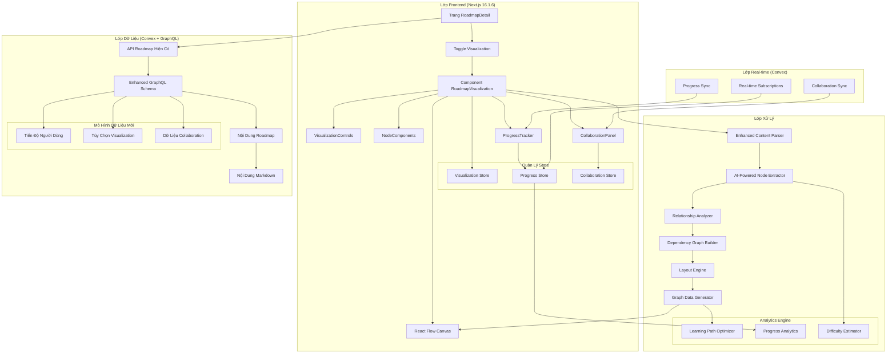
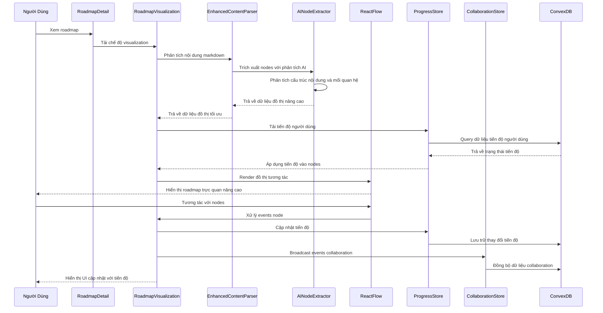
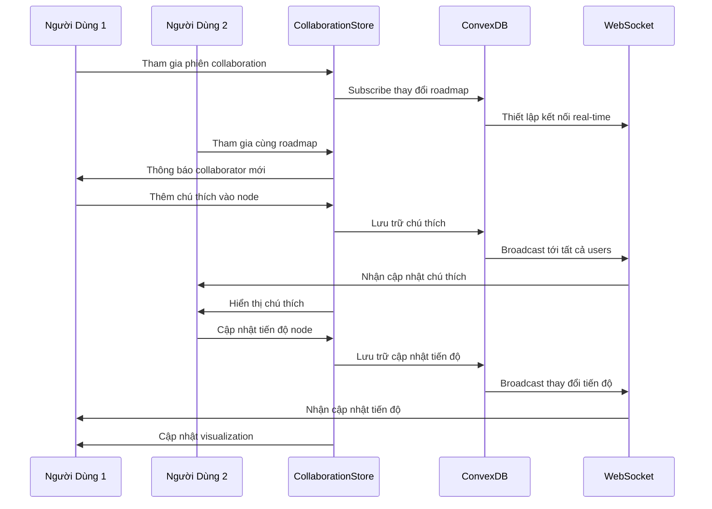

# Tài Liệu Thiết Kế: Trực Quan Hóa Roadmap

## Tổng Quan

Tính năng trực quan hóa roadmap chuyển đổi các roadmap markdown tĩnh thành sơ đồ tương tác trực quan sử dụng React Flow. Tính năng nâng cao này cho phép người dùng xem roadmaps dưới dạng đồ thị node được kết nối, cung cấp hiểu biết trực quan về lộ trình học tập, phụ thuộc và tiến trình qua các chủ đề công nghệ. Visualization tích hợp liền mạch với hệ thống roadmap VizTechStack hiện có, tận dụng cơ sở dữ liệu Convex, GraphQL API và các React components hiện tại. Nó giới thiệu các tính năng tiên tiến bao gồm phân tích nội dung thông minh, nhiều thuật toán bố cục, khám phá node tương tác, theo dõi tiến độ, chú thích cộng tác và đồng bộ hóa thời gian thực. Hệ thống duy trì khả năng tương thích hoàn toàn với các hoạt động CRUD roadmap hiện có trong khi thêm các khả năng phân tích trực quan mạnh mẽ và tối ưu hóa lộ trình học tập.

## Kiến Trúc

Hệ thống trực quan hóa roadmap tuân theo kiến trúc phân lớp hiện đại tích hợp sâu với cơ sở hạ tầng VizTechStack hiện có:



### Điểm Tích Hợp

**Tích Hợp Hệ Thống Hiện Có:**
- **Cơ Sở Dữ Liệu Convex**: Mở rộng schema roadmap hiện có với metadata visualization
- **GraphQL API**: Thêm queries/mutations mới cho các tính năng visualization
- **Authentication**: Tận dụng Clerk cho các tính năng tiến độ người dùng và collaboration
- **UI Components**: Tái sử dụng các components shadcn/ui hiện có để thiết kế nhất quán
- **Styling**: Duy trì tính nhất quán của design system Tailwind CSS 4

**Khả Năng Mới:**
- **AI-Enhanced Parsing**: Phân tích nội dung thông minh để trích xuất node tốt hơn
- **Real-time Collaboration**: Theo dõi cursor trực tiếp và chú thích chia sẻ
- **Progress Persistence**: Tiến độ học tập của người dùng được lưu trữ và đồng bộ hóa
- **Advanced Analytics**: Tối ưu hóa lộ trình học tập và phân tích độ khó
- **Multi-modal Visualization**: Hỗ trợ các phong cách học tập và tùy chọn khác nhau

## Sơ Đồ Sequence

### Luồng Visualization Nâng Cao



### Luồng Real-time Collaboration



## Components và Interfaces

### Component 1: RoadmapVisualization

**Mục đích**: Component container chính điều phối việc render visualization và tương tác người dùng

**Interface**:
```typescript
interface RoadmapVisualizationProps {
  roadmap: Roadmap;
  onNodeClick?: (nodeId: string) => void;
  onEdgeClick?: (edgeId: string) => void;
  className?: string;
}

interface RoadmapVisualizationState {
  graphData: GraphData;
  selectedNode: string | null;
  viewMode: 'overview' | 'detailed';
  loading: boolean;
  error: Error | null;
}
```

**Trách nhiệm**:
- Phân tích nội dung roadmap thành dữ liệu đồ thị
- Quản lý trạng thái visualization và tương tác người dùng
- Xử lý tính toán bố cục và định vị
- Cung cấp điều khiển zoom và pan
- Tích hợp với React Flow để render

### Component 2: ContentParser

**Mục đích**: Phân tích nội dung markdown để trích xuất nodes, relationships và metadata cho visualization đồ thị

**Interface**:
```typescript
interface ContentParser {
  parseContent(content: string): Promise<GraphData>;
  extractNodes(content: string): RoadmapNode[];
  extractRelationships(nodes: RoadmapNode[], content: string): RoadmapEdge[];
  validateGraphData(data: GraphData): boolean;
}

interface ParseOptions {
  includeSubsections: boolean;
  maxDepth: number;
  extractDependencies: boolean;
  autoLayout: boolean;
}
```

**Trách nhiệm**:
- Phân tích markdown headers thành nodes
- Trích xuất dependencies từ nội dung
- Tạo metadata và mô tả node
- Xác thực tính toàn vẹn cấu trúc đồ thị

### Component 3: VisualizationControls

**Mục đích**: Cung cấp điều khiển giao diện người dùng để thao tác view và hành vi visualization

**Interface**:
```typescript
interface VisualizationControlsProps {
  onZoomIn: () => void;
  onZoomOut: () => void;
  onFitView: () => void;
  onToggleLayout: (layout: LayoutType) => void;
  onToggleMode: (mode: ViewMode) => void;
  currentLayout: LayoutType;
  currentMode: ViewMode;
}

type LayoutType = 'hierarchical' | 'force' | 'circular' | 'grid';
type ViewMode = 'overview' | 'detailed' | 'focus';
```

**Trách nhiệm**:
- Cung cấp điều khiển zoom và pan
- Cho phép chuyển đổi thuật toán layout
- Toggle giữa các chế độ view
- Thao tác reset và fit view

## Data Models

### Model 1: GraphData

```typescript
interface GraphData {
  nodes: RoadmapNode[];
  edges: RoadmapEdge[];
  metadata: GraphMetadata;
}

interface GraphMetadata {
  totalNodes: number;
  totalEdges: number;
  maxDepth: number;
  layoutType: LayoutType;
  generatedAt: Date;
}
```

**Validation Rules**:
- Must have at least one node
- All edge source/target IDs must reference existing nodes
- No circular dependencies in hierarchical layouts
- Node IDs must be unique within the graph

### Model 2: RoadmapNode

```typescript
interface RoadmapNode {
  id: string;
  type: NodeType;
  position: Position;
  data: NodeData;
  style?: NodeStyle;
}

interface NodeData {
  label: string;
  description?: string;
  level: number;
  section: string;
  estimatedTime?: string;
  difficulty?: 'beginner' | 'intermediate' | 'advanced';
  resources?: Resource[];
  completed?: boolean;
}

interface Position {
  x: number;
  y: number;
}

type NodeType = 'topic' | 'skill' | 'milestone' | 'resource' | 'prerequisite';
```

**Validation Rules**:
- ID must be unique and non-empty
- Label must be non-empty string
- Level must be non-negative integer
- Position coordinates must be finite numbers

### Model 3: RoadmapEdge

```typescript
interface RoadmapEdge {
  id: string;
  source: string;
  target: string;
  type: EdgeType;
  data?: EdgeData;
  style?: EdgeStyle;
}

interface EdgeData {
  label?: string;
  relationship: RelationshipType;
  strength?: number;
  bidirectional?: boolean;
}

type EdgeType = 'dependency' | 'progression' | 'related' | 'optional';
type RelationshipType = 'prerequisite' | 'leads-to' | 'related-to' | 'part-of';
```

**Validation Rules**:
- Source and target must reference existing node IDs
- Edge ID must be unique
- Strength must be between 0 and 1 if specified
- No self-referencing edges (source !== target)

## Algorithmic Pseudocode

### Main Processing Algorithm

```pascal
ALGORITHM processRoadmapVisualization(roadmap)
INPUT: roadmap of type Roadmap
OUTPUT: graphData of type GraphData

BEGIN
  ASSERT roadmap.content IS NOT NULL AND roadmap.content IS NOT EMPTY
  
  // Step 1: Parse markdown content into structured data
  sections ← parseMarkdownSections(roadmap.content)
  ASSERT sections.length > 0
  
  // Step 2: Extract nodes from sections with loop invariant
  nodes ← []
  FOR each section IN sections DO
    ASSERT allPreviousNodesValid(nodes)
    
    sectionNodes ← extractNodesFromSection(section)
    validateNodes(sectionNodes)
    nodes.addAll(sectionNodes)
  END FOR
  
  // Step 3: Analyze relationships between nodes
  edges ← analyzeRelationships(nodes, roadmap.content)
  validateEdges(edges, nodes)
  
  // Step 4: Apply layout algorithm
  positionedNodes ← applyLayoutAlgorithm(nodes, edges, "hierarchical")
  
  // Step 5: Generate final graph data
  graphData ← createGraphData(positionedNodes, edges)
  
  ASSERT graphData.nodes.length > 0 AND validateGraphStructure(graphData)
  
  RETURN graphData
END
```

**Preconditions:**
- roadmap is a valid Roadmap object with non-null content
- roadmap.content contains valid markdown with headers
- Content parsing functions are available and properly implemented

**Postconditions:**
- Returns valid GraphData with at least one node
- All edges reference existing nodes
- Graph structure is acyclic for hierarchical layouts
- Node positions are calculated and finite

**Loop Invariants:**
- All previously processed nodes are valid and have unique IDs
- Node collection maintains structural integrity throughout iteration

### Node Extraction Algorithm

```pascal
ALGORITHM extractNodesFromSection(section)
INPUT: section of type MarkdownSection
OUTPUT: nodes of type RoadmapNode[]

BEGIN
  nodes ← []
  
  // Extract main topic node from section header
  IF section.header IS NOT NULL THEN
    mainNode ← createNodeFromHeader(section.header, section.level)
    nodes.add(mainNode)
  END IF
  
  // Extract subsection nodes with validation
  FOR each subsection IN section.subsections DO
    IF isValidSubsection(subsection) THEN
      subNode ← createNodeFromSubsection(subsection, section.level + 1)
      nodes.add(subNode)
    END IF
  END FOR
  
  // Extract resource nodes from content
  resources ← extractResourcesFromContent(section.content)
  FOR each resource IN resources DO
    resourceNode ← createResourceNode(resource, section.level + 2)
    nodes.add(resourceNode)
  END FOR
  
  RETURN nodes
END
```

**Preconditions:**
- section is a valid MarkdownSection with parsed content
- section.level is a non-negative integer
- Node creation functions are available

**Postconditions:**
- Returns array of valid RoadmapNode objects
- All nodes have unique IDs within the section
- Node levels are properly assigned based on section hierarchy

**Loop Invariants:**
- All previously created nodes have valid structure and unique IDs
- Node level assignments remain consistent with section hierarchy

### Layout Algorithm

```pascal
ALGORITHM applyLayoutAlgorithm(nodes, edges, layoutType)
INPUT: nodes of type RoadmapNode[], edges of type RoadmapEdge[], layoutType of type string
OUTPUT: positionedNodes of type RoadmapNode[]

BEGIN
  CASE layoutType OF
    "hierarchical":
      RETURN applyHierarchicalLayout(nodes, edges)
    "force":
      RETURN applyForceDirectedLayout(nodes, edges)
    "circular":
      RETURN applyCircularLayout(nodes, edges)
    "grid":
      RETURN applyGridLayout(nodes, edges)
    DEFAULT:
      RETURN applyHierarchicalLayout(nodes, edges)
  END CASE
END

ALGORITHM applyHierarchicalLayout(nodes, edges)
INPUT: nodes of type RoadmapNode[], edges of type RoadmapEdge[]
OUTPUT: positionedNodes of type RoadmapNode[]

BEGIN
  // Group nodes by level
  levelGroups ← groupNodesByLevel(nodes)
  
  // Calculate positions level by level
  yOffset ← 0
  FOR each level IN levelGroups DO
    levelNodes ← levelGroups[level]
    nodeWidth ← 200
    spacing ← 50
    totalWidth ← (levelNodes.length * nodeWidth) + ((levelNodes.length - 1) * spacing)
    startX ← -totalWidth / 2
    
    FOR i ← 0 TO levelNodes.length - 1 DO
      levelNodes[i].position.x ← startX + (i * (nodeWidth + spacing))
      levelNodes[i].position.y ← yOffset
    END FOR
    
    yOffset ← yOffset + 150
  END FOR
  
  RETURN nodes
END
```

**Preconditions:**
- nodes array contains valid RoadmapNode objects
- edges array contains valid RoadmapEdge objects
- All edge references point to existing nodes

**Postconditions:**
- All nodes have valid position coordinates
- Hierarchical layout maintains level-based vertical positioning
- No node overlaps in the final layout

**Loop Invariants:**
- All previously positioned nodes maintain their calculated positions
- Y-offset increases monotonically for each level

## Key Functions with Formal Specifications

### Function 1: parseMarkdownContent()

```typescript
function parseMarkdownContent(content: string): Promise<GraphData>
```

**Preconditions:**
- `content` is a non-null, non-empty string containing valid markdown
- Content contains at least one header (# or ##)
- Markdown syntax is well-formed

**Postconditions:**
- Returns Promise that resolves to valid GraphData object
- GraphData contains at least one node
- All edges in GraphData reference existing nodes
- Graph structure is validated and consistent

**Loop Invariants:** N/A (async function, no explicit loops in signature)

### Function 2: validateGraphStructure()

```typescript
function validateGraphStructure(graphData: GraphData): boolean
```

**Preconditions:**
- `graphData` is defined (not null/undefined)
- `graphData.nodes` and `graphData.edges` are arrays

**Postconditions:**
- Returns boolean indicating structural validity
- `true` if and only if graph passes all validation checks
- No mutations to input graphData parameter

**Loop Invariants:**
- For validation loops: All previously checked elements remain valid
- Validation state remains consistent throughout iteration

### Function 3: calculateNodePositions()

```typescript
function calculateNodePositions(nodes: RoadmapNode[], edges: RoadmapEdge[], layout: LayoutType): RoadmapNode[]
```

**Preconditions:**
- `nodes` is a non-empty array of valid RoadmapNode objects
- `edges` is an array of valid RoadmapEdge objects
- `layout` is a valid LayoutType enum value
- All edge source/target IDs reference existing nodes

**Postconditions:**
- Returns array of nodes with calculated position coordinates
- All returned nodes have finite, non-NaN position values
- Original node data is preserved, only positions are modified
- Layout algorithm constraints are satisfied (no overlaps, proper spacing)

**Loop Invariants:**
- All previously processed nodes have valid position assignments
- Layout constraints remain satisfied throughout position calculation

## UI/UX Design System

### Tailwind Config Setup

```javascript
// tailwind.config.js
module.exports = {
  content: [
    './pages/**/*.{js,ts,jsx,tsx,mdx}',
    './components/**/*.{js,ts,jsx,tsx,mdx}',
    './app/**/*.{js,ts,jsx,tsx,mdx}',
  ],
  theme: {
    extend: {
      colors: {
        // Primary Brand Colors (Cam/Đào nhẹ nhàng)
        primary: {
          50: '#fef7f0',
          100: '#fdeee0',
          200: '#fad9c1',
          300: '#f6be97',
          400: '#f19a6b',
          500: '#ed7c47', // Main primary
          600: '#de5f2a',
          700: '#b84820',
          800: '#933c1f',
          900: '#76331e',
        },
        // Secondary Colors (Xanh nhẹ)
        secondary: {
          50: '#f0f9ff',
          100: '#e0f2fe',
          200: '#bae6fd',
          300: '#7dd3fc',
          400: '#38bdf8',
          500: '#0ea5e9',
          600: '#0284c7',
          700: '#0369a1',
          800: '#075985',
          900: '#0c4a6e',
        },
        // Neutral Colors (Xám ấm)
        neutral: {
          50: '#fafaf9',
          100: '#f5f5f4',
          200: '#e7e5e4',
          300: '#d6d3d1',
          400: '#a8a29e',
          500: '#78716c',
          600: '#57534e',
          700: '#44403c',
          800: '#292524',
          900: '#1c1917',
        },
        // Success Colors (Xanh lá)
        success: {
          50: '#f0fdf4',
          100: '#dcfce7',
          200: '#bbf7d0',
          300: '#86efac',
          400: '#4ade80',
          500: '#22c55e',
          600: '#16a34a',
          700: '#15803d',
          800: '#166534',
          900: '#14532d',
        },
        // Warning Colors (Vàng)
        warning: {
          50: '#fffbeb',
          100: '#fef3c7',
          200: '#fde68a',
          300: '#fcd34d',
          400: '#fbbf24',
          500: '#f59e0b',
          600: '#d97706',
          700: '#b45309',
          800: '#92400e',
          900: '#78350f',
        },
        // Error Colors (Đỏ)
        error: {
          50: '#fef2f2',
          100: '#fee2e2',
          200: '#fecaca',
          300: '#fca5a5',
          400: '#f87171',
          500: '#ef4444',
          600: '#dc2626',
          700: '#b91c1c',
          800: '#991b1b',
          900: '#7f1d1d',
        },
        // Background Colors
        background: {
          primary: '#fefcfb',
          secondary: '#faf8f7',
          tertiary: '#f5f3f2',
        }
      },
      fontFamily: {
        sans: ['Inter', 'system-ui', 'sans-serif'],
        display: ['Poppins', 'system-ui', 'sans-serif'],
        mono: ['JetBrains Mono', 'monospace'],
      },
      fontSize: {
        'xs': ['0.75rem', { lineHeight: '1rem' }],
        'sm': ['0.875rem', { lineHeight: '1.25rem' }],
        'base': ['1rem', { lineHeight: '1.5rem' }],
        'lg': ['1.125rem', { lineHeight: '1.75rem' }],
        'xl': ['1.25rem', { lineHeight: '1.75rem' }],
        '2xl': ['1.5rem', { lineHeight: '2rem' }],
        '3xl': ['1.875rem', { lineHeight: '2.25rem' }],
        '4xl': ['2.25rem', { lineHeight: '2.5rem' }],
        '5xl': ['3rem', { lineHeight: '1' }],
        '6xl': ['3.75rem', { lineHeight: '1' }],
      },
      spacing: {
        '18': '4.5rem',
        '88': '22rem',
        '128': '32rem',
      },
      borderRadius: {
        'xl': '0.75rem',
        '2xl': '1rem',
        '3xl': '1.5rem',
      },
      boxShadow: {
        'soft': '0 2px 15px -3px rgba(0, 0, 0, 0.07), 0 10px 20px -2px rgba(0, 0, 0, 0.04)',
        'medium': '0 4px 25px -5px rgba(0, 0, 0, 0.1), 0 10px 10px -5px rgba(0, 0, 0, 0.04)',
        'large': '0 10px 40px -10px rgba(0, 0, 0, 0.1), 0 2px 10px -2px rgba(0, 0, 0, 0.04)',
      },
      animation: {
        'fade-in': 'fadeIn 0.5s ease-in-out',
        'slide-up': 'slideUp 0.3s ease-out',
        'slide-down': 'slideDown 0.3s ease-out',
        'scale-in': 'scaleIn 0.2s ease-out',
        'bounce-gentle': 'bounceGentle 0.6s ease-in-out',
      },
      keyframes: {
        fadeIn: {
          '0%': { opacity: '0' },
          '100%': { opacity: '1' },
        },
        slideUp: {
          '0%': { transform: 'translateY(10px)', opacity: '0' },
          '100%': { transform: 'translateY(0)', opacity: '1' },
        },
        slideDown: {
          '0%': { transform: 'translateY(-10px)', opacity: '0' },
          '100%': { transform: 'translateY(0)', opacity: '1' },
        },
        scaleIn: {
          '0%': { transform: 'scale(0.95)', opacity: '0' },
          '100%': { transform: 'scale(1)', opacity: '1' },
        },
        bounceGentle: {
          '0%, 100%': { transform: 'translateY(0)' },
          '50%': { transform: 'translateY(-5px)' },
        },
      },
    },
  },
  plugins: [
    require('@tailwindcss/forms'),
    require('@tailwindcss/typography'),
  ],
}
```

### Global CSS Setup

```css
/* globals.css */
@import 'tailwindcss/base';
@import 'tailwindcss/components';
@import 'tailwindcss/utilities';

/* Import fonts */
@import url('https://fonts.googleapis.com/css2?family=Inter:wght@300;400;500;600;700&display=swap');
@import url('https://fonts.googleapis.com/css2?family=Poppins:wght@400;500;600;700&display=swap');
@import url('https://fonts.googleapis.com/css2?family=JetBrains+Mono:wght@400;500;600&display=swap');

/* Base styles */
@layer base {
  html {
    scroll-behavior: smooth;
  }
  
  body {
    @apply bg-background-primary text-neutral-800 font-sans antialiased;
  }
  
  h1, h2, h3, h4, h5, h6 {
    @apply font-display font-semibold text-neutral-900;
  }
  
  h1 {
    @apply text-4xl lg:text-5xl;
  }
  
  h2 {
    @apply text-3xl lg:text-4xl;
  }
  
  h3 {
    @apply text-2xl lg:text-3xl;
  }
  
  h4 {
    @apply text-xl lg:text-2xl;
  }
  
  h5 {
    @apply text-lg lg:text-xl;
  }
  
  h6 {
    @apply text-base lg:text-lg;
  }
}

/* Component styles */
@layer components {
  /* Button variants */
  .btn-primary {
    @apply bg-primary-500 hover:bg-primary-600 text-white font-medium px-6 py-3 rounded-xl transition-all duration-200 shadow-soft hover:shadow-medium active:scale-95;
  }
  
  .btn-secondary {
    @apply bg-white hover:bg-neutral-50 text-primary-600 font-medium px-6 py-3 rounded-xl border border-primary-200 transition-all duration-200 shadow-soft hover:shadow-medium active:scale-95;
  }
  
  .btn-ghost {
    @apply bg-transparent hover:bg-primary-50 text-primary-600 font-medium px-6 py-3 rounded-xl transition-all duration-200 active:scale-95;
  }
  
  /* Card variants */
  .card {
    @apply bg-white rounded-2xl shadow-soft border border-neutral-100;
  }
  
  .card-hover {
    @apply card hover:shadow-medium hover:-translate-y-1 transition-all duration-300;
  }
  
  /* Input styles */
  .input {
    @apply w-full px-4 py-3 rounded-xl border border-neutral-200 focus:border-primary-400 focus:ring-2 focus:ring-primary-100 transition-all duration-200 bg-white;
  }
  
  /* Node styles for visualization */
  .node-beginner {
    @apply bg-success-50 border-success-200 text-success-800;
  }
  
  .node-intermediate {
    @apply bg-warning-50 border-warning-200 text-warning-800;
  }
  
  .node-advanced {
    @apply bg-error-50 border-error-200 text-error-800;
  }
  
  .node-completed {
    @apply bg-success-100 border-success-300 text-success-900;
  }
  
  /* Visualization controls */
  .viz-control {
    @apply bg-white/90 backdrop-blur-sm border border-neutral-200 rounded-lg p-2 shadow-soft hover:shadow-medium transition-all duration-200;
  }
  
  .viz-button {
    @apply p-2 rounded-md hover:bg-neutral-100 transition-colors duration-200 text-neutral-600 hover:text-neutral-800;
  }
}

/* Utility styles */
@layer utilities {
  .text-gradient {
    @apply bg-gradient-to-r from-primary-500 to-primary-600 bg-clip-text text-transparent;
  }
  
  .bg-gradient-primary {
    @apply bg-gradient-to-br from-primary-400 via-primary-500 to-primary-600;
  }
  
  .bg-gradient-soft {
    @apply bg-gradient-to-br from-background-primary via-background-secondary to-background-tertiary;
  }
  
  .glass {
    @apply bg-white/80 backdrop-blur-md border border-white/20;
  }
  
  .animate-float {
    animation: float 3s ease-in-out infinite;
  }
  
  @keyframes float {
    0%, 100% { transform: translateY(0px); }
    50% { transform: translateY(-10px); }
  }
}

/* React Flow custom styles */
.react-flow__node {
  @apply font-sans;
}

.react-flow__edge {
  @apply stroke-neutral-300;
}

.react-flow__edge.selected {
  @apply stroke-primary-400;
}

.react-flow__controls {
  @apply bg-white/90 backdrop-blur-sm border border-neutral-200 rounded-lg shadow-soft;
}

.react-flow__controls button {
  @apply text-neutral-600 hover:text-neutral-800 border-neutral-200;
}

.react-flow__minimap {
  @apply bg-white/90 backdrop-blur-sm border border-neutral-200 rounded-lg;
}
```

## Desktop Layout Design

### Trang Roadmap Detail Layout (`/roadmaps/[slug]`)

Layout tổng thể cho desktop được thiết kế với tone màu ấm áp và hiện đại:

```
┌─────────────────────────────────────────────────────────────────────────────┐
│ Header Navigation & Breadcrumb (bg-white shadow-soft)                      │
├─────────────────────────────────────────────────────────────────────────────┤
│ Roadmap Title & Metadata (bg-gradient-soft)                               │
├─────────────────────────────────────────────────────────────────────────────┤
│ View Toggle: [📄 Nội dung] [🗺️ Sơ đồ roadmap] (btn-primary/btn-secondary) │
├─────────────────────────────────────────────────────────────────────────────┤
│                                                                             │
│  ┌─────────────────────────────────┐  ┌─────────────────────────────────┐   │
│  │         Content View            │  │      Visualization View         │   │
│  │        (card-hover)             │  │        (card-hover)             │   │
│  │                                 │  │                                 │   │
│  │  • Markdown với typography     │  │  ┌─────────────────────────────┐ │   │
│  │  • Progress indicators         │  │  │   Viz Controls (glass)      │ │   │
│  │  • Resource cards              │  │  │  [🔍+] [🔍-] [⊞] [Layout▼] │ │   │
│  │  • Smooth animations           │  │  └─────────────────────────────┘ │   │
│  │                                 │  │                                 │   │
│  │                                 │  │  ┌─────────────────────────────┐ │   │
│  │                                 │  │  │                             │ │   │
│  │                                 │  │  │    React Flow Canvas        │ │   │
│  │                                 │  │  │   (custom node styling)     │ │   │
│  │                                 │  │  │                             │ │   │
│  │                                 │  │  │   [Frontend] ──→ [HTML]     │ │   │
│  │                                 │  │  │       │           │         │ │   │
│  │                                 │  │  │       ↓           ↓         │ │   │
│  │                                 │  │  │   [CSS] ──→ [JavaScript]    │ │   │
│  │                                 │  │  │                             │ │   │
│  │                                 │  │  └─────────────────────────────┘ │   │
│  │                                 │  │                                 │   │
│  └─────────────────────────────────┘  └─────────────────────────────────┘   │
│                                                                             │
└─────────────────────────────────────────────────────────────────────────────┘
```

### Layout Specifications

**Container Layout:**
- Max width: `1400px` (max-w-7xl)
- Padding: `24px` (px-6 py-8)
- Background: `bg-background-primary`
- Gap between sections: `24px` (space-y-6)

**View Toggle Section:**
- Height: `52px` (h-13)
- Button group: `rounded-xl border border-neutral-200 bg-white p-1`
- Active state: `btn-primary` với `shadow-soft`
- Inactive state: `btn-ghost`
- Smooth transition: `transition-all duration-300`

**Content Area:**
- Full height: `h-[calc(100vh-280px)]`
- Card styling: `card-hover`
- Smooth transition: `transition-all duration-300 ease-in-out`
- Background: `bg-white` với `shadow-soft`

**Node Styling:**
- Beginner: `node-beginner` (xanh lá nhẹ)
- Intermediate: `node-intermediate` (vàng cam nhẹ)
- Advanced: `node-advanced` (đỏ cam nhẹ)
- Completed: `node-completed` (xanh đậm)
- Border radius: `rounded-xl`
- Shadow: `shadow-soft hover:shadow-medium`

**Animation & Interactions:**
- Hover effects: `hover:-translate-y-1`
- Click effects: `active:scale-95`
- Loading states: `animate-pulse`
- Smooth transitions: `transition-all duration-200`

## Example Usage

```typescript
// Example 1: Desktop Roadmap Detail Page với UI/UX mới
import { RoadmapVisualization } from '@viztechstack/roadmap-visualization';
import { RoadmapContent } from '@viztechstack/roadmap-content';

function RoadmapDetailPage({ slug }: { slug: string }) {
  const { roadmap, loading, error } = useRoadmapBySlug(slug);
  const [viewType, setViewType] = useState<'content' | 'visualization'>('content');

  if (loading) return <RoadmapDetailSkeleton />;
  if (error || !roadmap) return <ErrorState />;

  return (
    <div className="min-h-screen bg-background-primary">
      {/* Header Navigation với shadow */}
      <Header className="bg-white shadow-soft border-b border-neutral-100" />
      
      {/* Main Content Container */}
      <div className="max-w-7xl mx-auto px-6 py-8">
        {/* Roadmap Header với gradient background */}
        <div className="mb-8 p-8 bg-gradient-soft rounded-2xl">
          <Breadcrumb 
            items={[
              { label: 'Roadmaps', href: '/roadmaps' },
              { label: roadmap.title, href: `/roadmaps/${slug}` }
            ]}
            className="text-neutral-600 mb-4"
          />
          <h1 className="text-4xl lg:text-5xl font-display font-bold text-gradient mb-4">
            {roadmap.title}
          </h1>
          <div className="flex flex-wrap items-center gap-6 text-sm text-neutral-600">
            <div className="flex items-center gap-2">
              <span className="text-primary-500">📅</span>
              <span>Cập nhật: {formatDate(roadmap.updatedAt)}</span>
            </div>
            <div className="flex items-center gap-2">
              <span className="text-primary-500">⏱️</span>
              <span>Thời gian: {roadmap.estimatedTime}</span>
            </div>
            <div className="flex items-center gap-2">
              <span className="text-primary-500">📊</span>
              <span>Độ khó: {roadmap.difficulty}</span>
            </div>
          </div>
        </div>

        {/* View Toggle với animation */}
        <div className="mb-8 flex justify-center">
          <div className="inline-flex rounded-xl border border-neutral-200 bg-white p-1 shadow-soft">
            <button
              onClick={() => setViewType('content')}
              className={`px-6 py-3 rounded-lg text-sm font-medium transition-all duration-300 ${
                viewType === 'content'
                  ? 'bg-primary-500 text-white shadow-soft transform scale-105'
                  : 'text-neutral-700 hover:text-neutral-900 hover:bg-neutral-50'
              }`}
            >
              <span className="flex items-center gap-2">
                📄 <span>Nội dung</span>
              </span>
            </button>
            <button
              onClick={() => setViewType('visualization')}
              className={`px-6 py-3 rounded-lg text-sm font-medium transition-all duration-300 ${
                viewType === 'visualization'
                  ? 'bg-primary-500 text-white shadow-soft transform scale-105'
                  : 'text-neutral-700 hover:text-neutral-900 hover:bg-neutral-50'
              }`}
            >
              <span className="flex items-center gap-2">
                🗺️ <span>Sơ đồ roadmap</span>
              </span>
            </button>
          </div>
        </div>

        {/* Content Area với enhanced styling */}
        <div className="card-hover overflow-hidden">
          <div className="transition-all duration-500 ease-in-out">
            {viewType === 'content' ? (
              <div className="animate-fade-in">
                <RoadmapContent 
                  content={roadmap.content}
                  className="p-8 prose prose-lg max-w-none prose-headings:text-neutral-900 prose-p:text-neutral-700 prose-a:text-primary-600 prose-strong:text-neutral-900"
                />
              </div>
            ) : (
              <div className="animate-fade-in">
                <RoadmapVisualization 
                  roadmap={roadmap}
                  className="h-[calc(100vh-280px)]"
                  onNodeClick={(nodeId) => {
                    console.log('Node clicked:', nodeId);
                  }}
                />
              </div>
            )}
          </div>
        </div>
      </div>
    </div>
  );
}

// Example 2: Enhanced Visualization với Modern Controls
function RoadmapVisualizationWithControls({ roadmap }: { roadmap: Roadmap }) {
  const [layout, setLayout] = useState<LayoutType>('hierarchical');
  const [viewMode, setViewMode] = useState<ViewMode>('overview');
  const [selectedNode, setSelectedNode] = useState<string | null>(null);

  return (
    <div className="relative h-full bg-background-secondary">
      {/* Enhanced Visualization Controls */}
      <div className="absolute top-6 left-6 z-20">
        <div className="glass rounded-xl p-3 shadow-medium">
          <div className="flex items-center gap-3">
            <button
              onClick={() => {/* zoom in logic */}}
              className="viz-button"
              title="Phóng to"
            >
              <svg className="w-5 h-5" fill="none" stroke="currentColor" viewBox="0 0 24 24">
                <path strokeLinecap="round" strokeLinejoin="round" strokeWidth={2} d="M12 6v6m0 0v6m0-6h6m-6 0H6" />
              </svg>
            </button>
            <button
              onClick={() => {/* zoom out logic */}}
              className="viz-button"
              title="Thu nhỏ"
            >
              <svg className="w-5 h-5" fill="none" stroke="currentColor" viewBox="0 0 24 24">
                <path strokeLinecap="round" strokeLinejoin="round" strokeWidth={2} d="M20 12H4" />
              </svg>
            </button>
            <button
              onClick={() => {/* fit view logic */}}
              className="viz-button"
              title="Vừa màn hình"
            >
              <svg className="w-5 h-5" fill="none" stroke="currentColor" viewBox="0 0 24 24">
                <path strokeLinecap="round" strokeLinejoin="round" strokeWidth={2} d="M4 8V4m0 0h4M4 4l5 5m11-1V4m0 0h-4m4 0l-5 5M4 16v4m0 0h4m-4 0l5-5m11 5l-5-5m5 5v-4m0 4h-4" />
              </svg>
            </button>
            <div className="w-px h-6 bg-neutral-200"></div>
            <select
              value={layout}
              onChange={(e) => setLayout(e.target.value as LayoutType)}
              className="input text-sm py-2 px-3 min-w-[120px]"
            >
              <option value="hierarchical">Phân cấp</option>
              <option value="force">Lực hút</option>
              <option value="circular">Vòng tròn</option>
              <option value="grid">Lưới</option>
            </select>
          </div>
        </div>
      </div>

      {/* React Flow Canvas với custom styling */}
      <RoadmapVisualization
        roadmap={roadmap}
        layout={layout}
        viewMode={viewMode}
        onNodeClick={setSelectedNode}
        className="w-full h-full"
      />

      {/* Enhanced Node Details Panel */}
      {selectedNode && (
        <div className="absolute top-6 right-6 w-96 z-20 animate-slide-down">
          <div className="glass rounded-xl p-6 shadow-large">
            <NodeDetailsPanel 
              nodeId={selectedNode}
              onClose={() => setSelectedNode(null)}
              className="space-y-4"
            />
          </div>
        </div>
      )}
    </div>
  );
}

// Example 3: Custom Node Component với styling mới
function CustomRoadmapNode({ data, selected }: { data: NodeData; selected: boolean }) {
  const getDifficultyStyle = (difficulty: string) => {
    switch (difficulty) {
      case 'beginner':
        return 'node-beginner';
      case 'intermediate':
        return 'node-intermediate';
      case 'advanced':
        return 'node-advanced';
      default:
        return 'bg-neutral-50 border-neutral-200 text-neutral-800';
    }
  };

  return (
    <div
      className={`
        px-4 py-3 rounded-xl border-2 min-w-[200px] transition-all duration-200
        ${getDifficultyStyle(data.difficulty)}
        ${data.completed ? 'node-completed' : ''}
        ${selected ? 'ring-2 ring-primary-400 ring-offset-2' : ''}
        hover:shadow-medium hover:-translate-y-1 cursor-pointer
      `}
    >
      <div className="flex items-center justify-between mb-2">
        <h3 className="font-medium text-sm">{data.label}</h3>
        {data.completed && (
          <svg className="w-4 h-4 text-success-600" fill="currentColor" viewBox="0 0 20 20">
            <path fillRule="evenodd" d="M16.707 5.293a1 1 0 010 1.414l-8 8a1 1 0 01-1.414 0l-4-4a1 1 0 011.414-1.414L8 12.586l7.293-7.293a1 1 0 011.414 0z" clipRule="evenodd" />
          </svg>
        )}
      </div>
      
      {data.estimatedTime && (
        <div className="flex items-center gap-1 text-xs opacity-75">
          <svg className="w-3 h-3" fill="none" stroke="currentColor" viewBox="0 0 24 24">
            <path strokeLinecap="round" strokeLinejoin="round" strokeWidth={2} d="M12 8v4l3 3m6-3a9 9 0 11-18 0 9 9 0 0118 0z" />
          </svg>
          <span>{data.estimatedTime}</span>
        </div>
      )}
    </div>
  );
}

// Example 4: Progress Indicator Component
function ProgressIndicator({ progress, total }: { progress: number; total: number }) {
  const percentage = (progress / total) * 100;
  
  return (
    <div className="space-y-2">
      <div className="flex justify-between text-sm">
        <span className="text-neutral-600">Tiến độ</span>
        <span className="font-medium text-neutral-900">{progress}/{total}</span>
      </div>
      <div className="w-full bg-neutral-200 rounded-full h-2">
        <div 
          className="bg-gradient-to-r from-primary-400 to-primary-500 h-2 rounded-full transition-all duration-500 ease-out"
          style={{ width: `${percentage}%` }}
        />
      </div>
      <div className="text-xs text-neutral-500 text-center">
        {percentage.toFixed(0)}% hoàn thành
      </div>
    </div>
  );
}

// Example 5: Loading States với skeleton
function RoadmapDetailSkeleton() {
  return (
    <div className="min-h-screen bg-background-primary">
      <div className="max-w-7xl mx-auto px-6 py-8">
        {/* Header skeleton */}
        <div className="mb-8 p-8 bg-gradient-soft rounded-2xl animate-pulse">
          <div className="h-4 bg-neutral-200 rounded w-48 mb-4"></div>
          <div className="h-12 bg-neutral-200 rounded w-96 mb-4"></div>
          <div className="flex gap-6">
            <div className="h-4 bg-neutral-200 rounded w-32"></div>
            <div className="h-4 bg-neutral-200 rounded w-28"></div>
            <div className="h-4 bg-neutral-200 rounded w-24"></div>
          </div>
        </div>
        
        {/* Toggle skeleton */}
        <div className="mb-8 flex justify-center">
          <div className="h-12 bg-white rounded-xl w-80 animate-pulse shadow-soft"></div>
        </div>
        
        {/* Content skeleton */}
        <div className="card h-96 animate-pulse">
          <div className="p-8 space-y-4">
            <div className="h-4 bg-neutral-200 rounded w-full"></div>
            <div className="h-4 bg-neutral-200 rounded w-5/6"></div>
            <div className="h-4 bg-neutral-200 rounded w-4/6"></div>
          </div>
        </div>
      </div>
    </div>
  );
}
```

## Correctness Properties

The roadmap visualization system must satisfy these universal properties:

```typescript
// Property 1: Graph Structure Integrity
∀ graphData: GraphData, 
  validateGraphStructure(graphData) ⟹ 
    (graphData.nodes.length > 0 ∧ 
     ∀ edge ∈ graphData.edges, ∃ sourceNode, targetNode ∈ graphData.nodes,
       edge.source = sourceNode.id ∧ edge.target = targetNode.id)

// Property 2: Node Position Validity
∀ nodes: RoadmapNode[], layout: LayoutType,
  let positionedNodes = calculateNodePositions(nodes, [], layout)
  ⟹ ∀ node ∈ positionedNodes,
      isFinite(node.position.x) ∧ isFinite(node.position.y)

// Property 3: Content Parsing Completeness
∀ content: string, content ≠ "" ∧ hasHeaders(content)
  ⟹ let graphData = parseMarkdownContent(content)
      ⟹ graphData.nodes.length ≥ countHeaders(content)

// Property 4: Layout Consistency
∀ nodes: RoadmapNode[], edges: RoadmapEdge[], layout: LayoutType,
  let result1 = applyLayoutAlgorithm(nodes, edges, layout)
  let result2 = applyLayoutAlgorithm(nodes, edges, layout)
  ⟹ result1 = result2 (deterministic layout)

// Property 5: Interaction State Consistency
∀ visualization: RoadmapVisualization, nodeId: string,
  visualization.selectNode(nodeId) ⟹
    (nodeId ∈ visualization.graphData.nodes.map(n => n.id) ⟹
     visualization.selectedNode = nodeId)
```

## Error Handling

### Error Scenario 1: Invalid Markdown Content

**Condition**: Roadmap content is empty, null, or contains no parseable headers
**Response**: Display error message with fallback to content view
**Recovery**: Provide option to switch to traditional content view or edit roadmap

### Error Scenario 2: Graph Layout Calculation Failure

**Condition**: Layout algorithm fails due to circular dependencies or invalid node structure
**Response**: Fall back to simple grid layout with error notification
**Recovery**: Allow user to try different layout algorithms or report the issue

### Error Scenario 3: React Flow Rendering Error

**Condition**: React Flow component fails to render due to invalid graph data or browser compatibility
**Response**: Show error boundary with diagnostic information
**Recovery**: Provide fallback to static diagram or content view

### Error Scenario 4: Performance Issues with Large Graphs

**Condition**: Roadmap contains too many nodes (>500) causing performance degradation
**Response**: Implement virtualization or node clustering
**Recovery**: Offer simplified view or pagination of graph sections

## Testing Strategy

### Unit Testing Approach

Focus on testing individual components and functions in isolation:

- **ContentParser**: Test markdown parsing with various content structures
- **Layout Algorithms**: Verify position calculations and constraint satisfaction
- **Graph Validation**: Test edge cases and invalid data handling
- **Node Components**: Test rendering and interaction behaviors

**Key Test Cases**:
- Empty content handling
- Malformed markdown parsing
- Circular dependency detection
- Layout algorithm correctness
- Node interaction events

**Property Test Library**: fast-check for TypeScript

### Property-Based Testing Approach

Use property-based testing to verify system invariants:

- **Graph Structure Properties**: Generate random valid graphs and verify structural integrity
- **Layout Consistency**: Test that layout algorithms produce consistent results
- **Content Parsing Properties**: Generate markdown content and verify parsing completeness
- **Performance Properties**: Test that operations complete within acceptable time bounds

### Integration Testing Approach

Test component interactions and data flow:

- **End-to-End Visualization Flow**: From roadmap loading to graph rendering
- **User Interaction Scenarios**: Node selection, zoom, pan, layout switching
- **Error Recovery Flows**: Test error boundaries and fallback mechanisms
- **Performance Testing**: Large roadmap handling and rendering performance

## Performance Considerations

**Rendering Optimization**:
- Implement node virtualization for large graphs (>100 nodes)
- Use React.memo for node components to prevent unnecessary re-renders
- Debounce layout calculations during user interactions
- Lazy load node details and resources

**Memory Management**:
- Implement graph data caching with LRU eviction
- Use object pooling for frequently created/destroyed nodes
- Monitor memory usage during long visualization sessions

**Layout Performance**:
- Pre-calculate common layout configurations
- Use web workers for complex layout algorithms
- Implement progressive layout rendering for large graphs

## Security Considerations

**Content Security**:
- Sanitize markdown content before parsing to prevent XSS
- Validate all user inputs in visualization controls
- Implement CSP headers for React Flow and related libraries

**Data Privacy**:
- Ensure roadmap content access follows existing RBAC rules
- No additional sensitive data exposure through visualization
- Maintain audit logs for visualization feature usage

## Dependencies

**New Dependencies Required**:
- `@xyflow/react` (^12.0.0) - React Flow library for graph visualization
- `dagre` (^0.8.5) - Graph layout algorithms
- `markdown-it` (^14.0.0) - Enhanced markdown parsing
- `d3-hierarchy` (^3.1.2) - Hierarchical layout calculations

**Existing Dependencies Leveraged**:
- React 19.2.3 - Component framework
- TypeScript 5.7 - Type safety
- Tailwind CSS 4 - Styling
- Apollo Client 3.8.8 - GraphQL data fetching
- Existing roadmap GraphQL schema and types

**Development Dependencies**:
- `@testing-library/react` - Component testing
- `fast-check` - Property-based testing
- `@types/dagre` - TypeScript definitions
- `@types/d3-hierarchy` - TypeScript definitions