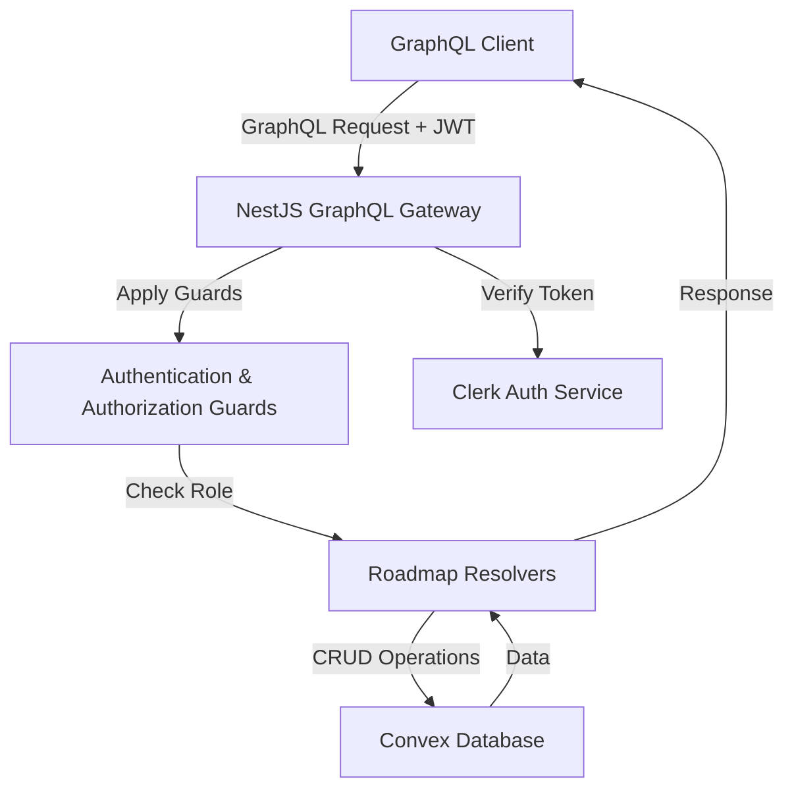
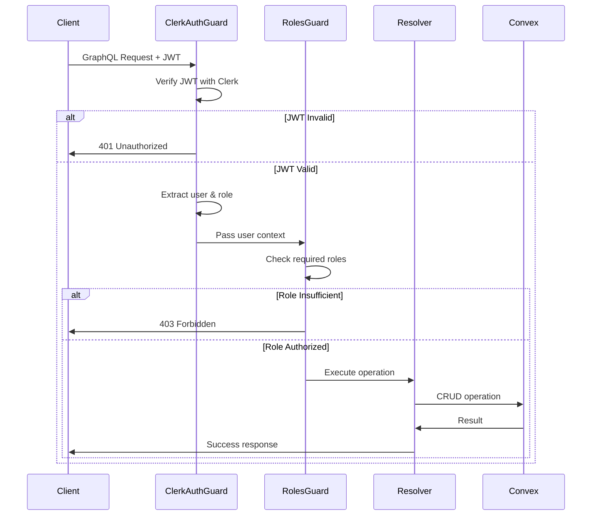
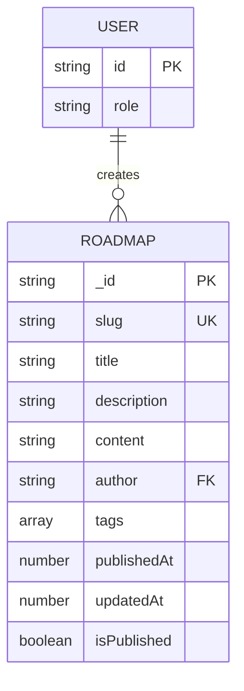

# Tài liệu Thiết kế - Hệ thống Kiểm soát Truy cập Dựa trên Vai trò Người dùng

## Tổng quan

Hệ thống kiểm soát truy cập dựa trên vai trò (RBAC) cho phép phân quyền truy cập vào các tính năng CRUD của roadmap dựa trên vai trò người dùng. Hệ thống tích hợp với Clerk để xác thực JWT và quản lý vai trò người dùng (Admin/User).

### Phạm vi Triển khai

Theo yêu cầu của người dùng, việc triển khai sẽ được chia thành 2 giai đoạn:

**Giai đoạn 1: Backend Implementation (Tài liệu này)**
- Xây dựng CRUD operations cho roadmap trong NestJS
- Triển khai GraphQL mutations và queries
- Cấu hình guards và decorators cho authorization
- Cập nhật Convex schema cho roadmap
- Viết unit tests và property-based tests

**Giai đoạn 2: Frontend Integration (Tài liệu riêng)**
- Tích hợp GraphQL client với Apollo
- Xây dựng UI components cho admin panel
- Triển khai conditional rendering dựa trên role
- Xử lý error states và loading states

Tài liệu này tập trung vào **Giai đoạn 1: Backend Implementation**.

### Mục tiêu Thiết kế

- Bảo mật: Đảm bảo chỉ Admin mới có quyền CRUD roadmap
- Tách biệt: Tách rõ logic authentication và authorization
- Tái sử dụng: Sử dụng lại guards và decorators hiện có
- Mở rộng: Dễ dàng thêm resources khác với RBAC tương tự
- Kiểm thử: Đảm bảo tất cả logic authorization được test kỹ lưỡng

## Kiến trúc

### Tổng quan Kiến trúc



### Luồng Xác thực và Phân quyền



### Cấu trúc Thư mục Backend

```
apps/api/src/
├── common/
│   ├── guards/
│   │   ├── clerk-auth.guard.ts      # Existing: JWT verification
│   │   └── roles.guard.ts            # Existing: Role-based authorization
│   ├── decorators/
│   │   ├── public.decorator.ts      # Existing: Mark public endpoints
│   │   ├── roles.decorator.ts       # Existing: Specify required roles
│   │   └── current-user.decorator.ts # Existing: Extract current user
│   └── convex/
│       └── convex.service.ts         # NEW: Convex client wrapper
├── modules/
│   └── roadmap/                      # NEW MODULE
│       ├── roadmap.module.ts
│       ├── domain/
│       │   └── models/
│       │       └── roadmap.model.ts
│       ├── application/
│       │   └── services/
│       │       └── roadmap.service.ts
│       └── transport/
│           └── graphql/
│               ├── schemas/
│               │   ├── roadmap.schema.ts
│               │   ├── roadmap-input.schema.ts
│               │   └── roadmap-response.schema.ts
│               └── resolvers/
│                   └── roadmap.resolver.ts
└── app.module.ts

convex/
├── schema.ts                         # UPDATE: Add roadmap table
└── roadmaps.ts                       # NEW: Convex functions for roadmap
```

## Các Thành phần và Giao diện

### 1. Convex Schema (Database Layer)

#### Roadmap Table Schema

```typescript
// convex/schema.ts
export default defineSchema({
  // ... existing tables (users, guides)
  
  roadmaps: defineTable({
    slug: v.string(),
    title: v.string(),
    description: v.string(),
    content: v.string(),
    author: v.string(),              // User ID from Clerk
    tags: v.array(v.string()),
    publishedAt: v.number(),
    updatedAt: v.number(),
    isPublished: v.boolean(),
  })
    .index("by_slug", ["slug"])
    .index("by_author", ["author"])
    .index("by_published", ["isPublished", "publishedAt"]),
});
```

#### Convex Functions

```typescript
// convex/roadmaps.ts
import { query, mutation } from "./_generated/server";
import { v } from "convex/values";

// Query: List all published roadmaps (public)
export const list = query({
  args: {},
  handler: async (ctx) => {
    return await ctx.db
      .query("roadmaps")
      .withIndex("by_published", (q) => q.eq("isPublished", true))
      .order("desc")
      .collect();
  },
});

// Query: Get roadmap by slug (public)
export const getBySlug = query({
  args: { slug: v.string() },
  handler: async (ctx, { slug }) => {
    return await ctx.db
      .query("roadmaps")
      .withIndex("by_slug", (q) => q.eq("slug", slug))
      .first();
  },
});

// Mutation: Create roadmap (admin only - enforced by NestJS)
export const create = mutation({
  args: {
    slug: v.string(),
    title: v.string(),
    description: v.string(),
    content: v.string(),
    author: v.string(),
    tags: v.array(v.string()),
    isPublished: v.boolean(),
  },
  handler: async (ctx, args) => {
    return await ctx.db.insert("roadmaps", {
      ...args,
      publishedAt: Date.now(),
      updatedAt: Date.now(),
    });
  },
});

// Mutation: Update roadmap (admin only - enforced by NestJS)
export const update = mutation({
  args: {
    id: v.id("roadmaps"),
    slug: v.optional(v.string()),
    title: v.optional(v.string()),
    description: v.optional(v.string()),
    content: v.optional(v.string()),
    tags: v.optional(v.array(v.string())),
    isPublished: v.optional(v.boolean()),
  },
  handler: async (ctx, { id, ...updates }) => {
    await ctx.db.patch(id, {
      ...updates,
      updatedAt: Date.now(),
    });
    return id;
  },
});

// Mutation: Delete roadmap (admin only - enforced by NestJS)
export const remove = mutation({
  args: { id: v.id("roadmaps") },
  handler: async (ctx, { id }) => {
    await ctx.db.delete(id);
    return id;
  },
});
```

### 2. Convex Service (Infrastructure Layer)

```typescript
// apps/api/src/common/convex/convex.service.ts
import { Injectable, OnModuleInit } from '@nestjs/common';
import { ConvexClient } from 'convex/browser';

@Injectable()
export class ConvexService implements OnModuleInit {
  private client: ConvexClient;

  onModuleInit() {
    const convexUrl = process.env.CONVEX_URL;
    if (!convexUrl) {
      throw new Error('CONVEX_URL environment variable is required');
    }
    this.client = new ConvexClient(convexUrl);
  }

  getClient(): ConvexClient {
    return this.client;
  }

  async query<T>(name: string, args?: Record<string, unknown>): Promise<T> {
    return await this.client.query(name as any, args);
  }

  async mutation<T>(name: string, args?: Record<string, unknown>): Promise<T> {
    return await this.client.mutation(name as any, args);
  }
}
```

### 3. Domain Models

```typescript
// apps/api/src/modules/roadmap/domain/models/roadmap.model.ts
export interface Roadmap {
  _id: string;
  slug: string;
  title: string;
  description: string;
  content: string;
  author: string;
  tags: string[];
  publishedAt: number;
  updatedAt: number;
  isPublished: boolean;
}

export interface CreateRoadmapInput {
  slug: string;
  title: string;
  description: string;
  content: string;
  tags: string[];
  isPublished: boolean;
}

export interface UpdateRoadmapInput {
  id: string;
  slug?: string;
  title?: string;
  description?: string;
  content?: string;
  tags?: string[];
  isPublished?: boolean;
}
```

### 4. GraphQL Schemas

```typescript
// apps/api/src/modules/roadmap/transport/graphql/schemas/roadmap.schema.ts
import { ObjectType, Field, ID } from '@nestjs/graphql';

@ObjectType()
export class RoadmapSchema {
  @Field(() => ID)
  id: string;

  @Field()
  slug: string;

  @Field()
  title: string;

  @Field()
  description: string;

  @Field()
  content: string;

  @Field()
  author: string;

  @Field(() => [String])
  tags: string[];

  @Field()
  publishedAt: number;

  @Field()
  updatedAt: number;

  @Field()
  isPublished: boolean;
}
```

```typescript
// apps/api/src/modules/roadmap/transport/graphql/schemas/roadmap-input.schema.ts
import { InputType, Field } from '@nestjs/graphql';

@InputType()
export class CreateRoadmapInput {
  @Field()
  slug: string;

  @Field()
  title: string;

  @Field()
  description: string;

  @Field()
  content: string;

  @Field(() => [String])
  tags: string[];

  @Field()
  isPublished: boolean;
}

@InputType()
export class UpdateRoadmapInput {
  @Field()
  id: string;

  @Field({ nullable: true })
  slug?: string;

  @Field({ nullable: true })
  title?: string;

  @Field({ nullable: true })
  description?: string;

  @Field({ nullable: true })
  content?: string;

  @Field(() => [String], { nullable: true })
  tags?: string[];

  @Field({ nullable: true })
  isPublished?: boolean;
}
```

### 5. Application Service

```typescript
// apps/api/src/modules/roadmap/application/services/roadmap.service.ts
import { Injectable } from '@nestjs/common';
import { ConvexService } from '../../../../common/convex/convex.service';
import type { Roadmap, CreateRoadmapInput, UpdateRoadmapInput } from '../../domain/models/roadmap.model';

@Injectable()
export class RoadmapService {
  constructor(private readonly convexService: ConvexService) {}

  async findAll(): Promise<Roadmap[]> {
    return await this.convexService.query<Roadmap[]>('roadmaps:list');
  }

  async findBySlug(slug: string): Promise<Roadmap | null> {
    return await this.convexService.query<Roadmap | null>('roadmaps:getBySlug', { slug });
  }

  async create(input: CreateRoadmapInput, authorId: string): Promise<string> {
    return await this.convexService.mutation<string>('roadmaps:create', {
      ...input,
      author: authorId,
    });
  }

  async update(input: UpdateRoadmapInput): Promise<string> {
    return await this.convexService.mutation<string>('roadmaps:update', input);
  }

  async delete(id: string): Promise<string> {
    return await this.convexService.mutation<string>('roadmaps:remove', { id });
  }
}
```

### 6. GraphQL Resolver

```typescript
// apps/api/src/modules/roadmap/transport/graphql/resolvers/roadmap.resolver.ts
import { Resolver, Query, Mutation, Args } from '@nestjs/graphql';
import { UseGuards } from '@nestjs/common';
import { RoadmapSchema } from '../schemas/roadmap.schema';
import { CreateRoadmapInput, UpdateRoadmapInput } from '../schemas/roadmap-input.schema';
import { RoadmapService } from '../../../application/services/roadmap.service';
import { ClerkAuthGuard } from '../../../../../common/guards/clerk-auth.guard';
import { RolesGuard } from '../../../../../common/guards/roles.guard';
import { Roles } from '../../../../../common/decorators/roles.decorator';
import { Public } from '../../../../../common/decorators/public.decorator';
import { CurrentUser } from '../../../../../common/decorators/current-user.decorator';
import type { CurrentUserData } from '../../../../../common/decorators/current-user.decorator';

@Resolver(() => RoadmapSchema)
@UseGuards(ClerkAuthGuard, RolesGuard)
export class RoadmapResolver {
  constructor(private readonly roadmapService: RoadmapService) {}

  @Query(() => [RoadmapSchema])
  @Public()
  async roadmaps(): Promise<RoadmapSchema[]> {
    return await this.roadmapService.findAll();
  }

  @Query(() => RoadmapSchema, { nullable: true })
  @Public()
  async roadmap(@Args('slug') slug: string): Promise<RoadmapSchema | null> {
    return await this.roadmapService.findBySlug(slug);
  }

  @Mutation(() => String)
  @Roles('admin')
  async createRoadmap(
    @Args('input') input: CreateRoadmapInput,
    @CurrentUser() user: CurrentUserData,
  ): Promise<string> {
    return await this.roadmapService.create(input, user.id);
  }

  @Mutation(() => String)
  @Roles('admin')
  async updateRoadmap(@Args('input') input: UpdateRoadmapInput): Promise<string> {
    return await this.roadmapService.update(input);
  }

  @Mutation(() => String)
  @Roles('admin')
  async deleteRoadmap(@Args('id') id: string): Promise<string> {
    return await this.roadmapService.delete(id);
  }
}
```

### 7. Module Configuration

```typescript
// apps/api/src/modules/roadmap/roadmap.module.ts
import { Module } from '@nestjs/common';
import { RoadmapResolver } from './transport/graphql/resolvers/roadmap.resolver';
import { RoadmapService } from './application/services/roadmap.service';
import { ConvexService } from '../../common/convex/convex.service';

@Module({
  providers: [RoadmapResolver, RoadmapService, ConvexService],
  exports: [RoadmapService],
})
export class RoadmapModule {}
```

```typescript
// apps/api/src/app.module.ts (update)
import { Module } from '@nestjs/common';
import { GraphQLModule } from '@nestjs/graphql';
import { ApolloDriver, ApolloDriverConfig } from '@nestjs/apollo';
import { RoadmapModule } from './modules/roadmap/roadmap.module';
// ... other imports

@Module({
  imports: [
    // ... existing modules
    RoadmapModule,
  ],
  // ... rest of configuration
})
export class AppModule {}
```

## Mô hình Dữ liệu

### Roadmap Entity

| Field | Type | Description | Constraints |
|-------|------|-------------|-------------|
| _id | string | Unique identifier | Auto-generated by Convex |
| slug | string | URL-friendly identifier | Unique, indexed |
| title | string | Roadmap title | Required |
| description | string | Short description | Required |
| content | string | Full markdown content | Required |
| author | string | Creator's Clerk user ID | Required, indexed |
| tags | string[] | Category tags | Required |
| publishedAt | number | Publication timestamp | Auto-generated |
| updatedAt | number | Last update timestamp | Auto-updated |
| isPublished | boolean | Publication status | Required, indexed |

### User Context (from JWT)

| Field | Type | Description | Source |
|-------|------|-------------|--------|
| id | string | User's Clerk ID | JWT sub claim |
| role | string | User role (admin/user) | JWT metadata.role |

### Relationships




## Correctness Properties

*A property is a characteristic or behavior that should hold true across all valid executions of a system—essentially, a formal statement about what the system should do. Properties serve as the bridge between human-readable specifications and machine-verifiable correctness guarantees.*

### Property 1: JWT Token Validation

*For any* valid JWT token issued by Clerk, when the backend receives it in the Authorization header, the ClerkAuthGuard should successfully verify it and extract the user information.

**Validates: Requirements 2.2, 8.1**

### Property 2: Role Extraction from JWT

*For any* authenticated request with a valid JWT token, the system should extract the user's role from the token metadata and attach it to the request context, defaulting to "user" if no role is specified.

**Validates: Requirements 2.3, 8.2**

### Property 3: Public Read Access

*For any* request to query roadmaps (with or without authentication), the system should allow the operation and return all published roadmaps.

**Validates: Requirements 1.3, 4.1, 4.2, 4.3, 4.4, 5.1, 6.1**

### Property 4: Unauthenticated Write Rejection

*For any* create, update, or delete mutation attempted without a valid JWT token in the Authorization header, the system should reject the request with a 401 Unauthorized error.

**Validates: Requirements 5.2, 8.5**

### Property 5: Non-Admin Write Rejection

*For any* create, update, or delete mutation attempted by an authenticated user with role "user" (not "admin"), the system should reject the request with a 403 Forbidden error.

**Validates: Requirements 6.2, 6.3, 6.4, 8.4**

### Property 6: Admin Full CRUD Access

*For any* CRUD operation (create, read, update, delete) attempted by an authenticated user with role "admin", the system should allow the operation to proceed.

**Validates: Requirements 7.2, 7.3, 7.4, 7.5**

### Property 7: Authorization Check Execution

*For any* protected GraphQL mutation (create, update, delete), the system should execute both ClerkAuthGuard and RolesGuard in sequence before allowing the resolver to execute.

**Validates: Requirements 8.3**

### Property 8: Invalid Token Error Response

*For any* request with an invalid, malformed, or expired JWT token, the system should return a 401 Unauthorized error with message "Invalid token".

**Validates: Requirements 8.5**

### Property 9: Forbidden Error Response

*For any* operation rejected due to insufficient permissions, the system should return a 403 Forbidden error with a clear message indicating the user lacks the required permissions.

**Validates: Requirements 8.4, 10.1, 10.2**

### Property 10: Authentication Error Logging

*For any* authentication or authorization error (401 or 403), the system should log the error with sufficient context (user ID if available, operation attempted, timestamp) for debugging and security auditing.

**Validates: Requirements 10.4**

### Property 11: Roadmap Creation Persistence

*For any* valid CreateRoadmapInput provided by an admin user, after the createRoadmap mutation completes successfully, querying the roadmap by its slug should return a roadmap with all the provided input fields matching.

**Validates: Requirements 7.2** (Round-trip property for data persistence)

### Property 12: Roadmap Update Idempotency

*For any* roadmap and any UpdateRoadmapInput, applying the same update twice should result in the same final state as applying it once.

**Validates: Requirements 7.4** (Idempotence property)

### Property 13: Roadmap Deletion Completeness

*For any* existing roadmap, after an admin successfully deletes it, subsequent queries for that roadmap by slug should return null.

**Validates: Requirements 7.5** (Deletion verification property)

## Xử lý Lỗi

### Phân loại Lỗi

#### 1. Authentication Errors (401 Unauthorized)

**Nguyên nhân:**
- JWT token không được cung cấp
- JWT token không hợp lệ hoặc bị giả mạo
- JWT token đã hết hạn
- Authorization header bị thiếu hoặc sai định dạng

**Xử lý:**
```typescript
// ClerkAuthGuard
if (!authHeader || !authHeader.startsWith('Bearer ')) {
  throw new UnauthorizedException('Missing or malformed Authorization header');
}

try {
  const sessionClaims = await verifyToken(token, { secretKey: this.secretKey });
  // ... attach user to context
} catch (error) {
  this.logger.error('Clerk token verification failed', error);
  throw new UnauthorizedException('Invalid token');
}
```

**Response Format:**
```json
{
  "errors": [
    {
      "message": "Invalid token",
      "extensions": {
        "code": "UNAUTHENTICATED"
      }
    }
  ]
}
```

#### 2. Authorization Errors (403 Forbidden)

**Nguyên nhân:**
- User đã xác thực nhưng không có role phù hợp
- User có role "user" cố gắng thực hiện admin operations

**Xử lý:**
```typescript
// RolesGuard
if (!user || !user.role) {
  this.logger.debug('Access Denied: No role found');
  throw new ForbiddenException('Access denied: No role assigned');
}

const hasRole = requiredRoles.includes(user.role);
if (!hasRole) {
  this.logger.debug('Access Denied: Required roles check failed');
  throw new ForbiddenException('Insufficient permissions');
}
```

**Response Format:**
```json
{
  "errors": [
    {
      "message": "Insufficient permissions",
      "extensions": {
        "code": "FORBIDDEN"
      }
    }
  ]
}
```

#### 3. Validation Errors (400 Bad Request)

**Nguyên nhân:**
- Input data không hợp lệ (thiếu required fields, sai format)
- Slug đã tồn tại khi tạo roadmap mới
- ID không tồn tại khi update/delete

**Xử lý:**
```typescript
// Service layer validation
async create(input: CreateRoadmapInput, authorId: string): Promise<string> {
  // Check for duplicate slug
  const existing = await this.findBySlug(input.slug);
  if (existing) {
    throw new BadRequestException(`Roadmap with slug "${input.slug}" already exists`);
  }
  
  return await this.convexService.mutation<string>('roadmaps:create', {
    ...input,
    author: authorId,
  });
}
```

**Response Format:**
```json
{
  "errors": [
    {
      "message": "Roadmap with slug \"example\" already exists",
      "extensions": {
        "code": "BAD_REQUEST"
      }
    }
  ]
}
```

#### 4. Server Errors (500 Internal Server Error)

**Nguyên nhân:**
- Convex connection failure
- Unexpected errors trong business logic

**Xử lý:**
```typescript
// Global exception filter
try {
  return await this.convexService.mutation<string>('roadmaps:create', input);
} catch (error) {
  this.logger.error('Failed to create roadmap', error);
  throw new InternalServerErrorException('Failed to create roadmap');
}
```

### Error Logging Strategy

```typescript
// Logger configuration
export class RoadmapService {
  private readonly logger = new Logger(RoadmapService.name);

  async create(input: CreateRoadmapInput, authorId: string): Promise<string> {
    this.logger.log(`Creating roadmap: ${input.slug} by user: ${authorId}`);
    
    try {
      const result = await this.convexService.mutation<string>('roadmaps:create', {
        ...input,
        author: authorId,
      });
      
      this.logger.log(`Successfully created roadmap: ${result}`);
      return result;
    } catch (error) {
      this.logger.error(`Failed to create roadmap: ${input.slug}`, error.stack);
      throw error;
    }
  }
}
```

### Error Response Localization

Để hỗ trợ thông báo lỗi bằng tiếng Việt (theo yêu cầu 10.2, 10.3):

```typescript
// Custom exception messages
export const ErrorMessages = {
  UNAUTHORIZED: 'Vui lòng đăng nhập để tiếp tục',
  FORBIDDEN: 'Bạn không có quyền thực hiện thao tác này',
  INVALID_TOKEN: 'Token xác thực không hợp lệ',
  EXPIRED_TOKEN: 'Phiên đăng nhập đã hết hạn',
  DUPLICATE_SLUG: 'Slug này đã tồn tại',
  ROADMAP_NOT_FOUND: 'Không tìm thấy roadmap',
};

// Usage in guards
throw new UnauthorizedException(ErrorMessages.UNAUTHORIZED);
throw new ForbiddenException(ErrorMessages.FORBIDDEN);
```

## Chiến lược Kiểm thử

### Tổng quan

Hệ thống sử dụng kết hợp **Unit Testing** và **Property-Based Testing** để đảm bảo tính đúng đắn toàn diện:

- **Unit Tests**: Kiểm tra các trường hợp cụ thể, edge cases, và error conditions
- **Property Tests**: Xác minh các thuộc tính phổ quát trên nhiều đầu vào ngẫu nhiên

### Property-Based Testing Configuration

**Framework**: fast-check (cho TypeScript/JavaScript)

**Installation**:
```bash
pnpm add -D fast-check @types/fast-check
```

**Configuration**:
- Mỗi property test chạy tối thiểu 100 iterations
- Mỗi test phải reference property tương ứng trong design document
- Tag format: `Feature: user-role-based-access-control, Property {number}: {property_text}`

### Test Structure

```
apps/api/src/modules/roadmap/
├── __tests__/
│   ├── unit/
│   │   ├── roadmap.service.spec.ts
│   │   └── roadmap.resolver.spec.ts
│   └── properties/
│       ├── auth.properties.spec.ts
│       ├── authorization.properties.spec.ts
│       └── roadmap-crud.properties.spec.ts
└── test/
    └── e2e/
        └── roadmap.e2e-spec.ts
```

### Property-Based Tests

#### 1. Authentication Properties

```typescript
// __tests__/properties/auth.properties.spec.ts
import * as fc from 'fast-check';
import { Test } from '@nestjs/testing';
import { ClerkAuthGuard } from '../../../common/guards/clerk-auth.guard';

describe('Authentication Properties', () => {
  // Feature: user-role-based-access-control, Property 1: JWT Token Validation
  it('should verify any valid Clerk JWT token', async () => {
    await fc.assert(
      fc.asyncProperty(
        fc.record({
          sub: fc.string(),
          metadata: fc.record({
            role: fc.constantFrom('admin', 'user'),
          }),
        }),
        async (validPayload) => {
          // Generate valid JWT with payload
          const token = await generateValidJWT(validPayload);
          const result = await verifyToken(token);
          expect(result).toBeDefined();
          expect(result.sub).toBe(validPayload.sub);
        }
      ),
      { numRuns: 100 }
    );
  });

  // Feature: user-role-based-access-control, Property 2: Role Extraction from JWT
  it('should extract role from any authenticated request', async () => {
    await fc.assert(
      fc.asyncProperty(
        fc.record({
          sub: fc.string(),
          metadata: fc.option(
            fc.record({ role: fc.constantFrom('admin', 'user') }),
            { nil: undefined }
          ),
        }),
        async (payload) => {
          const token = await generateValidJWT(payload);
          const user = await extractUserFromToken(token);
          
          const expectedRole = payload.metadata?.role || 'user';
          expect(user.role).toBe(expectedRole);
        }
      ),
      { numRuns: 100 }
    );
  });

  // Feature: user-role-based-access-control, Property 8: Invalid Token Error Response
  it('should reject any invalid JWT token with 401', async () => {
    await fc.assert(
      fc.asyncProperty(
        fc.oneof(
          fc.constant(''),
          fc.string().filter(s => !s.includes('.')),
          fc.constant('invalid.token.here'),
          fc.string().map(s => `Bearer ${s}`)
        ),
        async (invalidToken) => {
          await expect(verifyToken(invalidToken)).rejects.toThrow(
            UnauthorizedException
          );
        }
      ),
      { numRuns: 100 }
    );
  });
});
```

#### 2. Authorization Properties

```typescript
// __tests__/properties/authorization.properties.spec.ts
import * as fc from 'fast-check';

describe('Authorization Properties', () => {
  // Feature: user-role-based-access-control, Property 4: Unauthenticated Write Rejection
  it('should reject any write operation without authentication', async () => {
    await fc.assert(
      fc.asyncProperty(
        fc.constantFrom('createRoadmap', 'updateRoadmap', 'deleteRoadmap'),
        fc.record({
          slug: fc.string(),
          title: fc.string(),
          description: fc.string(),
          content: fc.string(),
          tags: fc.array(fc.string()),
          isPublished: fc.boolean(),
        }),
        async (operation, input) => {
          const response = await executeGraphQL({
            operation,
            input,
            headers: {}, // No Authorization header
          });
          
          expect(response.errors).toBeDefined();
          expect(response.errors[0].extensions.code).toBe('UNAUTHENTICATED');
        }
      ),
      { numRuns: 100 }
    );
  });

  // Feature: user-role-based-access-control, Property 5: Non-Admin Write Rejection
  it('should reject any write operation by non-admin users', async () => {
    await fc.assert(
      fc.asyncProperty(
        fc.constantFrom('createRoadmap', 'updateRoadmap', 'deleteRoadmap'),
        fc.record({
          slug: fc.string(),
          title: fc.string(),
          description: fc.string(),
          content: fc.string(),
          tags: fc.array(fc.string()),
          isPublished: fc.boolean(),
        }),
        async (operation, input) => {
          const userToken = await generateTokenWithRole('user');
          const response = await executeGraphQL({
            operation,
            input,
            headers: { Authorization: `Bearer ${userToken}` },
          });
          
          expect(response.errors).toBeDefined();
          expect(response.errors[0].extensions.code).toBe('FORBIDDEN');
        }
      ),
      { numRuns: 100 }
    );
  });

  // Feature: user-role-based-access-control, Property 6: Admin Full CRUD Access
  it('should allow any CRUD operation by admin users', async () => {
    await fc.assert(
      fc.asyncProperty(
        fc.constantFrom('createRoadmap', 'updateRoadmap', 'deleteRoadmap', 'roadmaps'),
        fc.record({
          slug: fc.string(),
          title: fc.string(),
          description: fc.string(),
          content: fc.string(),
          tags: fc.array(fc.string()),
          isPublished: fc.boolean(),
        }),
        async (operation, input) => {
          const adminToken = await generateTokenWithRole('admin');
          const response = await executeGraphQL({
            operation,
            input,
            headers: { Authorization: `Bearer ${adminToken}` },
          });
          
          expect(response.errors).toBeUndefined();
          expect(response.data).toBeDefined();
        }
      ),
      { numRuns: 100 }
    );
  });
});
```

#### 3. CRUD Properties

```typescript
// __tests__/properties/roadmap-crud.properties.spec.ts
import * as fc from 'fast-check';

describe('Roadmap CRUD Properties', () => {
  // Feature: user-role-based-access-control, Property 3: Public Read Access
  it('should allow any request to read roadmaps', async () => {
    await fc.assert(
      fc.asyncProperty(
        fc.option(fc.string(), { nil: undefined }), // Optional auth token
        async (authToken) => {
          const headers = authToken 
            ? { Authorization: `Bearer ${authToken}` }
            : {};
          
          const response = await executeGraphQL({
            operation: 'roadmaps',
            headers,
          });
          
          expect(response.errors).toBeUndefined();
          expect(response.data.roadmaps).toBeDefined();
          expect(Array.isArray(response.data.roadmaps)).toBe(true);
        }
      ),
      { numRuns: 100 }
    );
  });

  // Feature: user-role-based-access-control, Property 11: Roadmap Creation Persistence
  it('should persist any valid roadmap created by admin', async () => {
    await fc.assert(
      fc.asyncProperty(
        fc.record({
          slug: fc.string().filter(s => s.length > 0),
          title: fc.string().filter(s => s.length > 0),
          description: fc.string(),
          content: fc.string(),
          tags: fc.array(fc.string()),
          isPublished: fc.boolean(),
        }),
        async (input) => {
          const adminToken = await generateTokenWithRole('admin');
          
          // Create roadmap
          const createResponse = await executeGraphQL({
            operation: 'createRoadmap',
            input,
            headers: { Authorization: `Bearer ${adminToken}` },
          });
          
          expect(createResponse.errors).toBeUndefined();
          
          // Query back
          const queryResponse = await executeGraphQL({
            operation: 'roadmap',
            input: { slug: input.slug },
            headers: {},
          });
          
          expect(queryResponse.data.roadmap).toBeDefined();
          expect(queryResponse.data.roadmap.slug).toBe(input.slug);
          expect(queryResponse.data.roadmap.title).toBe(input.title);
          expect(queryResponse.data.roadmap.description).toBe(input.description);
        }
      ),
      { numRuns: 100 }
    );
  });

  // Feature: user-role-based-access-control, Property 12: Roadmap Update Idempotency
  it('should produce same result when applying same update twice', async () => {
    await fc.assert(
      fc.asyncProperty(
        fc.record({
          title: fc.string(),
          description: fc.string(),
        }),
        async (updateInput) => {
          const adminToken = await generateTokenWithRole('admin');
          const roadmapId = await createTestRoadmap();
          
          // Apply update once
          await executeGraphQL({
            operation: 'updateRoadmap',
            input: { id: roadmapId, ...updateInput },
            headers: { Authorization: `Bearer ${adminToken}` },
          });
          
          const firstResult = await getRoadmapById(roadmapId);
          
          // Apply same update again
          await executeGraphQL({
            operation: 'updateRoadmap',
            input: { id: roadmapId, ...updateInput },
            headers: { Authorization: `Bearer ${adminToken}` },
          });
          
          const secondResult = await getRoadmapById(roadmapId);
          
          expect(secondResult).toEqual(firstResult);
        }
      ),
      { numRuns: 100 }
    );
  });

  // Feature: user-role-based-access-control, Property 13: Roadmap Deletion Completeness
  it('should make any deleted roadmap unqueryable', async () => {
    await fc.assert(
      fc.asyncProperty(
        fc.record({
          slug: fc.string().filter(s => s.length > 0),
          title: fc.string(),
        }),
        async (roadmapData) => {
          const adminToken = await generateTokenWithRole('admin');
          
          // Create roadmap
          const createResponse = await executeGraphQL({
            operation: 'createRoadmap',
            input: { ...roadmapData, description: '', content: '', tags: [], isPublished: true },
            headers: { Authorization: `Bearer ${adminToken}` },
          });
          
          const roadmapId = createResponse.data.createRoadmap;
          
          // Delete roadmap
          await executeGraphQL({
            operation: 'deleteRoadmap',
            input: { id: roadmapId },
            headers: { Authorization: `Bearer ${adminToken}` },
          });
          
          // Query should return null
          const queryResponse = await executeGraphQL({
            operation: 'roadmap',
            input: { slug: roadmapData.slug },
            headers: {},
          });
          
          expect(queryResponse.data.roadmap).toBeNull();
        }
      ),
      { numRuns: 100 }
    );
  });
});
```

### Unit Tests

Unit tests bổ sung cho các trường hợp cụ thể và edge cases:

```typescript
// __tests__/unit/roadmap.service.spec.ts
describe('RoadmapService', () => {
  describe('create', () => {
    it('should throw BadRequestException for duplicate slug', async () => {
      // Specific example test
      const input = {
        slug: 'existing-slug',
        title: 'Test',
        description: 'Test',
        content: 'Test',
        tags: [],
        isPublished: true,
      };
      
      await expect(service.create(input, 'user-123')).rejects.toThrow(
        BadRequestException
      );
    });

    it('should handle empty tags array', async () => {
      // Edge case test
      const input = {
        slug: 'test-slug',
        title: 'Test',
        description: 'Test',
        content: 'Test',
        tags: [],
        isPublished: true,
      };
      
      const result = await service.create(input, 'user-123');
      expect(result).toBeDefined();
    });
  });

  describe('update', () => {
    it('should throw NotFoundException for non-existent roadmap', async () => {
      // Error condition test
      await expect(
        service.update({ id: 'non-existent-id', title: 'New Title' })
      ).rejects.toThrow(NotFoundException);
    });
  });
});
```

### E2E Tests

```typescript
// test/e2e/roadmap.e2e-spec.ts
describe('Roadmap E2E', () => {
  it('should complete full CRUD workflow as admin', async () => {
    const adminToken = await getAdminToken();
    
    // Create
    const createRes = await request(app.getHttpServer())
      .post('/graphql')
      .set('Authorization', `Bearer ${adminToken}`)
      .send({
        query: `
          mutation {
            createRoadmap(input: {
              slug: "test-roadmap"
              title: "Test Roadmap"
              description: "Test Description"
              content: "Test Content"
              tags: ["test"]
              isPublished: true
            })
          }
        `,
      });
    
    expect(createRes.body.data.createRoadmap).toBeDefined();
    
    // Read
    const readRes = await request(app.getHttpServer())
      .post('/graphql')
      .send({
        query: `
          query {
            roadmap(slug: "test-roadmap") {
              title
            }
          }
        `,
      });
    
    expect(readRes.body.data.roadmap.title).toBe('Test Roadmap');
    
    // Update
    const updateRes = await request(app.getHttpServer())
      .post('/graphql')
      .set('Authorization', `Bearer ${adminToken}`)
      .send({
        query: `
          mutation {
            updateRoadmap(input: {
              id: "${createRes.body.data.createRoadmap}"
              title: "Updated Title"
            })
          }
        `,
      });
    
    expect(updateRes.body.errors).toBeUndefined();
    
    // Delete
    const deleteRes = await request(app.getHttpServer())
      .post('/graphql')
      .set('Authorization', `Bearer ${adminToken}`)
      .send({
        query: `
          mutation {
            deleteRoadmap(id: "${createRes.body.data.createRoadmap}")
          }
        `,
      });
    
    expect(deleteRes.body.errors).toBeUndefined();
  });
});
```

### Test Coverage Goals

- **Unit Tests**: 80%+ code coverage
- **Property Tests**: 100% coverage of correctness properties
- **E2E Tests**: Coverage of critical user workflows
- **Integration Tests**: Coverage of guard and resolver integration

### Running Tests

```bash
# Run all tests
pnpm test --filter @viztechstack/api

# Run unit tests only
pnpm test --filter @viztechstack/api -- --testPathPattern=unit

# Run property tests only
pnpm test --filter @viztechstack/api -- --testPathPattern=properties

# Run E2E tests
pnpm test --filter @viztechstack/api -- --testPathPattern=e2e

# Run with coverage
pnpm test --filter @viztechstack/api -- --coverage
```

## Tóm tắt

Tài liệu thiết kế này mô tả chi tiết việc triển khai hệ thống RBAC cho roadmap CRUD operations ở backend. Thiết kế tập trung vào:

1. **Bảo mật**: Sử dụng Clerk JWT validation và role-based guards
2. **Tái sử dụng**: Leverage existing guards và decorators
3. **Kiểm thử**: Kết hợp unit tests và property-based tests để đảm bảo correctness
4. **Mở rộng**: Kiến trúc module hóa dễ dàng thêm resources mới

Giai đoạn tiếp theo sẽ tích hợp backend này với frontend Next.js để hoàn thiện toàn bộ feature.
