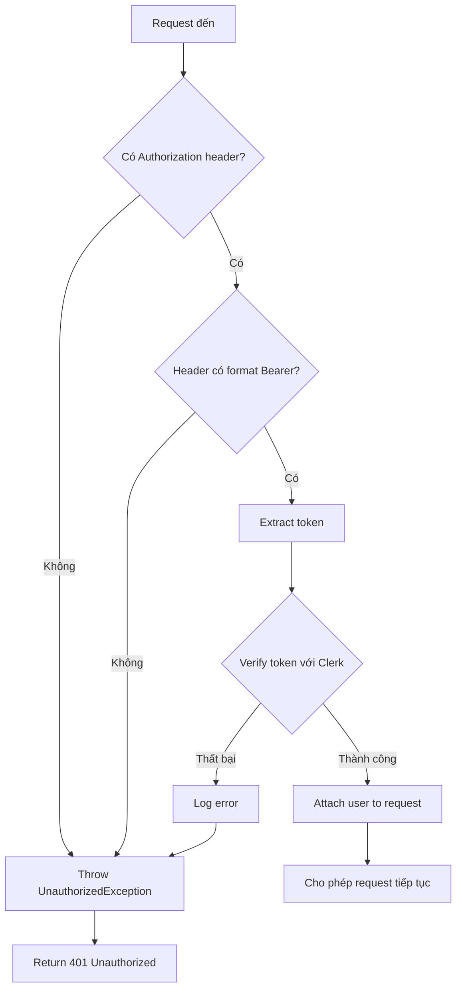

# Task 9.3: Kiểm thử Property-Based cho Từ chối Token Không hợp lệ

## Tổng quan

Task này triển khai các property-based tests để xác minh rằng hệ thống từ chối đúng cách mọi yêu cầu có JWT token không hợp lệ, bị lỗi định dạng, hoặc thiếu Authorization header. Đây là một phần quan trọng của lớp bảo mật authentication trong hệ thống.

## Mục đích của Test

Property-based test này xác minh **Property 8: Invalid Token Error Response** từ tài liệu thiết kế:

> *Với bất kỳ yêu cầu nào có JWT token không hợp lệ, bị lỗi định dạng, hoặc đã hết hạn, hệ thống phải trả về lỗi 401 Unauthorized với thông báo "Invalid token".*

**Validates Requirements:** 8.5

## Các loại Token không hợp lệ được kiểm thử

Test này sử dụng fast-check để tự động sinh ra nhiều loại token không hợp lệ và xác minh rằng tất cả đều bị từ chối:

### 1. Token không có dấu chấm (Invalid format)
```typescript
fc.constant('invalid')
```
- Token không có cấu trúc JWT chuẩn (header.payload.signature)
- Ví dụ: `"invalid"`, `"randomstring"`

### 2. Token thiếu các phần (Malformed)
```typescript
fc.string({ minLength: 1 }).filter(s => !s.includes('.'))
```
- Token có nội dung nhưng không có dấu chấm phân cách
- Ví dụ: `"abcdefghijk"`, `"token123"`

### 3. Token có định dạng sai (Wrong structure)
```typescript
fc.constant('invalid.token.here')
```
- Token có dấu chấm nhưng nội dung không phải JWT hợp lệ
- Ví dụ: `"invalid.token.here"`, `"fake.jwt.token"`

### 4. Token bị biến dạng (Corrupted)
```typescript
fc.string({ minLength: 1 }).map(s => `malformed-${s}`)
```
- Token có prefix hoặc format không đúng
- Ví dụ: `"malformed-abc123"`, `"malformed-xyz"`

### 5. Thiếu Authorization Header
```typescript
fc.constant(undefined)
```
- Request không có header Authorization
- Đây là trường hợp phổ biến khi client quên gửi token

## Cách hoạt động của Error Handling

### Luồng xử lý trong ClerkAuthGuard



### Code xử lý trong ClerkAuthGuard

```typescript
// 1. Kiểm tra Authorization header
const authHeader = request.headers.authorization;
if (!authHeader || !authHeader.startsWith('Bearer ')) {
  throw new UnauthorizedException('Missing or malformed Authorization header');
}

// 2. Extract token
const token = authHeader.substring(7);

// 3. Verify token với Clerk
try {
  const sessionClaims = await verifyToken(token, { 
    secretKey: this.secretKey 
  });
  // ... attach user to request
} catch (error) {
  this.logger.error('Clerk token verification failed', error);
  throw new UnauthorizedException('Invalid token');
}
```

### Response Format khi token không hợp lệ

```json
{
  "errors": [
    {
      "message": "Invalid token",
      "extensions": {
        "code": "UNAUTHENTICATED"
      }
    }
  ]
}
```

## Cách chạy Test

### Chạy tất cả authentication property tests

```bash
pnpm test --filter @viztechstack/api -- auth.properties.spec.ts
```

### Chạy chỉ test invalid token rejection

```bash
pnpm test --filter @viztechstack/api -- auth.properties.spec.ts -t "should reject any invalid JWT token format"
```

### Chạy test với verbose output

```bash
pnpm test --filter @viztechstack/api -- auth.properties.spec.ts --verbose
```

## Cấu trúc Test File

File test nằm tại: `apps/api/src/modules/roadmap/__tests__/properties/auth.properties.spec.ts`

```typescript
describe('Authentication Properties', () => {
  // Setup mocks và test environment
  beforeAll(() => {
    process.env.CLERK_SECRET_KEY = 'test-secret-key';
  });

  beforeEach(() => {
    reflector = new Reflector();
    guard = new ClerkAuthGuard(reflector);
    jest.clearAllMocks();
  });

  // Test invalid token rejection
  it('should reject any invalid JWT token format with 401', async () => {
    await fc.assert(
      fc.asyncProperty(
        // Generator tạo các loại token không hợp lệ
        fc.oneof(
          fc.constant('invalid'),
          fc.string({ minLength: 1 }).filter(s => !s.includes('.')),
          fc.constant('invalid.token.here'),
          fc.string({ minLength: 1 }).map(s => `malformed-${s}`)
        ),
        async (invalidToken) => {
          // Mock verifyToken để throw error
          mockVerifyToken.mockRejectedValueOnce(new Error('Invalid token'));

          const mockContext = createMockExecutionContext(invalidToken);
          jest.spyOn(reflector, 'getAllAndOverride').mockReturnValue(false);

          // Verify rằng guard throws UnauthorizedException
          await expect(guard.canActivate(mockContext)).rejects.toThrow(
            UnauthorizedException
          );
        }
      ),
      { numRuns: 100 } // Chạy 100 lần với input ngẫu nhiên
    );
  });
});
```

## Các vấn đề thường gặp và Cách khắc phục

### 1. Test fails với "CLERK_SECRET_KEY is not defined"

**Nguyên nhân:** Environment variable không được set trong test environment.

**Giải pháp:**
```typescript
beforeAll(() => {
  process.env.CLERK_SECRET_KEY = 'test-secret-key';
});
```

### 2. Mock không hoạt động đúng

**Nguyên nhân:** Mock không được clear giữa các test cases.

**Giải pháp:**
```typescript
beforeEach(() => {
  jest.clearAllMocks();
});
```

### 3. Test timeout khi chạy 100 iterations

**Nguyên nhân:** Mỗi iteration mất quá nhiều thời gian.

**Giải pháp:** Tăng timeout trong jest config hoặc giảm numRuns:
```typescript
{ numRuns: 50, timeout: 10000 }
```

### 4. UnauthorizedException không được throw

**Nguyên nhân:** Reflector trả về `true` cho IS_PUBLIC_KEY, làm cho endpoint được coi là public.

**Giải pháp:** Mock reflector để trả về `false`:
```typescript
jest.spyOn(reflector, 'getAllAndOverride').mockReturnValue(false);
```

## Tại sao sử dụng Property-Based Testing?

### So sánh với Unit Testing truyền thống

**Unit Test truyền thống:**
```typescript
it('should reject invalid token', async () => {
  const invalidToken = 'invalid.token.here';
  await expect(guard.canActivate(context)).rejects.toThrow();
});
```
- Chỉ test 1 trường hợp cụ thể
- Có thể bỏ sót các edge cases

**Property-Based Test:**
```typescript
it('should reject any invalid JWT token', async () => {
  await fc.assert(
    fc.asyncProperty(
      fc.oneof(...generators),
      async (invalidToken) => {
        // Test với nhiều loại token khác nhau
      }
    ),
    { numRuns: 100 }
  );
});
```
- Test 100 trường hợp khác nhau tự động
- Phát hiện edge cases mà developer không nghĩ tới
- Đảm bảo property đúng với MỌI input không hợp lệ

### Lợi ích của Property-Based Testing

1. **Phát hiện bug sớm:** Tự động tìm ra các edge cases
2. **Tăng độ tin cậy:** Test nhiều trường hợp hơn với ít code hơn
3. **Documentation:** Property mô tả rõ ràng hành vi hệ thống
4. **Regression prevention:** Đảm bảo property luôn đúng khi refactor

## Liên kết với Requirements

Test này validate **Requirement 8.5:**

> IF JWT token không hợp lệ hoặc hết hạn, THEN THE System SHALL trả về lỗi 401 Unauthorized

Bằng cách test với 100 iterations và nhiều loại token không hợp lệ khác nhau, chúng ta đảm bảo rằng requirement này được thỏa mãn trong MỌI trường hợp, không chỉ một vài trường hợp cụ thể.

## Best Practices khi viết Property-Based Tests

1. **Sử dụng generators phù hợp:** Chọn generators tạo ra input đại diện cho domain
2. **Giữ properties đơn giản:** Mỗi test nên verify 1 property rõ ràng
3. **Mock external dependencies:** Không gọi API thật trong tests
4. **Set numRuns hợp lý:** 100 iterations là chuẩn, có thể tăng cho critical code
5. **Clear mocks giữa tests:** Tránh side effects giữa các test cases

## Tài liệu tham khảo

- [fast-check Documentation](https://github.com/dubzzz/fast-check)
- [Property-Based Testing Guide](https://fsharpforfunandprofit.com/posts/property-based-testing/)
- [Clerk JWT Verification](https://clerk.com/docs/backend-requests/handling/nodejs)
- [NestJS Guards](https://docs.nestjs.com/guards)
