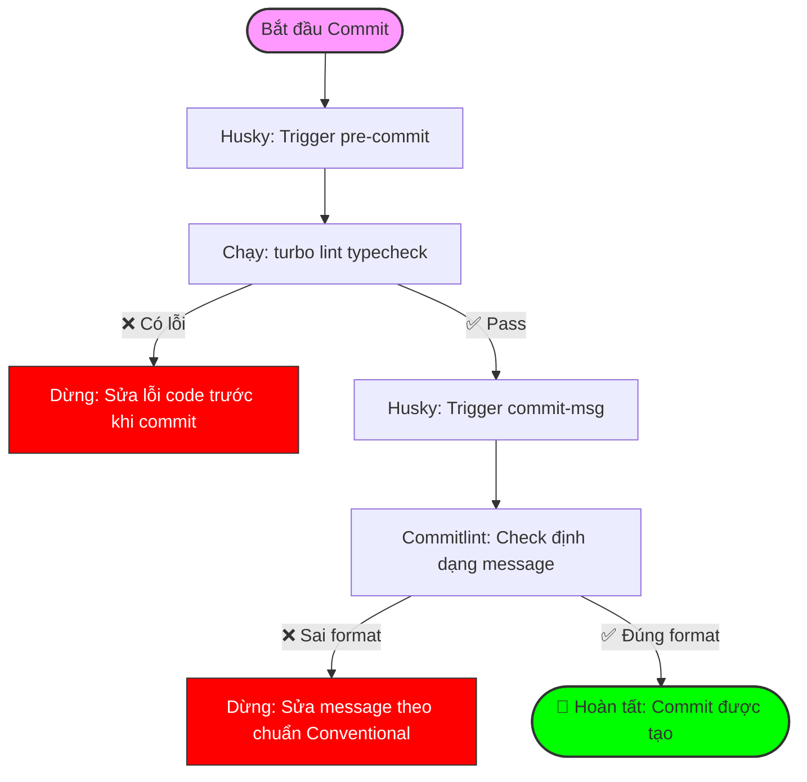

# TECHNICAL & BUSINESS DESIGN DOCUMENT: HUSKY INTEGRATION 🐶

## 🎯 System Overview

Hệ thống Git Hooks sử dụng **Husky** phối hợp với **Commitlint** và **Turborepo** để thiết lập một "Quality Gate" ngay tại máy local của Developer. Mục tiêu là ngăn chặn code lỗi và commit message không chuẩn lọt vào repository và CI/CD pipeline.

---

## 🛠 TECHNICAL DESIGN DOCUMENT (TDD)

### 1. Architecture Decision

- **Tooling Selection**:
  - **Husky (v9)**: Native git hooks management.
  - **Commitlint**: Enforce Conventional Commits specification.
  - **Turborepo**: Optimize performance by only linting/type-checking affected packages (future optimization) or running global checks efficiently.
- **Workflow Strategy**:
  - **Fail-Fast**: Chặn lỗi ngay tại bước `git commit`.
  - **Automation**: Tự động cài đặt hooks thông qua `pnpm prepare`.

### 2. Implementation Details

- **Pre-commit Hook**: Chạy `pnpm turbo lint typecheck`.
  - Đảm bảo code máy local phải pass toàn bộ rule về style và type trước khi được commit.
- **Commit-msg Hook**: Chạy `commitlint`.
  - Đảm bảo lịch sử git sạch sẽ, dễ dàng cho việc auto-generate changelog.

### 3. Integrated Flow Diagram (Flowchart)

---

## 📈 BUSINESS DESIGN DOCUMENT (BDD)

### 1. Core Value Proposition

- **Giảm Chi Phí Fix Bug**: Phát hiện lỗi sớm nhất có thể (ngay khi gõ code).
- **Onboarding Tốc Độ**: Dev mới follow chuẩn chung của project một cách tự động mà không cần đọc docs quá nhiều.
- **CI/CD Reliability**: Giảm tải cho CI/CD pipeline bằng cách lọc bỏ các commit "rác" hoặc commit gây vỡ build trước khi chúng được push lên server.

### 2. Quality Standards (BDD Scenarios)

#### Scenario 1: Đảm bảo code sạch trước khi commit

- **Given**: Developer sửa code nhưng vi phạm luật ESLint hoặc sai Type.
- **When**: Developer thực hiện lệnh `git commit`.
- **Then**: Husky phải chặn lại và hiển thị lỗi cụ thể để fix.

#### Scenario 2: Đảm bảo lịch sử Git chuyên nghiệp

- **Given**: Developer viết message ngắn ngủi như "done", "fixed bug".
- **When**: Developer thực hiện lệnh `git commit`.
- **Then**: Commitlint phải chặn lại và yêu cầu định dạng `type(scope): description`.

### 3. Risk & Trade-offs

- **Trade-off**: Thời gian `git commit` sẽ lâu hơn một chút (tốn vài giây để check).
- **Mitigation**: Sử dụng Turborepo caching để những lần check sau cực nhanh (chỉ check file thay đổi).

---

## 🏗 Folder Structure Reference

- `.husky/`: Chứa các script hooks thực thi.
- [.commitlintrc.json](file:///d:/lh222k/CWJ/VizTechStack/.commitlintrc.json): Định nghĩa luật cho commit message.
- [package.json](file:///d:/lh222k/CWJ/VizTechStack/package.json): Chứa script `prepare` để bootstrap Husky.
